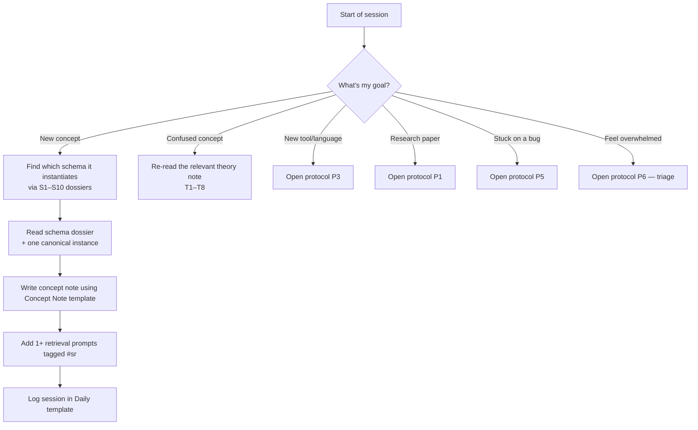

# How to Use This Vault

> Operating manual. Read this before anything else.

This vault is **not** a textbook. It is a **learning operating system**. The notes are not content to be consumed — they are instruments to be applied.

---

## The mental shift

Most learners treat a knowledge base as a **filing cabinet**: a place to store what they learned. This vault treats a knowledge base as a **gym**: a place to build schema density and retrieval strength.

The difference is operational:

- **Filing cabinet**: you add notes and never re-open them.
- **Gym**: you write a note, retrieve from it tomorrow, test yourself next week, link it to a new schema next month.

Every feature of this vault — tags, links, templates, retrieval prompts, weekly reviews — exists to **force you to retrieve, compare, and produce**, because those are the only activities that build durable mastery.

---

## The four vault rules

### Rule 1 — Every note connects to a schema

When you create a new concept note (e.g., "B-tree"), you must:

1. Identify which of the 10 universal schemas it instantiates (here: [[02_Schemas/S3 — Tree & Hierarchy|S3 — Tree & Hierarchy]] and [[02_Schemas/S6 — Memory & Locality|S6 — Memory & Locality]]).
2. Add a wikilink to that schema note in the new concept note.
3. Add a backlink-style reference in the schema dossier's "Canonical instances" section.

If you cannot identify a schema, the concept is either (a) genuinely new — in which case it may need its own schema note, or (b) not yet understood — in which case read more until the schema becomes visible.

### Rule 2 — Every concept ends in retrieval

No concept note is "done" until it contains at least one self-test question tagged `#sr` (for the Spaced Repetition plugin). The retrieval prompt should be at mastery level ≥ 2 (explanation), not level 1 (recall).

Example:
```
What data structure combines the B-tree schema with the memory locality schema, and why does locality matter for its performance on disk? #sr
```

### Rule 3 — Every session is logged

Open [[06_Templates/Daily Session|the Daily Session template]] at the start of each study session and fill it in. Even a one-line log counts. The point is not the log itself — it is the act of closing the loop, which improves metacognitive monitoring (see [[01_Theory/T3 — Deliberate Practice|T3 — Deliberate Practice]] — feedback loop).

### Rule 4 — Every week, abstract

Sunday evening: run [[04_Protocols/P8 — How to Run a Weekly Review|the Weekly Review protocol]]. The single most important output is **new schema links** — explicit connections between concepts you studied this week and concepts you studied earlier.

---

## How to read a note in this vault

Every note follows a consistent shape:

1. **Frontmatter** — metadata, tags, mastery level.
2. **One-sentence summary** in a blockquote at the top.
3. **Mechanism** — how the underlying cognitive process works.
4. **Evidence** — citations to peer-reviewed research.
5. **How to apply** — concrete actions in your study.
6. **Common failure modes** — what goes wrong when people misapply it.
7. **Cross-links** — to related theory, schemas, methods, protocols.
8. **Retrieval queue** — `#sr`-tagged self-test questions.

You do not need to read every note top to bottom. The shape is consistent so you can scan to the section you need.

---

## How to choose what to read next

Use this decision tree:



---

## How the folders work together

| Folder | Role | When you touch it |
|--------|------|-------------------|
| `00_MOCs/` | Navigation | Daily — start here |
| `01_Theory/` | Cognitive mechanisms | When a method isn't working, ask "why?" |
| `02_Schemas/` | Universal abstractions | Every time you learn a new concept — link it |
| `03_Methods/` | Study strategies | When planning a study session |
| `04_Protocols/` | Step-by-step playbooks | When starting a specific task (paper, code, bug) |
| `05_Roadmap/` | Curriculum & sequencing | When planning a week or month |
| `06_Templates/` | Boilerplate | Daily / weekly / per-concept |
| `07_PKM/` | Obsidian setup | Once at the start, then rarely |
| `08_References/` | Citations | When you want the original source |
| `09_Glossary/` | Definitions | When you forget a term |
| `10_Daily/` | Your logs | Every session |

---

## The single best habit

If you only adopt one thing from this vault, adopt this:

> **End every study session by writing one retrieval prompt you cannot yet answer, and tag it `#sr`.**

That habit alone, sustained for six months, will outperform any other study strategy.

---

## What this vault will NOT do

- It will not teach you the content of computer science. That is your job.
- It will not give you a "secret shortcut." There isn't one. Expertise research is clear on this.
- It will not work without **deliberate, sustained effort** on your part.
- It will not replace mentorship, real projects, or feedback from peers.

What it **will** do is compress years of inefficient study into a coherent system. The research is consistent: people who learned this way — by building schemas, retrieving, spacing, interleaving, and triaging — reached senior-level capability faster than those who did not. The vault's job is to make that path the default.

---

## Next steps

1. Open [[00_MOCs/00 Master Index|Master Index]].
2. Pick a starting point based on your available time (5 / 30 / 120 minutes).
3. Begin.
