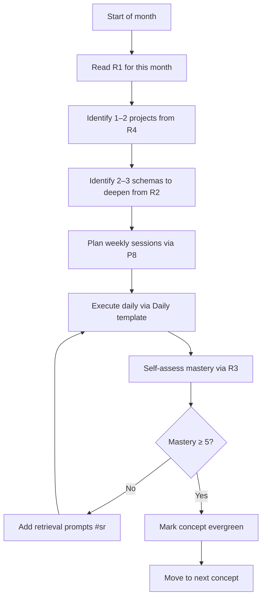

# MOC — Roadmap

> The curriculum. Not "what to learn in CS" — "how to sequence your study so the schemas compound."

---

## The roadmap files

| # | File | Purpose |
|---|------|---------|
| [[05_Roadmap/R1 — The 12-Month Study Sequence\|R1]] | 12-Month Study Sequence | Month-by-month plan. |
| [[05_Roadmap/R2 — Three Pillars Curriculum\|R2]] | Three Pillars Curriculum | Software / Systems / AI as one connected graph. |
| [[05_Roadmap/R3 — Mastery Rubric\|R3]] | Mastery Rubric | 6 levels: recall → explanation → derivation → implementation → diagnosis → transfer. |
| [[05_Roadmap/R4 — Project-Based Learning Tracks\|R4]] | Project-Based Learning Tracks | Three deep tracks: Systems, AI, Languages/Tools. |
| [[05_Roadmap/R5 — The Dependency Graph of CS\|R5]] | Dependency Graph of CS | What unlocks what. Use this to triage. |

---

## The thesis of the roadmap

> The fastest learners in CS history did **not** study every subject independently. They learned by **building representative systems**, which forced them to learn the underlying schemas in context, which then transferred to adjacent fields.

The roadmap is therefore organized around:

1. **A vertical spine** — fundamentals that unlock everything else (R2, R5).
2. **Horizontal schemas** — 10 abstractions you revisit at increasing depth (R1, R2).
3. **Representative projects** — the engine that drives schema formation (R4).
4. **A mastery rubric** — so you know when "done" means done (R3).

---

## The 12-month skeleton

| Months | Phase | Primary output |
|--------|-------|----------------|
| 1–3 | Foundations | Programming fluency + discrete math + 3 schemas (S1, S2, S9) |
| 4–6 | Systems spine | OS + networking + databases + 3 schemas (S5, S6, S7) |
| 7–9 | Depth project | One substantial system built end-to-end |
| 10–12 | Breadth & transfer | Distributed systems + ML foundations + adaptive expertise work |

Full detail: [[05_Roadmap/R1 — The 12-Month Study Sequence|R1]].

---

## The mastery rubric in one table

| Level | What you can do | Test |
|-------|-----------------|------|
| 1 Recall | Define the term | "What is a page fault?" |
| 2 Explanation | Explain why | "Why does virtual memory need a TLB?" |
| 3 Derivation | Derive or prove | "Derive effective access time given TLB hit rate." |
| 4 Implementation | Build it | "Implement a toy VM simulator." |
| 5 Diagnosis | Debug it | "Explain why this workload pages excessively." |
| 6 Transfer | Apply elsewhere | "Compare VM paging with DB buffer-pool management." |

A concept is **"mastered"** only at level 5 or 6. Levels 1–3 are staging. Most learners stop at 2 and call it mastery — that is the central trap.

Full rubric: [[05_Roadmap/R3 — Mastery Rubric|R3]].

---

## How to use the roadmap

---

## The honest disclaimer

This roadmap will not make you a senior engineer in 12 months. The research is clear: there is no shortcut. What this roadmap **will** do is:

- Eliminate the **wasted years** most learners spend on redundant coverage.
- Force **schema-based** organization from day 1.
- Embed **retrieval and triage** into daily practice.
- Make **adaptive expertise** (not just routine) the explicit goal.

If you sustain the daily protocol for 12 months, you will be further than 90% of self-directed learners reach in 4 years. The remaining gap to "senior" is filled only by years of representative practice with feedback — that part cannot be compressed.

---

## Cross-links

- [[00_MOCs/MOC — Schemas|Schemas MOC]] — the horizontal axis.
- [[00_MOCs/MOC — Protocols|Protocols MOC]] — how to study each item.
- [[06_Templates/Monthly Retrospective|Monthly Retrospective]] — review your progress monthly.
