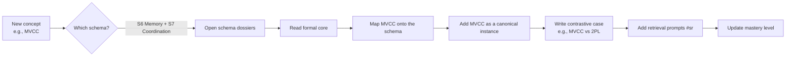

# MOC — Schemas

> The 10 universal abstractions that recur across computer science.
>
> Master these once, and 70–80% of every new field becomes a familiar instantiation rather than a new idea.

This is the heart of the vault. Each schema is documented as a **7-part dossier** following the protocol from [[04_Protocols/P7 — How to Build a Schema Dossier|P7]]:

1. **Formal core** — definitions, invariants, notation.
2. **Canonical instances** — at least 3 from different domains.
3. **Contrastive cases** — looks similar, differs in a crucial way.
4. **Implementation** — build the minimal version from scratch.
5. **Failure analysis** — race conditions, numerical instability, complexity blowups.
6. **Transfer tests** — same schema, different terminology.
7. **Delayed retrieval** — reconstruct at increasing intervals.

---

## The 10 schemas

| # | Schema | Highest-traffic domains |
|---|--------|-------------------------|
| [[02_Schemas/S1 — State & Transition\|S1]] | State & Transition | FSM, TCP, parsers, Markov, RL |
| [[02_Schemas/S2 — Graph & Reachability\|S2]] | Graph & Reachability | Algorithms, KGs, ASTs, networks |
| [[02_Schemas/S3 — Tree & Hierarchy\|S3]] | Tree & Hierarchy | B-trees, DOM, parse trees, Merkle |
| [[02_Schemas/S4 — Optimization & Constraints\|S4]] | Optimization & Constraints | ML, query planning, routing, OR |
| [[02_Schemas/S5 — Information Flow\|S5]] | Information Flow | Compilers, NNs, pipelines, CPU |
| [[02_Schemas/S6 — Memory & Locality\|S6]] | Memory & Locality | Caches, VM, buffer pools, CDN, NUMA |
| [[02_Schemas/S7 — Concurrency & Coordination\|S7]] | Concurrency & Coordination | Threads, async, consensus, Kafka |
| [[02_Schemas/S8 — Probability & Uncertainty\|S8]] | Probability & Uncertainty | Bayes, Markov, RL, diffusion |
| [[02_Schemas/S9 — Representation & Transformation\|S9]] | Representation & Transformation | LinAlg, embeddings, CV, NeRF |
| [[02_Schemas/S10 — Search & Inference\|S10]] | Search & Inference | BFS/DFS, A*, DP, chess, RAG |

---

## Mastery priority

Based on the research synthesis, learn the schemas in **this order** — it minimizes backtracking:

1. **S1 State & Transition** — the most fundamental computational abstraction.
2. **S9 Representation & Transformation** — the math foundation for AI/graphics.
3. **S2 Graph & Reachability** — appears in nearly every system.
4. **S5 Information Flow** — pipelines, compilers, NNs.
5. **S6 Memory & Locality** — performance reasoning in every domain.
6. **S7 Concurrency & Coordination** — the hardest; benefits from all prior.
7. **S4 Optimization & Constraints** — unlocks ML and systems tuning.
8. **S8 Probability & Uncertainty** — unlocks ML, distributed reasoning, reliability.
9. **S3 Tree & Hierarchy** — partly subsumed by S2 but worth its own dossier.
10. **S10 Search & Inference** — synthesizes S1, S2, S4, S8.

---

## How to use a schema dossier



---

## Schema mastery tracker

```dataview
TABLE WITHOUT ID
  file.link AS "Schema",
  mastery AS "Mastery",
  reviewed AS "Last reviewed"
FROM "02_Schemas"
WHERE file.name != "MOC — Schemas"
SORT file.name ASC
```

---

## The horizontal layering principle

For each schema, learn it across **6 layers** (from the research):

| Layer | Question |
|-------|----------|
| Mathematical model | What is the formal object? |
| Hardware | How does silicon implement it? |
| Language/runtime | How does the language expose it? |
| Operating system | How does the OS schedule / coordinate it? |
| Distributed system | How does it manifest across machines? |
| Production practice | How do we observe and debug it? |

Example for S7 Concurrency: happens-before → cache coherence & atomics → Java/C++ memory models → futexes & scheduling → logical clocks & consensus → tracing & deadlock diagnosis.

This **layered comparison** is what produces transfer. Pure exposure to a label ("concurrency") does not.

---

## Cross-links

- [[01_Theory/T1 — Schema Transfer|T1 Schema Transfer]] — the mechanism.
- [[03_Methods/M6 — Analogical Comparison|M6 Analogical Comparison]] — how to study schemas.
- [[04_Protocols/P7 — How to Build a Schema Dossier|P7 — Build a Schema Dossier]] — the construction protocol.
