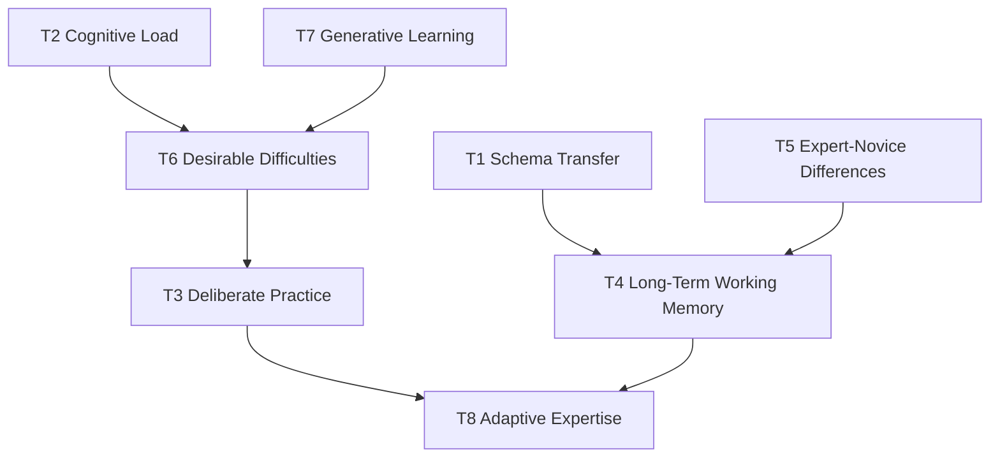

# MOC — Theory

> Eight cognitive principles that explain why this vault works.

The theory notes are not background reading. They are the **operating manual for your brain**. When a study method stops working, the answer to "why?" is almost always in one of these eight notes.

---

## The principles

| # | Principle | What it explains |
|---|-----------|------------------|
| [[01_Theory/T1 — Schema Transfer\|T1]] | Schema Transfer | Why learning state machines in TCP makes parser design easier. |
| [[01_Theory/T2 — Cognitive Load Theory\|T2]] | Cognitive Load Theory | Why you can't read a distributed-systems paper cold. |
| [[01_Theory/T3 — Deliberate Practice\|T3]] | Deliberate Practice | Why "just doing it" doesn't make you an expert. |
| [[01_Theory/T4 — Long-Term Working Memory\|T4]] | Long-Term Working Memory | Why experts seem to hold 50 things in their head at once. |
| [[01_Theory/T5 — Expert-Novice Differences\|T5]] | Expert-Novice Differences | Why novices classify code by syntax and experts by purpose. |
| [[01_Theory/T6 — Desirable Difficulties\|T6]] | Desirable Difficulties | Why feeling slow can mean you're learning more. |
| [[01_Theory/T7 — Generative Learning\|T7]] | Generative Learning | Why writing your own explanation beats re-reading. |
| [[01_Theory/T8 — Adaptive Expertise\|T8]] | Adaptive Expertise | Why some senior engineers get stuck and others don't. |

---

## How the principles connect

- **T1, T5, T4** explain the **what**: experts have richer schemas stored in long-term memory.
- **T2, T6, T7** explain the **how**: instruction must respect working memory limits but stay difficult enough to drive schema formation.
- **T3, T8** explain the **practice**: deliberate, feedback-rich work builds adaptive — not just routine — expertise.

---

## Reading order

If reading for the first time: T1 → T2 → T3 → T4 → T5 → T6 → T7 → T8.

If diagnosing a learning problem:

| Symptom | Read |
|---------|------|
| "I read it but I can't apply it" | T1, T7 |
| "The material is too dense, I keep zoning out" | T2 |
| "I've been coding for years but not getting better" | T3, T8 |
| "I forget everything within a week" | T6, T7 |
| "I can solve familiar problems but freeze on novel ones" | T5, T8 |
| "I keep relearning the same concept" | T1, T4 |

---

## Cross-links

- Schemas (`02_Schemas/`) — the **content** that schemas carry.
- Methods (`03_Methods/`) — **operationalizations** of these principles.
- [[08_References/References Index|References]] — primary sources.
