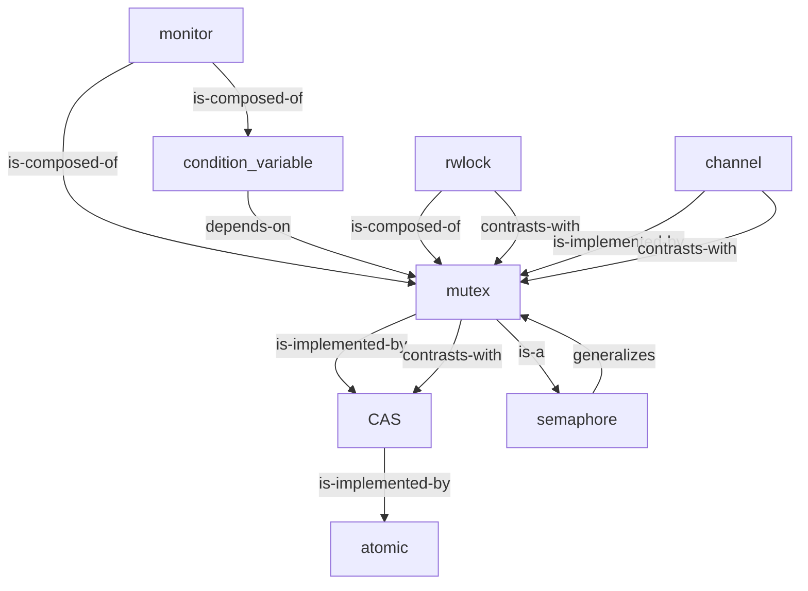

# M9 — Concept Mapping

> Draw a graph where nodes are concepts and **edges are labeled with the relation type**. The labeling is the active ingredient.

**Evidence rating:** ★★★
**Targets:** Integration of prior and new knowledge; explicit articulation of relationships; detection of missing links.
**Primary theory:** [[01_Theory/T7 — Generative Learning|T7 Generative Learning]]

---

## 1. The method

A concept map is a graph. Nodes are concepts. Edges are the **relationships** between concepts — and each edge must be **labeled** with the relation type. "is-a," "depends-on," "is-implemented-by," "contrasts-with," "is-a-special-case-of," "is-composed-of." The labeling is the entire point. An unlabeled graph is just a connected bubble diagram; it does not require the learner to articulate *how* two concepts relate.

The procedure for a topic: write the major concepts as nodes on a blank canvas (paper, whiteboard, or a Mermaid graph in Obsidian). Draw edges between related concepts. For every edge, write a phrase on the edge that makes the relation explicit — short enough to fit, specific enough to disambiguate. Then add a few sentences of context around the map: what the central nodes are, what the major sub-graphs are, where the map is incomplete.

The map is generative: you produce the structure, the labels, and the integration. It is also diagnostic: every edge you struggle to label is a missing relation in your understanding. A learner who cannot label the edge between "mutex" and "semaphore" has not understood that a mutex is a binary semaphore with ownership semantics — that gap is the next thing to study.

In Obsidian, concept maps can be drawn with Mermaid (`graph TD` blocks), which keeps them as searchable text and version-controlled alongside the rest of the vault. Hand-drawn maps are equally effective for the cognitive work; digitize them later only if you'll use the digital version.

## 2. Why it works (the mechanism)

Concept mapping works through three mechanisms:

1. **Forced articulation of relations.** Most learners store concepts as isolated nodes ("I know what a mutex is; I know what a semaphore is") without explicit links. The map forces the relation to be made explicit: "a mutex is a binary semaphore with ownership tracking." This explicit articulation is what transfers — the relation, not the node, is the schema (see [[01_Theory/T1 — Schema Transfer|T1]]).

2. **Integration of prior and new knowledge.** A concept map places new nodes adjacent to old nodes and requires their relations to be drawn. This builds the elaborative network that supports retrieval (see [[03_Methods/M5 — Elaboration & Self-Explanation|M5]]).

3. **Generative processing.** Producing a map from scratch requires selection (which concepts matter), organization (how they cluster), and integration (how they connect). All three are deeper levels of processing than reading (Craik & Lockhart).

The labeled-edge requirement is the load-bearing feature. Without labels, the learner can draw a map that *looks* complete while leaving every relation implicit. Labels force each relation to be articulate-able; if you can't label it, you don't know it.

A second mechanism is **knowledge integration**. A concept map forces the learner to place new nodes adjacent to old nodes and draw their relations. This is elaboration (see [[03_Methods/M5 — Elaboration & Self-Explanation|M5]]) in graphical form. The spatial layout itself encodes information: clusters of dense edges indicate sub-schemas; sparse bridges between clusters indicate the integration frontier where new knowledge connects to old. The map's topology is a diagnostic of the learner's schema structure.

A third mechanism is **externalized cognition**. The map offloads the structure from working memory to the page, freeing the learner to reason about the structure rather than hold it in mind. This is the same benefit as a diagram or equation: the external representation lets the learner inspect relations that would otherwise exceed working-memory capacity (see [[01_Theory/T2 — Cognitive Load Theory|T2]]).

## 3. Evidence

**Nesbit & Adesope (2006)** — meta-analysis of concept mapping studies. Mean effect d ≈ 0.4–0.5 vs. control conditions (reading, lecture, outlining). Effects were larger when (a) maps were student-generated rather than studied, (b) edges were labeled, (c) maps were revised after feedback.

**Novak (1990)** — originator of concept mapping as an educational tool (building on Ausubel's assimilation theory). Argued that meaningful learning occurs when new concepts are explicitly linked to existing ones; concept maps operationalize that linking.

**Haugwitz, Summers, Kluge & Taricani (2014)** — labeling edges (vs. unlabeled) substantially increased transfer performance. The labeling is the mechanism.

**Cañas et al. (2003)** — concept maps used as knowledge-elicitation tools with experts; showed that the maps surface tacit relational knowledge experts had not articulated verbally.

**Dunlosky et al. (2013)** — concept mapping was not reviewed separately, but image-based methods (including mapping) showed variable effects depending on quality. The review cautioned that the technique is only as good as the cognitive work the learner puts into the map.

Full citations: [[08_References/References Index|References Index]].

## 4. How to apply it

1. **Pick a topic with 6–15 major concepts.** Too few and the map is trivial; too many and the map becomes unreadable. Concurrency primitives, sorting algorithms, consensus protocols — all good.

2. **List the concepts as nodes.** Don't draw edges yet.

3. **Draw edges, one at a time, labeling each.** Use a small set of relation types:
   - `is-a` (subtype)
   - `is-composed-of` (has parts)
   - `depends-on` (requires)
   - `is-implemented-by` (realization)
   - `contrasts-with` (opposition / trade-off)
   - `is-a-special-case-of`
   - `generalizes`
   - `evolves-into`

4. **If you can't label an edge, either remove it or mark it for study.** An unlabeled edge is a confession of ignorance, not a relation.

5. **Identify the central nodes (highest degree).** These are the schema's hubs; they should be the ones you can explain most deeply.

6. **Write a one-paragraph summary below the map.** What does the map's overall shape tell you about the schema? Which sub-graphs are dense (well-understood) vs. sparse (gaps)?

7. **Re-draw the map after a delay.** A map drawn from memory a week later reveals which relations stuck and which decayed. This combines with [[03_Methods/M2 — Spaced Repetition|M2]].

8. **Use Mermaid in Obsidian** for digital maps; the text is searchable and the graph renders in preview.

## 5. Common failure modes

| Misuse | Why it fails | Fix |
|--------|--------------|-----|
| Unlabeled edges | No articulation of relations; the map looks complete but encodes nothing. | Force a label on every edge. |
| Too many nodes | Map becomes unreadable; relations lost in noise. | Cap at 15 nodes per map. |
| Copying from a source map | Transcription, not generation. | Draw from memory; compare after. |
| Pretty maps without thinking | Visual polish substitutes for cognitive work. | Prioritize labels over aesthetics. |
| One-shot, never revised | Relations decay without re-articulation. | Re-draw from memory after a delay. |
| Using only `related-to` as the relation | Vague relation labels don't force articulation. | Use specific relations (is-a, depends-on, contrasts-with). |
| Maps as decoration in notes | If the map isn't the focus of a study session, it's not working. | Treat the map as a deliverable, not a side note. |

## 6. Worked example

You study concurrency primitives. You list 8 nodes: `mutex`, `semaphore`, `monitor`, `condition variable`, `atomic operation`, `CAS (compare-and-swap)`, `channel`, `read-write lock`. You draw a Mermaid graph:

Below the map you write:

> The map shows that CAS is the foundational primitive (atomic hardware op), from which mutex is built, from which monitors, channels, and read-write locks are built. Semaphores generalize mutexes (counting vs. binary). The contrasts-with edges expose the design space: mutex (simple, blocking) vs. CAS (lock-free, retry-based); rwlock (reader-parallel) vs. mutex (exclusive); channel (synchronous communication) vs. mutex (synchronous protection).

The map surfaces a gap: you cannot label the edge between `condition variable` and `semaphore`. You marked it for study. After research, you discover that condition variables are sometimes used to implement counting semantics, but they are conceptually different (CV = wait for a predicate; semaphore = wait for a count). You add the edge `condition_variable -->|contrasts-with| semaphore` with the labeling reason.

## 7. Cross-links

- **Theory**: [[01_Theory/T7 — Generative Learning|T7 Generative Learning]] — primary mechanism.
- **Theory**: [[01_Theory/T1 — Schema Transfer|T1 Schema Transfer]] — labeled edges make the schema's relations explicit.
- **Methods**: [[03_Methods/M5 — Elaboration & Self-Explanation|M5 Self-Explanation]] — labeling edges is a form of elaboration.
- **Methods**: [[03_Methods/M6 — Analogical Comparison|M6 Analogical Comparison]] — comparison produces the relation labels.
- **Methods**: [[03_Methods/M8 — Generative Production|M8 Generative Production]] — the map is a produced artifact.

## 8. Retrieval queue

#sr
- Define concept mapping. What is the load-bearing feature, and why?
- Nesbit & Adesope (2006): what were the mean effect sizes, and which features of the map increased them?
- Why is an unlabeled edge a confession of ignorance rather than a relation?
- List six relation types useful for labeling edges in CS concept maps.
- Design a concept map (nodes + labeled edges + summary) for the schema "consensus protocols" including Paxos, Raft, Zab, PBFT, and 2PC.
- Nesbit & Adesope (2006): what were the mean effect sizes, and which features of the map increased them?
- Why is an unlabeled edge a confession of ignorance rather than a relation?
- Why does the map's topology (clusters, bridges) serve as a diagnostic of schema structure?
- List six relation types useful for labeling edges in CS concept maps.
- Cañas et al. (2003): what does concept mapping surface in experts that verbal elicitation misses?
- You draw a concept map and find one node with no incoming edges. What are two possible diagnoses, and what is the fix for each?
- Why must concept maps be student-generated rather than studied? What is lost when you study an expert's map?

---

> **Bottom line**: nodes are easy; edges are hard. The label on each edge is the cognitive work. A pretty map with unlabeled edges is decoration; an ugly map with precise labels is learning.
