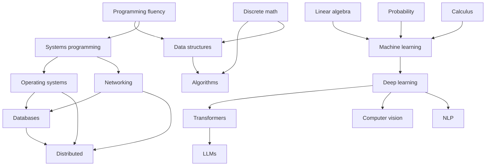

# R2 — Three Pillars Curriculum

> Software Engineering, Systems Engineering, AI Engineering — three pillars that look like separate careers but are actually one connected graph of schemas.

---

## The thesis

Most universities and most self-learners treat these pillars as separate curricula. The research on schema transfer (see [[01_Theory/T1 — Schema Transfer|T1]]) says this is a massive waste: the same schemas appear in all three.

The pillar view is for **career planning**. The schema view is for **learning**. This note gives you both, but the schema view is the one that produces compression.

## The three pillars

### Pillar 1 — Software Engineering

| Subdomain | Schemas used | Mastery target (year 1) |
|-----------|--------------|--------------------------|
| Programming languages | S1, S5 | Level 4 in 1 language |
| Software design (OOP, SOLID, DDD) | S2, S3 | Level 3 |
| Algorithms & data structures | S2, S3, S10 | Level 4 |
| Frontend (React, Next.js) | S1, S3, S5 | Level 3 |
| Mobile (Android) | S1, S5 | Level 2 |
| Backend (Spring, Django, REST, gRPC) | S1, S5, S7 | Level 4 |

### Pillar 2 — Systems Engineering & Infrastructure

| Subdomain | Schemas used | Mastery target (year 1) |
|-----------|--------------|--------------------------|
| Operating systems | S1, S6, S7 | Level 4 |
| Networking | S1, S5 | Level 4 |
| Distributed systems | S7, S2, S8 | Level 4 |
| Databases | S3, S6, S7 | Level 4 |
| DevOps | S5, S7 | Level 3 |
| Streaming (Kafka) | S5, S7 | Level 3 |
| HPC | S6, S7, S9 | Level 2 |

### Pillar 3 — AI Engineering

| Subdomain | Schemas used | Mastery target (year 1) |
|-----------|--------------|--------------------------|
| Machine learning | S4, S8, S9 | Level 4 |
| Deep learning | S4, S5, S9 | Level 4 |
| Transformers | S5, S9, S10 | Level 4 |
| Computer vision | S9, S4 | Level 3 |
| NLP | S8, S9, S10 | Level 3 |
| Generative AI | S4, S8, S9 | Level 3 |
| Symbolic AI | S1, S10 | Level 2 |

---

## The schema-spine view

If we re-sort by schema instead of by pillar, the curriculum looks like this:

```
S1 State       — used in 18 of 21 subdomains above
S2 Graph       — used in 14
S3 Tree        — used in 9
S4 Optimization — used in 9
S5 Information Flow — used in 13
S6 Memory      — used in 8
S7 Concurrency — used in 11
S8 Probability — used in 8
S9 Representation — used in 10
S10 Search     — used in 7
```

This is the empirical answer to "which schema should I learn first?": the highest-traffic schemas first. S1 appears almost everywhere; start there. S10 appears less frequently; defer.

## The dependency structure

Some pillars unlock others. The rough dependency graph:



This is also in [[05_Roadmap/R5 — The Dependency Graph of CS|R5 Dependency Graph]] with more detail.

## How to use the pillar view

The pillar view matters for two things:

### 1. Career-naming

When someone asks "what kind of engineer are you?" the pillar answer ("backend engineer", "ML engineer") is correct. The schema answer ("I'm good at state machines") is not socially useful. Have both.

### 2. Project selection

A project belongs to a pillar. The schemas are the *means*; the pillar is the *end*. Don't pick a schema and search for a project; pick a project (in the pillar you want to grow in) and use the schema dossiers as study material while implementing.

See [[05_Roadmap/R4 — Project-Based Learning Tracks|R4 Project Tracks]] for canonical projects per pillar.

## How to use the schema view

The schema view matters for **everything else**:

- **Sequencing**: schemas first, pillars second.
- **Triage**: when two pillar-topics compete for your time, pick the one that deepens a higher-priority schema.
- **Transfer**: when entering a new subdomain, identify which schemas it uses and pull up the dossiers.
- **Self-assessment**: rate yourself per schema, not per pillar. Schema ratings are honest; pillar ratings are fuzzy.

## The vertical-horizontal-layered design

The research synthesis in the source material recommends a curriculum that is:

- **Vertical** in one or two domains (deep mastery of, say, databases).
- **Horizontal** across schemas (state machines everywhere they appear).
- **Layered** within each schema (math → hardware → language → OS → distributed → production).

Example for S7 Concurrency:

| Layer | Topic |
|-------|-------|
| Math | Interleavings, partial orders, happens-before, invariants |
| Hardware | Caches, coherence, atomics, memory ordering |
| Language | Java memory model, C++ atomics, Python multiprocessing |
| OS | Threads, scheduling, futexes, signals |
| Distributed | Logical clocks, consensus, replication |
| Production | Tracing, contention profiling, fault injection |

This layered approach is what makes the schema transferable. Pure horizontal exposure to a label ("concurrency") does not.

## Mastery targets — realistic

For a 12-month, ~15 hr/week effort (see [[05_Roadmap/R1 — The 12-Month Study Sequence|R1]]):

- **Pillar 1**: depth in 1 language, 1 backend framework, basic algorithms. Level 4 in S1, S5.
- **Pillar 2**: depth in OS or databases (pick one). Level 4 in S6 or S7.
- **Pillar 3**: depth in basic ML. Level 4 in S4, S9.

You will **not** reach level 4 in all 21 subdomains. That is years of work. The point is to reach **schema depth** in 3–4 schemas — which then makes adjacent subdomains cheap to enter later.

## Cross-links

- [[05_Roadmap/R1 — The 12-Month Study Sequence|R1 12-Month Sequence]] — month-by-month plan.
- [[05_Roadmap/R3 — Mastery Rubric|R3 Mastery Rubric]] — how to assess levels.
- [[05_Roadmap/R4 — Project-Based Learning Tracks|R4 Project Tracks]] — pillar-specific projects.
- [[05_Roadmap/R5 — The Dependency Graph of CS|R5 Dependency Graph]] — sequencing detail.
- [[00_MOCs/MOC — Schemas|Schemas MOC]] — the schema dossiers.

## Retrieval queue

#sr
- Why does the schema view produce compression that the pillar view does not?
- List the 5 schemas with highest traffic across the 21 subdomains.
- What are the 6 layers in the vertical-horizontal-layered curriculum design?
- For S7 Concurrency, name a topic at each of the 6 layers.
- You have 4 free hours this week. Subdomain A deepens S1; subdomain B deepens S10. Which do you choose, and why?

---

> **Bottom line**: pillars are for careers; schemas are for learning. Sequence by schema, implement by pillar. The compression comes from the schema view; the projects come from the pillar view.
