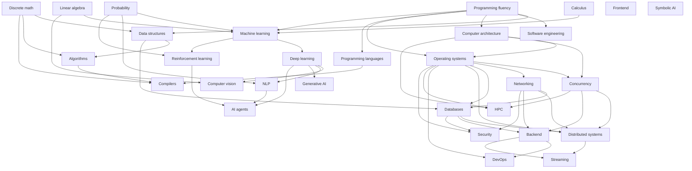

# R5 — The Dependency Graph of CS

> What unlocks what. Use this to triage: if a concept has many dependents, learn it early. If it has few, defer.

---

## The thesis

Computer science is not a flat list of subjects. It is a directed acyclic graph (DAG) of dependencies. Most sequencing mistakes come from ignoring the DAG — trying to learn distributed systems before networking, or ML before linear algebra.

This note gives you the DAG, the prerequisite-centrality ranking, and the rules for deviating from the canonical order.

## The dependency graph

## Prerequisite centrality ranking

Counting how many downstream concepts each prerequisite unlocks:

| Concept | Direct dependents | Centrality tier |
|---------|-------------------|-----------------|
| Programming fluency | 9 | Tier 1 (essential) |
| Discrete math | 5 | Tier 1 |
| Linear algebra | 4 | Tier 1 |
| Probability | 4 | Tier 1 |
| Calculus | 1 | Tier 2 |
| Data structures | 4 | Tier 1 |
| Algorithms | 3 | Tier 2 |
| Computer architecture | 4 | Tier 1 |
| Operating systems | 6 | Tier 1 |
| Networking | 5 | Tier 1 |
| Concurrency | 5 | Tier 1 |
| Databases | 4 | Tier 1 |
| Distributed systems | 2 | Tier 2 |
| ML | 4 | Tier 1 (within AI) |

**Tier 1** = learn early; high payoff. **Tier 2** = can be deferred; lower payoff.

## The canonical order (matches R1)

1. **Programming fluency** — non-negotiable first.
2. **Discrete math** + **data structures** — alongside programming.
3. **Algorithms** — after data structures.
4. **Computer architecture** — alongside algorithms.
5. **Operating systems** — after architecture + programming.
6. **Networking** — after OS.
7. **Concurrency** — after OS.
8. **Databases** — after OS + networking.
9. **Linear algebra** + **probability** + **calculus** — parallel track, ready by the time you reach ML.
10. **Distributed systems** — after OS + networking + databases + concurrency.
11. **ML** — after linear algebra + probability + calculus + programming.
12. **Deep learning** — after ML.
13. **CV / NLP / GenAI** — after deep learning.

## When to deviate

Deviate from canonical order when:

1. **A project requires it.** If your Q3 project is Track B (transformer), you must learn linear algebra and probability in Q1, even though canonical order places them later. Projects override canonical order.

2. **Your job requires it.** If you start a backend job next month, prioritize databases and concurrency, defer ML. Career overrides canonical order.

3. **You've already learned a prerequisite.** Skip it. The canonical order assumes nothing. Adjust to your actual prior knowledge.

4. **You're stuck on a concept that depends on a gap.** If you're struggling with Paxos, the gap is probably consensus + partial failure + quorum semantics. Backfill those, then return.

## When NOT to deviate

Do not deviate when:

1. **You're bored.** Boredom is not a sequencing signal. It's a difficulty signal (too easy) or a fatigue signal (too tired). Adjust difficulty, not sequence.

2. **The next topic looks more interesting.** Interesting-ness is a poor guide. The DAG is a better guide. Trust the DAG.

3. **You're trying to optimize for an interview.** Interview prep is a different problem from learning. Use a separate protocol for it. Don't let interview timing distort your curriculum.

## How to use this graph weekly

In your [[04_Protocols/P8 — How to Run a Weekly Review|weekly review]], when triaging what to study next:

1. List candidate concepts.
2. For each, check: are all prerequisites at mastery level ≥ 4? If not, the prerequisite is the higher-priority study.
3. Among concepts whose prerequisites are met, prioritize by prerequisite centrality (Tier 1 > Tier 2).
4. Within the same tier, prioritize by project relevance (see [[04_Protocols/P6 — How to Triage What to Ignore|P6 triage]]).

## The diagnostic question

When you feel stuck on a concept X, ask:

> "What is the prerequisite of X that I have not actually mastered (only memorized)?"

90% of the time, the answer identifies the actual blocker. The remaining 10% is genuine difficulty of X itself.

## Cross-links

- [[05_Roadmap/R1 — The 12-Month Study Sequence|R1 12-Month Sequence]] — applies this DAG.
- [[05_Roadmap/R2 — Three Pillars Curriculum|R2 Three Pillars]] — pillar-level view.
- [[04_Protocols/P6 — How to Triage What to Ignore|P6 Triage]] — operationalizes this graph.
- [[01_Theory/T2 — Cognitive Load Theory|T2 CLT]] — why prerequisite order matters (element interactivity).

## Retrieval queue

#sr
- Name the 4 Tier-1 prerequisites by centrality ranking.
- Why is "programming fluency" the highest-centrality prerequisite?
- Give 2 valid reasons to deviate from the canonical learning order and 2 invalid reasons.
- You're stuck on Paxos. What is the diagnostic question to identify the actual blocker?
- In a weekly review, you have 3 candidate concepts whose prerequisites are met. How do you prioritize them?

---

> **Bottom line**: computer science is a DAG. The DAG tells you what to learn next, not your interests or your fears. Trust the DAG; it eliminates 80% of "am I ready for X?" anxiety.
