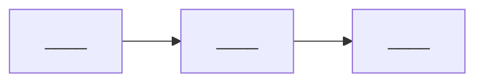

# Project Log

> Template for a learning project (e.g., Q3 depth project from [[05_Roadmap/R4 — Project-Based Learning Tracks|R4]]).

---

**Project name:** ____
**Track** (A / B / C from R4): ____
**Start date:** YYYY-MM-DD
**Target end date:** YYYY-MM-DD
**Status:** in progress / paused / complete / abandoned

## Goal

What will be true when this project is done? Be specific and testable.

> ____

## Schemas exercised

- [[02_Schemas/S_ — _|S_]] — ____ *(how)*
- [[02_Schemas/S_ — _|S_]] — ____ *(how)*
- [[02_Schemas/S_ — _|S_]] — ____ *(how)*

## Architecture

A 1-paragraph description + a diagram (use Mermaid or attach an image).

## Components

| Component | Status | Tests | Notes |
|-----------|--------|-------|-------|
| ____ | not started / in progress / done | __ / __ | ____ |
| ____ | not started / in progress / done | __ / __ | ____ |
| ____ | not started / in progress / done | __ / __ | ____ |

## Weekly milestones

| Week | Milestone | Hit? |
|------|-----------|------|
| 1 | ____ | [ ] |
| 2 | ____ | [ ] |
| 3 | ____ | [ ] |
| 4 | ____ | [ ] |

## Bugs and lessons

A running log of bugs encountered and what they taught.

### Bug 1
- **Symptom:** ____
- **Hypothesis:** ____
- **Root cause:** ____
- **Schema violated:** [[02_Schemas/S_ — _|S_]]
- **Lesson:** ____

### Bug 2
- **Symptom:** ____
- **Hypothesis:** ____
- **Root cause:** ____
- **Schema violated:** [[02_Schemas/S_ — _|S_]]
- **Lesson:** ____

## Reference materials

- **Paper:** [[____]]
- **Book chapters:** ____
- **Reference implementation (read-only):** ____

## Rules

- [ ] No use of canonical libraries (no etcd, no PyTorch, no LLVM).
- [ ] Tests from day 1.
- [ ] Open-sourced.
- [ ] No peeking at reference implementation while writing own (see [[05_Roadmap/R4 — Project-Based Learning Tracks|R4]]).

## Retrospective (filled at end)

> **What schemas did this project deepen?**

> ____

> **Where did schemas mislead?**

> ____

> **What would I do differently?**

> ____

> **What is my mastery level on each schema after this project?**

| Schema | Before | After |
|--------|--------|-------|
| [[02_Schemas/S_ — _|S_]] | _ | _ |
| [[02_Schemas/S_ — _|S_]] | _ | _ |
| [[02_Schemas/S_ — _|S_]] | _ | _ |

---

## Cross-links

- [[05_Roadmap/R4 — Project-Based Learning Tracks|R4 — the project tracks]]
- [[04_Protocols/P5 — How to Debug a System|P5 — debug protocol]]
- [[06_Templates/Daily Session|Daily Session template]]
- [[06_Templates/Monthly Retrospective|Monthly Retrospective template]]
