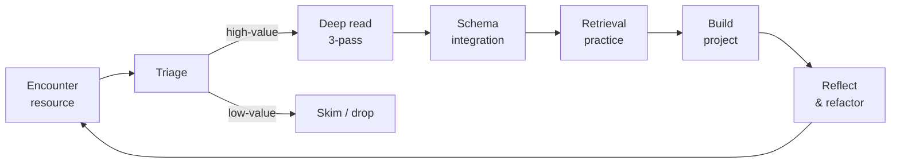

# 🧠 How to Learn Computer Science

> *A complete, evidence-based learning system for mastering computer science in the shortest realistic timeframe — grounded in cognitive science, educational psychology, and expertise research.*

This vault does **not** teach you computer science topics directly. It teaches you **how to learn computer science itself**. Every recommendation is grounded in peer-reviewed research and translated into a concrete, repeatable protocol you can apply today.

---

## 🚪 Start Here

If this is your first time in the vault, read in this order:

1. [[Start-Here]] — orient yourself (5 min)
2. [[Vault-Map]] — see the whole architecture (5 min)
3. [[The-3-7-Year-Arc]] — understand the timeline (10 min)
4. [[MOC-Foundations]] — the cognitive science bedrock (30 min)
5. [[The-Learning-Loop]] — the daily/weekly operating loop (20 min)

Then open the [[Vault-Map.canvas]] for a visual overview.

---

## 📚 The Five Core Pillars

| Pillar | MOC | Research Question |
|---|---|---|
| 🧱 Foundations | [[MOC-Foundations]] | What does cognitive science say about how experts learn? |
| 📖 Reading & Synthesis | [[MOC-Reading-and-Synthesis]] | How do experts parse dense technical prose? |
| 🎯 Information Triage | [[MOC-Information-Triage]] | How do you decide what to ignore? |
| ⚖️ Load Management | [[MOC-Load-Management]] | How do you avoid burnout under volume? |
| 🗺️ Schema Construction | [[MOC-Schema-Construction]] | How do you build transferable mental models? |

Supporting layers:

- 👥 [[MOC-Case-Studies]] — historical workflows (Knuth, Dijkstra, Norvig, McCarthy, Bell Labs)
- 🗺️ [[MOC-Domain-Maps]] — how to attack each CS subdomain
- 🔧 [[MOC-Workflows]] — operational protocols (daily, weekly, project-level)
- 📋 [[09-Templates/]] — Obsidian templates
- 🛣️ [[10-Roadmap/]] — the 3–7 year arc
- ⚙️ [[Obsidian-Setup-Guide]] — configure your vault

---

## 🎯 The Core Thesis

> **High-velocity technical learning is not a talent. It is a set of cognitive, behavioral, and information-processing behaviors that can be explicitly trained.**

The five mechanisms that make it possible:

1. **Long-Term Working Memory** ([[Long-Term-Working-Memory]]) — experts retrieve from LTM, not WM
2. **Schema-driven perception** ([[Schema-Theory-and-Anderson]]) — experts see structure, novices see surface
3. **Selective ignorance** ([[Selective-Ignorance]]) — they read less, but more strategically
4. **Deliberate practice** ([[Deliberate-Practice]]) — they engineer their own feedback loops
5. **Isomorphism detection** ([[Isomorphism-Detection]]) — they map new structure onto old structure

---

## 🔁 The Operating Loop

See [[The-Learning-Loop]] for the full protocol.

---

## 📖 How to Read This Vault

- **Notes are atomic.** Each note is one idea. Links are denser than prose.
- **Read MOCs first.** Each section has a Map of Content that orients you.
- **Theory block → Translation → Protocol → Worked example.** Every note follows this shape.
- **Apply, don't archive.** If a note doesn't change a behavior, you didn't really learn it.
- **Track yourself.** Use the [[Daily-Learning-Log]] template daily.

---

## 🧭 Quick Navigation

- **First time?** → [[Start-Here]]
- **Want the big picture?** → [[Vault-Map.canvas]]
- **Building a curriculum?** → [[MOC-Domain-Maps]]
- **Stuck or burned out?** → [[Burnout-Prevention]] + [[Session-Architecture]]
- **Starting a new book/paper/codebase?** → [[Resource-Triage-Card]]
- **Daily use?** → [[Daily-Learning-Log]]

---

*Vault version: 1.0 · Built from cognitive-science and expertise-research literature · See [[Bibliography]] for full sources.*
