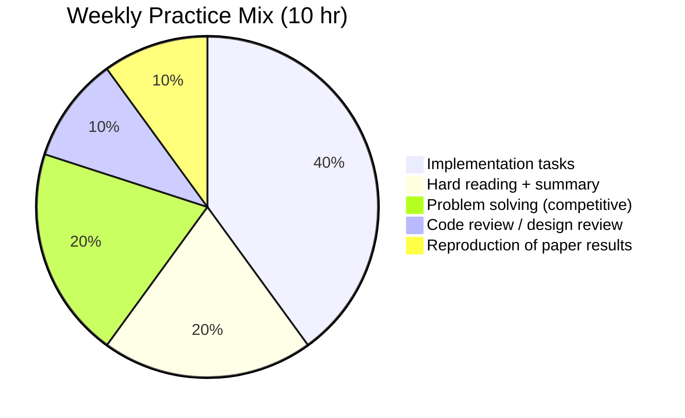

# Deliberate Practice Protocol

> *The operational form of [[Expertise-Research-Ericsson]]. Theory is on the other note; this is what you actually do.*

---

## The Five Requirements

For practice to count as *deliberate*, all five must hold:

1. **Specific performance target.** Not "get better at Go" but "implement a lock-free queue that passes the race detector under 8-thread stress test."
2. **At the edge of competence.** You should fail ~30% of the time. 0% failure = too easy. >50% failure = too hard.
3. **Immediate, informative feedback.** Tests, benchmarks, expert review, working reference. Practice without feedback is just repetition.
4. **Repetition with refinement.** Same task, multiple attempts, each trying to fix a specific deficiency.
5. **Full concentration.** No music with lyrics. No phone. No Slack. Single-task. See [[Environmental-Design]].

---

## The 90-Minute Block

The unit of deliberate practice is the 90-minute focused block.

```
00:00 - 05:00  Prime: read target, recall relevant schemas
05:00 - 75:00  Work: at the edge, single-tasked, with feedback loops running
75:00 - 90:00  Reflect: log what was hard, what you learned, what's next
```

- One block per day is sustainable for years.
- Two blocks per day is sustainable for ~3-6 months before burnout risk.
- Three+ blocks per day is unsustainable for almost everyone.

For more: [[Session-Architecture]].

---

## Designing a Practice Task

Use this template (see [[Project-Implementation-Log]]):

```markdown
## Practice Task: <name>
Target: <measurable outcome>
Edge indicator: <what 30% failure looks like>
Feedback source: <test/benchmark/reviewer/reference>
Reps planned: <N sessions>
Success criterion: <when do I move on?>
```

### Examples

**Task**: Implement a malloc/free
- Target: Pass all tests in malloc-lab, peak utilization > 80%
- Edge indicator: Free list coalescing logic will be wrong first 2-3 attempts
- Feedback source: Test suite + benchmark against glibc malloc
- Reps: 3 sessions (each from scratch)
- Success: All tests pass + utilization > 80% on all traces

**Task**: Read & summarize Lamport's "Time, Clocks"
- Target: 1-page summary that a peer could use to teach the paper
- Edge indicator: Will initially fail to articulate why physical clocks are insufficient
- Feedback source: Compare summary to a known-good summary (e.g., Murat Demirbas's blog)
- Reps: 2 sessions (read, summarize, compare, re-summarize)
- Success: Summary teaches the paper without misleading

**Task**: Debug a concurrency issue in unfamiliar code
- Target: Identify root cause + write failing test + fix
- Edge indicator: Will spend 30+ min on red herrings
- Feedback source: Test suite; can reproduce deterministically
- Reps: 1 session
- Success: Fix merged, test added

---

## Avoiding the Anti-Patterns

### Anti-pattern 1: Tutorial loops
Tutorials are below your edge. They feel productive but don't build skill. **Rule**: never do a tutorial that you can complete without failing at least once.

### Anti-pattern 2: Production without feedback
Writing production code with no tests, no review, and no benchmarks is *performance*, not practice. You'll plateau.

### Anti-pattern 3: Reading without application
Reading a paper without a follow-up activity (summary, reproduction, implementation) is consumption, not practice. Forgetting rate is ~80% in 1 week. See [[Testing-Effect-Retrieval-Practice]].

### Anti-pattern 4: Solving only what you're good at
Comfortable practice = zero growth. **Rule**: every 4th session should be on your weakest subdomain.

### Anti-pattern 5: No rest
Deliberate practice without recovery produces fatigue, not expertise. See [[Burnout-Prevention]].

---

## The Weekly Practice Mix

For a 10-hour deliberate-practice week:



Adjust to your goals, but keep at least 60% in *implementation* and *problem-solving*. Reading without building produces shallow schemas.

---

## Logging

Every session ends with a [[Daily-Learning-Log]] entry:

```markdown
## Session — YYYY-MM-DD
- Task: <one line>
- Time: 90 min
- Edge: <what was at the edge today>
- Failures: <what I got wrong>
- Feedback received: <from where>
- Next: <what to change tomorrow>
```

After 3 months, you'll have ~90 entries. Patterns will emerge: "I consistently fail at X," "I avoid Y," "I learn fastest when Z."

---

## Cross-Links

- [[Expertise-Research-Ericsson]] — the theory this protocol operationalizes
- [[Session-Architecture]] — the 90-min block in context
- [[Build-to-Learn]] — implementation as consolidation
- [[Daily-Learning-Log]] — the logging template
- [[Project-Implementation-Log]] — multi-session project tracking

← Back to [[MOC-Foundations]]
