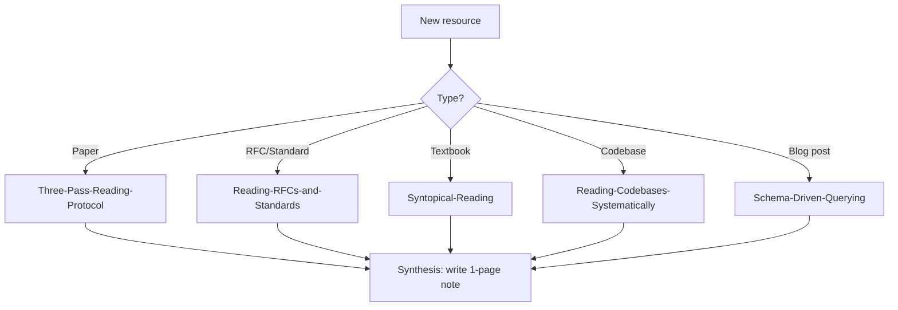

# 📖 MOC — Reading & Synthesis

> *How experts physically and mentally parse dense technical literature.*

---

## The Core Mechanism

Experts do not read dense technical material linearly. They use a layered, schema-driven approach:

1. **Pre-load schema** — prime LTM with the structure of what's coming (see [[Schema-Driven-Querying]])
2. **Structural pass** — map the topology (sections, figures, claims) before reading content
3. **Selective deep pass** — read only the parts where the structure is novel
4. **Synthesis pass** — connect to existing schemas; produce a written artifact

Novices do the opposite: linear, depth-first, no priming, no synthesis.

---

## Notes in This Section

- [[Expert-vs-Novice-Reading]] — empirical differences in eye-tracking and comprehension
- [[Syntopical-Reading]] — Adler's method applied to multi-source technical reading
- [[Schema-Driven-Querying]] — reading with a question, not a paragraph
- [[Reading-RFCs-and-Standards]] — protocol for IETF specs and similar
- [[Reading-Research-Papers]] — Keshav's three-pass method
- [[Reading-Codebases-Systematically]] — beacon-driven code navigation
- [[Three-Pass-Reading-Protocol]] — the operational protocol

---

## Reading Protocol Decision Tree

---

## The Synthesis Imperative

Reading without synthesis = forgetting. Every reading session must produce a written artifact:

- Paper → 1-page summary in [[Concept-Note-Template]]
- RFC → annotated note with state machine + key invariants
- Textbook chapter → reformulated in your own words + 3 problems solved
- Codebase → architectural sketch + entry-point map

The artifact is the *evidence* that you learned. No artifact, no learning.

---

## Reading Speed Is a Function of Schema Density

A novice reads a distributed systems paper at ~2 pages/hour with ~30% retention.
An expert reads the same paper at ~10 pages/hour with ~70% retention.

The 5x speed difference is not "reading faster." It is the expert retrieving 5-10 LTM schemas per paragraph that the novice must construct from scratch. See [[Long-Term-Working-Memory]].

**Implication**: do not try to read faster. Try to *build schemas faster*. Speed follows.

---

← Back to [[Home]]
