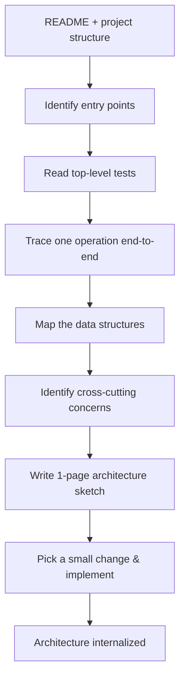

# Reading Codebases Systematically

---

## The Problem

A 100,000-line codebase is not "100,000 lines of reading." It is a *system* with structure, conventions, invariants, and emergent behavior. Reading it line-by-line is impossible and pointless.

A senior engineer can absorb the architecture of a 100k-line codebase in 1-2 days. A novice takes weeks and often still doesn't understand it. The difference is *method*.

---

## Theory: Beacon-Driven Navigation

Studies of programmer navigation (Storey, 2005; DeLine et al., 2007) show that experts navigate codebases using **beacons** — high-information anchors that reveal structure:

- **Entry points**: `main()`, request handlers, CLI dispatchers
- **Public interfaces**: API surfaces, exported functions
- **Type definitions**: structs/classes/enums that name domain concepts
- **Comments at file boundaries**: the 5-line header that explains what this module does
- **Tests**: encode expected behavior and invariants
- **Configuration**: what knobs exist and what they mean

Novices read sequentially. Experts navigate beacons.

---

## CS Translation

Codebase reading is itself a learnable skill. Three levels:

### Level 1 — Tourist (1-2 hours)

Goal: *What does this system do, and how is it organized?*

1. Read the README. (5 min)
2. Read the top-level directory structure. (5 min)
3. Find the entry points. (10 min)
4. Trace one request/operation end-to-end. (30-60 min)
5. Read the test directory structure. (10 min)
6. Read the build/CI configuration. (10 min)

**Output**: A 1-page architectural sketch.

### Level 2 — Resident (1-2 days)

Goal: *I can make a small change safely.*

1. Pick a feature or bug to fix.
2. Identify the files involved (using grep, file names, tests).
3. Read those files deeply.
4. Identify the conventions (error handling, logging, testing patterns) by reading 3-5 existing examples.
5. Make the change. Run the tests.
6. Get a code review from someone who knows the codebase.

**Output**: A working change + a mental model of one subsystem.

### Level 3 — Native (1-3 months)

Goal: *I can design changes that span multiple subsystems.*

1. Read the entire `docs/` directory (if it exists).
2. Read the major data structure definitions (often in one or two files).
3. Read the entire test suite once (don't run, just read).
4. Trace every cross-cutting concern: logging, error handling, metrics, auth, configuration.
5. Read the git history of the most-changed files (reveals what's stable and what's in flux).
6. Read recent design docs / RFCs / PRs that touch the system.

**Output**: A 5-10 page architectural document you wrote yourself, that becomes your reference.

---

## Protocol: The First Day in a Codebase



### Step 1 — README and structure (15 min)

- Read README fully
- List the top-level directories; for each, write 1 line: "what lives here?"
- Identify the build system, test runner, and CI config

### Step 2 — Find entry points (15 min)

For a CLI: where is `main()`?
For a server: where is the request dispatcher?
For a library: what's the public API?

Read the entry point carefully. It usually reveals the system's top-level architecture.

### Step 3 — Read top-level tests (30 min)

Tests are documentation that compiles. They encode:

- What the system is supposed to do
- The expected invariants
- The common usage patterns
- The edge cases the authors cared about

Don't run them. Just read.

### Step 4 — Trace one operation (30-60 min)

Pick one user-visible operation. Trace it from entry to exit:

- "What happens when a user creates an account?"
- "What happens when a packet arrives?"
- "What happens when a query is executed?"

Take notes. Draw a sequence diagram.

### Step 5 — Map the data structures (30 min)

Find the file that defines the major domain types (User, Order, Connection, Request, etc.). Read it. This file often reveals the entire domain model.

### Step 6 — Cross-cutting concerns (30 min)

For each of: error handling, logging, configuration, metrics, auth — find *one* example. You don't need to read every call site; you need to know the pattern.

### Step 7 — Write the sketch (30 min)

A 1-page document:

```
System: <name>
Purpose: <1 sentence>
Entry points: <list>
Major subsystems: <list with 1-line descriptions>
Core data model: <list of main types>
Cross-cutting patterns:
  - Error handling: <pattern>
  - Logging: <pattern>
  - ...
Operation trace: <sequence diagram or step list>
```

This document goes into your [[Concept-Note-Template|concept notes]].

### Step 8 — Make a small change (1-3 hours)

The fastest way to internalize a codebase is to change it. Pick a 5-20 line change (typo fix, comment improvement, small bug fix). Implement it. Run tests. Open a PR.

You are now a *resident*, not a tourist.

---

## Common Anti-Patterns

- ❌ Reading every file from `src/` down (impossible; pointless)
- ❌ Setting up the dev environment before reading any code (wastes a day)
- ❌ Starting with the hardest part (you don't have the schemas yet)
- ❌ Reading without taking notes (you'll forget 90% in a week)
- ❌ Using IDE "Go to Definition" reflexively (breaks top-down understanding)

---

## Tooling

- **`grep`/`ripgrep`** — find symbols, find usages
- **`git log -p -- path/to/file`** — history of a file
- **`git log --diff-filter=A --summary`** — find when files were added
- **Treesitter / LSP** — semantic navigation
- **`ast-grep`** — structural search

Use tools to *augment* beacon-driven navigation, not replace it. Don't grep randomly; grep for symbols you identified in your architecture sketch.

---

## Key Citations

- Storey, M. A. (2005). Theories, methods and tools in program comprehension. *IEEE IWPC*.
- DeLine, R., Czerwinski, M., Robertson, G. (2005). Easing program comprehension by sharing navigation data. *IEEE VL/HCC*.
- Soloway, E., Ehrlich, K. (1984). Empirical studies of programming knowledge. *IEEE Transactions on Software Engineering*. [Beacons concept]

Full citations: [[Bibliography]]

---

## Cross-Links

- [[Expert-vs-Novice-Reading]] — beacon-driven reading is the codebase analogue
- [[Schema-Driven-Querying]] — codebase reading is query-driven
- [[Concept-Note-Template]] — for the architecture sketch
- [[Build-to-Learn]] — implementation as the consolidation step

← Back to [[MOC-Reading-and-Synthesis]]
