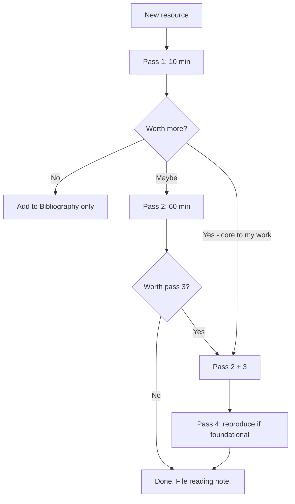

# Three-Pass Reading Protocol (Obsidian-Ready)

> *Operational form of [[Reading-Research-Papers]]. Paste this into every reading session.*

---

## When to Use

- Reading a research paper
- Reading a long technical blog post
- Reading a chapter of a textbook
- Reading an RFC (with the [[Reading-RFCs-and-Standards|RFC-specific modifications]])

## When Not to Use

- Reading a 2-page blog post → just read it
- Reading API documentation → use [[Schema-Driven-Querying]]
- Reading a novel → just read it
- Reading for breadth across many sources → use [[Syntopical-Reading]]

---

## Pass 1 — Triage (5-10 min)

**Goal**: Decide whether this is worth more time.

```
[ ] Read title + abstract
[ ] Read introduction
[ ] Read all section headings
[ ] Read conclusion
[ ] Skim references for familiar/unfamiliar works
```

**Output** (in your reading note):

```markdown
## Pass 1 — YYYY-MM-DD
- Topic: <1 sentence>
- Claim: <1 sentence>
- Worth pass 2? [Y/N/Reference-only]
```

If "Reference-only": Add 1-line summary to [[Bibliography]], stop.

---

## Pass 2 — Structural (45-60 min)

**Goal**: Understand the argument without verifying it.

```
[ ] Read all sections, skipping:
    - Dense proofs (read theorem statements only)
    - Evaluation details (read headline numbers + figures)
[ ] Mark unfamiliar references for later
[ ] Examine every figure and table carefully
[ ] Identify the 3-5 threshold concepts
```

**Output**:

```markdown
## Pass 2 — YYYY-MM-DD
- Problem: <1 sentence>
- Contribution: <1-3 sentences>
- Method (key idea): <1 paragraph>
- Evaluation summary: <1 paragraph>
- Threshold concepts: <list>
- Limitations / open questions: <list>
- My assessment: <1 paragraph — is the contribution real? method sound? eval convincing?>
- Worth pass 3? [Y/N]
```

Usually stop here. Pass 3 only if you will build on this work or suspect it's wrong.

---

## Pass 3 — Deep (2-5 hours)

**Goal**: Virtually re-implement the work. Critique it.

```
[ ] For each method section:
    [ ] Re-derive the algorithm in pseudo-code
    [ ] Re-derive each proof step (note any gaps)
[ ] For each evaluation:
    [ ] Predict expected results
    [ ] Compare to actual; note divergences
[ ] List every assumption (including implicit ones)
[ ] Identify what the paper does NOT claim
[ ] Compare to 2-3 related works
[ ] Sketch how you would extend or test this work
```

**Output**:

```markdown
## Pass 3 — YYYY-MM-DD
### Re-derivation
<your pseudo-code>

### Assumptions
<list>

### Limitations (claimed + unclaimed)
<list>

### Comparison to related work
| This paper | <related 1> | <related 2> |
|---|---|---|
| ... | ... | ... |

### Critique
<your assessment of weaknesses, missing baselines, unstated assumptions>

### Extension sketch
<what you would do next, given this work>
```

---

## Pass 4 — Reproduce (optional, 4-10 hours)

**Goal**: Make the claims operational.

```
[ ] Get the code (if available) — clone, build, run
[ ] If no code, re-implement a minimal version
[ ] Reproduce at least one experiment
[ ] Document divergences from the paper
```

**Output**: A repo link or a written reproduction report.

---

## The Reading Note Template

Every reading session produces a note based on [[Concept-Note-Template]]. Save in your reading notes folder. Tag with the topic for [[Dataview-Queries|Dataview]] aggregation.

```yaml
---
type: reading-note
source: "<paper title, authors, year>"
url: "<link>"
read: YYYY-MM-DD
pass: 1  # or 2, 3, 4
tags: [topic1, topic2]
rating: 4  # 1-5, your assessment of value
---

# <Paper title>

## Pass <N> — <Date>

<output from above>
```

---

## Decision Tree



---

## Anti-Patterns

- ❌ Skipping Pass 1 and going straight to Pass 2 → wastes 60 min on papers you should have rejected
- ❌ Doing Pass 3 on papers that only warrant Pass 1 → wastes hours
- ❌ Doing Pass 2 without producing a written summary → no consolidation
- ❌ Reading 10 papers in a row at Pass 1 without decisions → triage without action
- ❌ Treating "Pass 1" as "I'll come back later" — make the decision now

---

## Cross-Links

- [[Reading-Research-Papers]] — the theory
- [[Resource-Triage-Card]] — for the Pass 1 decision
- [[Concept-Note-Template]] — the note structure
- [[Bibliography]] — where reference-only entries go

← Back to [[MOC-Reading-and-Synthesis]]
