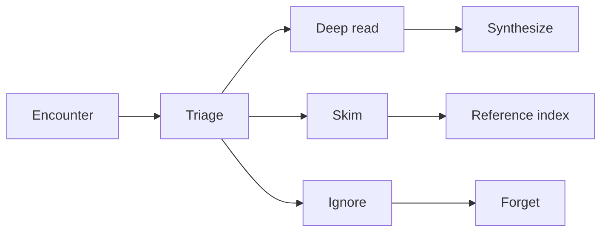

# 🎯 MOC — Information Triage

> *How high-velocity learners decide what to read, what to skim, and what to ignore.*

---

## The Core Problem

> *"It is physically impossible to read everything deeply."*

CS literature doubles every ~5-7 years. Even within a subfield (say, distributed systems), the rate of new papers, blog posts, RFCs, and code releases exceeds any human's reading capacity by 100x.

High-velocity learners are not the ones who read more. They are the ones who **read less, but more strategically**.

---

## Notes in This Section

- [[Selective-Ignorance]] — the master skill
- [[Threshold-Concepts]] — what to read first
- [[Constraint-Based-Analysis]] — predicting value before reading
- [[Resource-Utility-Heuristics]] — fast triage rules
- [[Triage-Decision-Tree]] — the operational flowchart

---

## The Three-Bucket Model

Every resource you encounter goes into one of three buckets:

**Target distribution** for a mature learner:
- Deep read: ~10% of encountered resources
- Skim: ~30%
- Ignore: ~60%

If you find yourself deep-reading >25% of what you encounter, your triage is failing. You're either (a) encountering too narrow a range or (b) over-committing to mediocre material.

---

## The Cost of Premature Depth

Reading a 300-page book deeply takes ~30 hours. If you read the wrong book, that's 30 hours *not* spent on the right book. Worse, the wrong book's framing may actively interfere with later learning of the right one (see [[Cognitive-Flexibility-Theory]] — a single poorly-chosen case can mislead).

Time spent triaging is high-leverage: 5 minutes of triage can save 30 hours of misdirected reading.

---

## The Default Heuristic

> **Read the minimum number of canonical sources deeply; everything else is reference.**

For any given CS subdomain, there are usually 3-5 canonical sources that everyone agrees are foundational. Read those. Everything else is skim-or-ignore unless a specific need arises.

Examples:

- **Algorithms**: CLRS + Sedgewick + Kleinberg-Tardos. Stop.
- **Operating systems**: OSTEP + Silberschatz. Stop.
- **Networks**: Kurose-Ross + Stevens TCP/IP Illustrated vol. 1. Stop.
- **Databases**: Hellerstein et al. (Red Book) + Garcia-Molina. Stop.
- **Distributed systems**: Kleppmann + Tanenbaum-van Steen. Stop.
- **Compilers**: Dragon Book + SICP chapters 4-5 + Appel. Stop.
- **ML**: Bishop + Goodfellow + ESL (cherry-pick). Stop.

Everything else is *context*, not *core*. Read it as needed.

---

## Cross-Links

- [[Selective-Ignorance]] — the master skill
- [[Resource-Triage-Card]] — Obsidian template
- [[MOC-Reading-and-Synthesis]] — what to do with what you don't ignore

← Back to [[Home]]
