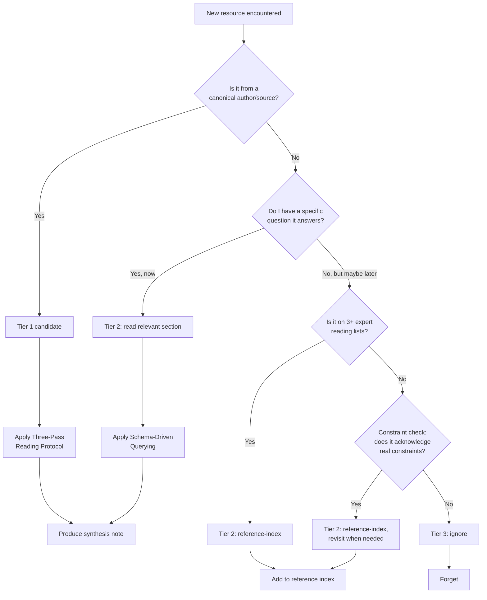

# Triage Decision Tree

> *Operational form of [[Resource-Utility-Heuristics]] and [[Selective-Ignorance]].*

---

## The Decision Tree

---

## Step-by-Step

### Step 1 — Encounter

You see a paper, book, blog post, or video recommended.

### Step 2 — Authority check (1 min)

- Is the author an expert in this subdomain?
- Is the source canonical (top conference, established publisher, well-known blog)?
- **Yes** → Step 3
- **No** → Step 4

### Step 3 — Tier 1 candidate

- Add to your "to-read" list (Tier 1)
- Apply [[Three-Pass-Reading-Protocol]] when scheduled
- Done.

### Step 4 — Specific need check (1 min)

- Do I have a specific question this resource answers *right now*?
- **Yes** → Step 5 (Tier 2)
- **No** → Step 6

### Step 5 — Tier 2 (skim)

- Apply [[Schema-Driven-Querying]]
- Read only the relevant section
- Add to reference index
- Done.

### Step 6 — Canonical reading list check (1 min)

- Does this resource appear on 3+ expert reading lists for the subdomain? (Check [[MOC-Domain-Maps]])
- **Yes** → Step 7 (Tier 2)
- **No** → Step 8

### Step 7 — Tier 2 (reference-index)

- Add to reference index with 1-line summary
- Don't read now
- Done.

### Step 8 — Constraint check (2 min)

- See [[Constraint-Based-Analysis]]
- Does the work acknowledge real constraints of the subdomain?
- **Yes** → Step 7 (Tier 2)
- **No** → Step 9

### Step 9 — Tier 3 (ignore)

- Don't add to your reading list
- Don't bookmark
- Move on
- Done.

---

## Frequency of Decisions

For a self-directed CS learner over a year, expect:

- ~500 resources encountered
- ~50 Tier 1 decisions (10%)
- ~150 Tier 2 decisions (30%)
- ~300 Tier 3 decisions (60%)

If your Tier 1 rate is >20%, you're being too permissive. Tighten the authority and canonical checks.

---

## The Revisit Rule

Every 6 months, revisit your reference index. Ask:

- Have I encountered this resource's name 3+ times in the last 6 months?
- Have I had a question it would answer?

If yes to either → promote to Tier 2 active or Tier 1.

If no → consider demoting to Tier 3.

The reference index is *not* a graveyard. It's an active triage surface.

---

## The Escalation Rule

If a Tier 3 resource keeps coming up (e.g., you've ignored it 5 times but it keeps being recommended), escalate it. Five recommendations from independent sources is a strong signal that you're missing something.

Don't escalate just because one person recommends it loudly. Escalate on *independent* recommendations.

---

## Anti-Patterns

- ❌ Reading everything that gets recommended
- ❌ Bookmarking everything "for later" (you won't read it)
- ❌ Triaging without writing the decision down (you'll re-triage the same resource 5 times)
- ❌ Letting Tier 2 become a graveyard (revisit regularly)
- ❌ Treating this as a one-time decision (your schemas change; so should your triage)

---

## Template

Use [[Resource-Triage-Card]] to record each triage decision. After 3 months, you'll have ~100 cards. Patterns will emerge: which authors you trust, which sources are signal vs noise, which topics you're over- or under-investing in.

---

## Cross-Links

- [[Selective-Ignorance]] — the principle
- [[Resource-Utility-Heuristics]] — the underlying rules
- [[Resource-Triage-Card]] — Obsidian template
- [[Triage-Decision-Tree]] — this flowchart

← Back to [[MOC-Information-Triage]]
