# Session Architecture

> *Designing the 90-minute block and the day around it.*

---

## The 90-Minute Block

The unit of deliberate practice is the 90-minute block. This is not arbitrary; it reflects:

- Ultradian rhythm (~90-min cycles in human attention)
- Cognitive resource depletion curves
- Empirical observation of expert practitioners (musicians, writers, programmers)

```mermaid
gantt
    title 90-Minute Deep Work Block
    dateFormat X
    axisFormat %M
    section Block
    Prime (recall schemas) :a1, 0, 5m
    Deep work (single-task) :a2, after a1, 70m
    Reflect & log :a3, after a2, 15m
```



### Phase 1 — Prime (5 min)

- Recall what you already know about the topic (this activates LTM schemas, reducing WM load during deep work)
- Write down 1-3 questions you want answered
- Eliminate distractions (close tabs, phone in another room, water/tea ready)

### Phase 2 — Deep work (70-80 min)

- Single-task
- At the edge of competence
- With active feedback loops
- Pause for 5 min every 25-30 min if saturation approaches (see [[Working-Memory-Saturation]])
- If you hit the wall early, stop early — don't extend the block

### Phase 3 — Reflect & log (10-15 min)

- Write a [[Daily-Learning-Log]] entry
- What was hard? What did you learn? What's the next step?
- This reflection is *part of the practice*, not optional

---

## The Day

A sustainable day has 1-3 deep work blocks, separated by recovery:

```mermaid
gantt
    title Sustainable Day
    dateFormat X
    axisFormat %H:%M
    section Morning
    Block 1 (deep work) :a1, 0, 90m
    Break (walk, eat) :a2, after a1, 60m
    section Afternoon
    Block 2 (deep work) :a3, after a2, 90m
    Break :a4, after a3, 60m
    section Late afternoon
    Block 3 (lower-load: review, light reading, code review) :a5, after a4, 60m
```

- **Block 1**: highest-load work (when you're freshest)
- **Block 2**: medium-load work
- **Block 3**: low-load work (review, retrieval practice, lighter reading)

Three blocks of 90 min = 4.5 hours of deep work. That's near the ceiling for sustainable deliberate practice.

---

## The Week

```mermaid
gantt
    title Sustainable Week
    dateFormat X
    axisFormat %a
    section Mon-Fri
    3 deep blocks/day :a1, 0, 5d
    section Sat
    1-2 deep blocks :a2, after a1, 1d
    section Sun
    Rest, light review only :a3, after a2, 1d
```



- 5 days × 4.5 hours = 22.5 deep hours
- 1 day × 2-3 hours = 2.5 deep hours
- 1 day = rest (light review OK; no new material)
- **Total: ~25 deep hours/week**

This is *not* a maximum-effort schedule. It's a *sustainable indefinitely* schedule. Maintained for 4 years, this is ~5,000 hours of deliberate practice — within the Ericsson range for solid expertise.

---

## Variation by Energy Level

Not all days are equal. Energy fluctuates with sleep, stress, health, and season. Adjust:

| Energy | Block count | Block length | Activity |
|---|---|---|---|
| High (slept well, low stress) | 3 × 90 min | 90 min | Hardest material |
| Normal | 2 × 90 min | 90 min | Standard material |
| Low (poor sleep, mild stress) | 1-2 × 60 min | 60 min | Familiar material, review |
| Recovering (sick, jet-lagged) | 0-1 × 45 min | 45 min | Light review only |

**Don't fight low-energy days.** Reduce load, recover faster, return to full capacity sooner.

---

## Pre-Session Ritual

A consistent ritual reduces context-switching cost:

1. Same physical space (see [[Environmental-Design]])
2. Same start time (circadian alignment)
3. Same pre-session beverage (tea, water; not coffee for afternoon blocks)
4. Same opening activity (review yesterday's log, 2 min)
5. Same closing activity (write today's log, 10 min)

After 2-3 weeks, the ritual itself becomes a retrieval cue for "deep work mode." You enter focus faster.

---

## The 4 Block Types

Not all blocks are reading. Vary block types:

### Block Type A — Hard reading + summary
- Read 1-2 hard sections of a paper/book
- Write 1-page summary
- 90 min total

### Block Type B — Implementation
- Build something at the edge of competence
- 90 min single-task
- No reading during the block

### Block Type C — Problem-solving
- Solve 2-4 problems (Advent of Code, Project Euler, course problems)
- 90 min
- After: review solutions, note patterns

### Block Type D — Retrieval & review
- Spaced repetition cards
- Re-read own notes from 1 week ago
- Self-test on concepts
- 45-60 min (this is lower-load)

A sustainable week has a mix of all 4 types. Reading-only weeks produce shallow schemas; implementation-only weeks produce unreflected skill.

---

## Common Anti-Patterns

- ❌ 4+ deep blocks/day (you will burn out in 6 weeks)
- ❌ Blocks > 90 min (quality collapses)
- ❌ Blocks without reflection (you forget 70% in 24 hours)
- ❌ Blocks without breaks (saturation → no learning)
- ❌ Mixing block types within a block (no implementation + reading + SR in 90 min)
- ❌ Scheduling deep work in the post-lunch slump (energy mismatch)
- ❌ Skipping rest days (compounds fatigue)

---

## Cross-Links

- [[Deliberate-Practice]] — the theory behind the 90-min block
- [[Working-Memory-Saturation]] — why blocks end at 90 min
- [[Burnout-Prevention]] — what happens if you violate the weekly rhythm
- [[Daily-Learning-Log]] — the reflection template
- [[Environmental-Design]] — setting up the space

← Back to [[MOC-Load-Management]]
