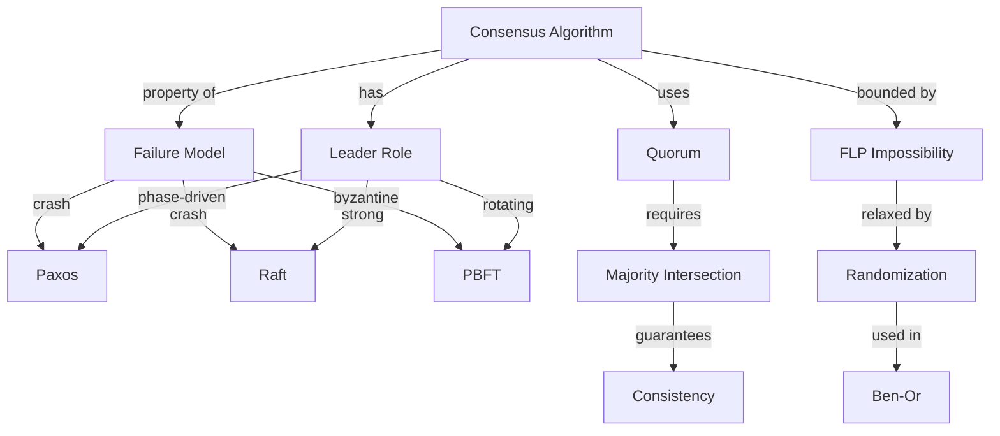

# Concept Mapping Protocol

> Novak, J. D., & Cañas, A. J. (2008). *The Theory Underlying Concept Maps*.

---

## Theory

A **concept map** is a visual representation of relationships between concepts. Unlike mind maps (which radiate from a central node), concept maps are networks with labeled edges specifying the *type* of relationship.

Research (Novak; Cañas) shows concept mapping:
- Forces explicit articulation of relationships
- Reveals gaps in understanding (you can't draw a relationship you can't articulate)
- Produces a stable external artifact you can revisit
- Supports retrieval practice (re-draw from memory)

---

## CS Translation

Concept maps are especially useful for:

- Comparing N related systems (consensus algorithms, sorting algorithms, type systems)
- Mapping a domain's structure (the "what is operating systems" map)
- Tracking schema evolution (re-draw every 3 months; see what changed)

---

## Protocol: Building a Concept Map

### Step 1 — Define the focus question
A good map answers a specific question. Bad: "Distributed systems." Good: "How do distributed systems achieve consensus under partial failure?"

### Step 2 — List concepts (5-20)
Brainstorm every relevant concept. Don't worry about structure yet.

For consensus: *proposal, acceptor, quorum, majority, ballot, leader, follower, log, partition, crash, Byzantine, vote, promise, accept, commit, viewstamped, Paxos, Raft, PBFT.*

### Step 3 — Identify the most general concept
Place it at the top. (For consensus: "consensus algorithm.")

### Step 4 — Arrange hierarchically
Place more general concepts above, more specific below. Don't force a strict hierarchy — branches cross-link.

### Step 5 — Add labeled edges
Each edge has a *linking phrase*: "is-a," "uses," "differs from," "generalizes," "specializes," "requires," "produces."

Example: `Paxos --specializes--> consensus algorithm`
Example: `Raft --differs from--> Paxos (along axis: leader role)`

### Step 6 — Add cross-links
The most important step. Cross-links connect branches, revealing non-obvious relationships. They're where insight lives.

Example: `quorum --requires--> majority (because: majority quorums intersect)`

### Step 7 — Iterate
First draft will be wrong. Revise 3-5 times over a week.

---

## The Comparison Matrix

A special form of concept map for comparing N systems across M dimensions:

| System | Failure model | Leader | Message complexity | Liveness |
|---|---|---|---|---|
| Paxos | Crash | Phase-driven | O(n) | Eventual |
| Raft | Crash | Strong leader | O(n) | Eventual |
| PBFT | Byzantine | Rotating primary | O(n²) | Eventual |
| Viewstamped | Crash | View-based | O(n) | Eventual |

The matrix is the simplest, highest-ROI form of concept mapping. Always start with a matrix.

---

## Worked Example: Concept Map for "Consensus"

Drawing this map yourself, from memory, after studying the topic is itself a powerful retrieval exercise.

---

## Software

- **Mermaid** in Obsidian (built-in) — text-based, version-controllable
- **Excalidraw plugin** for Obsidian — free-form, hand-drawn style
- **Obsidian Canvas** — visual node-and-edge layout
- **Graphviz** (via plugin) — automatic layout

Recommendation: use Mermaid for structured maps (consensus comparison), Excalidraw for free-form thinking.

---

## Common Anti-Patterns

- ❌ Mind maps (radial, unlabeled edges) — lack the linking phrases that make concept maps powerful
- ❌ Maps with too many concepts (>25) — become unreadable; split into multiple maps
- ❌ Maps you only draw once — the value is in iteration
- ❌ Maps you don't re-derive from memory — drawing from memory is the retrieval exercise

---

## Key Citations

- Novak, J. D., & Cañas, A. J. (2008). The theory underlying concept maps. *Concept Maps: Theory, Methodology, Technology*.
- Nesbit, J. C., & Adesope, O. O. (2006). Learning with concept and knowledge maps: A meta-analysis. *Review of Educational Research, 76*(3), 413-448.

Full citations: [[Bibliography]]

---

## Cross-Links

- [[Schema-Map-Note]] — Obsidian template
- [[Cognitive-Flexibility-Theory]] — comparison matrices are criss-crossing
- [[Concept-Note-Template]] — for individual concepts
- [[Isomorphism-Detection]] — cross-links reveal isomorphisms

← Back to [[MOC-Schema-Construction]]
