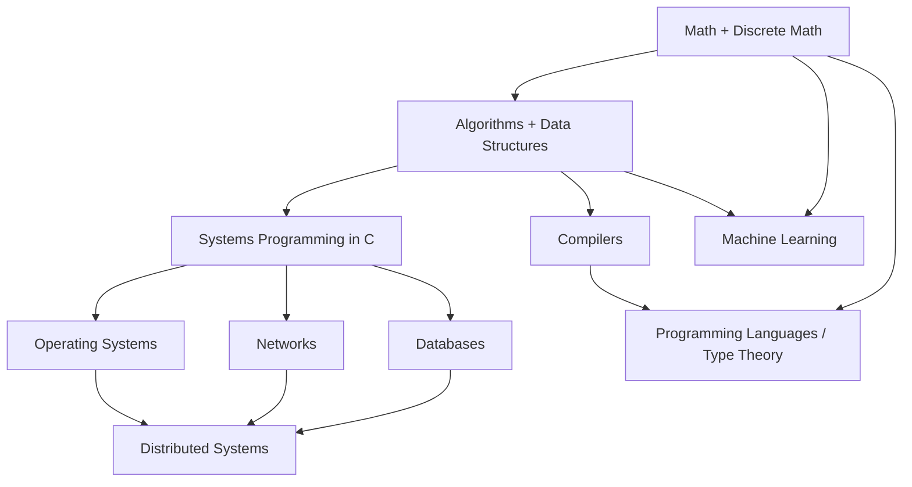

# 🗺️ MOC — CS Domain Maps

> *How to attack each CS subdomain using the cognitive-science principles in this vault.*

---

## The Purpose

This section translates the abstract learning principles ([[Cognitive-Load-Theory|CLT]], [[Long-Term-Working-Memory|LT-WM]], [[Deliberate-Practice|DP]], etc.) into specific plans for each major CS subdomain.

Each domain map answers:

- What are the **threshold concepts**? (Learn these first.)
- What are the **canonical sources**? (Read these deeply.)
- What are the **common failure modes** in learning this domain?
- What **build projects** consolidate the schemas?
- What are the **triage shortcuts** for this domain?

---

## The Domain Maps

- [[Learn-Math-for-CS]] — discrete math, linear algebra, probability, proofs
- [[Learn-Algorithms-and-Data-Structures]] — complexity, core data structures, algorithm design
- [[Learn-Systems-Programming]] — C, memory, concurrency primitives
- [[Learn-Operating-Systems]] — processes, memory, file systems, scheduling
- [[Learn-Networks]] — protocols, layering, the TCP/IP stack
- [[Learn-Databases]] — storage, indexing, transactions, query optimization
- [[Learn-Compilers]] — lexing, parsing, code generation, optimization
- [[Learn-Distributed-Systems]] — consensus, replication, fault tolerance, CAP
- [[Learn-ML]] — linear models, neural nets, training, evaluation
- [[Learn-Programming-Languages]] — paradigms, semantics, type systems

---

## The Learning Order

A typical 3-7 year arc:



This order respects prerequisite relationships. See [[The-3-7-Year-Arc]] for the timeline.

---

## The Domain-Map Template

Each domain map below follows this template:

```markdown
# Learn <Domain>

## Threshold Concepts
<the 5-10 ideas you must cross first>

## Canonical Sources (Tier 1)
<3-5 books/papers to read deeply>

## Reference Index (Tier 2)
<resources to consult on demand>

## Common Failure Modes
<mistakes that slow learning>

## Build Projects
<5-10 projects that consolidate schemas>

## Triage Shortcuts
<how to filter resources in this domain>

## Estimated Time
<rough hours for solid competence>
```

---

## How to Use

1. Pick the domain you're currently learning
2. Read its map
3. Identify your current sub-phase (threshold crossing? canonical reading? build?)
4. Execute that phase using the protocols in [[MOC-Workflows]]
5. When the domain is "done" (you've crossed thresholds + read Tier 1 + built 3+ projects), move to the next

Don't try to learn all domains in parallel. 2-3 at a time is the max.

---

← Back to [[Home]]
