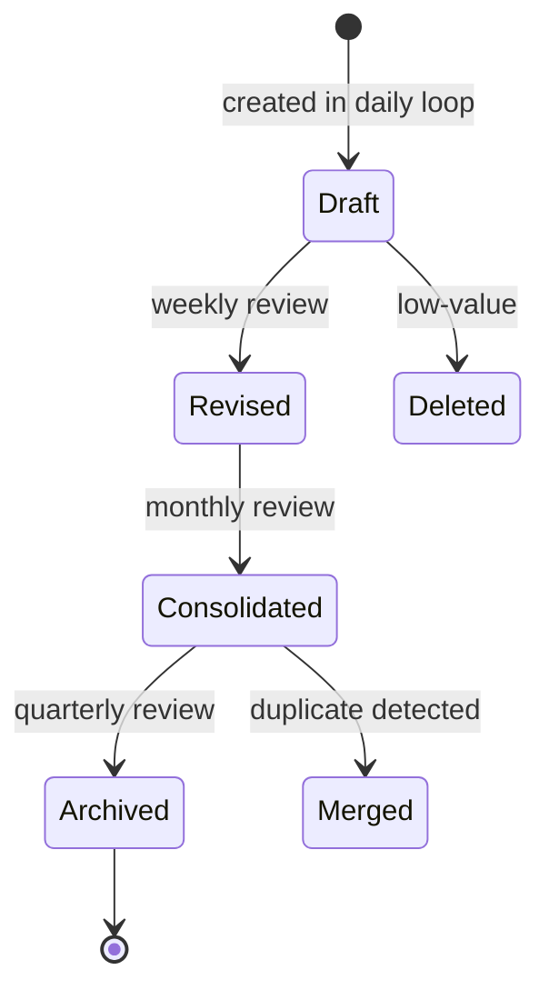

# Knowledge Consolidation Workflow

> *Converting scattered notes into coherent schemas.*

---

## The Problem

After 3 months of running [[The-Learning-Loop]], you'll have:
- 50+ reading notes
- 30+ concept notes
- 10+ project logs
- 100+ daily log entries
- 200+ SR cards

This is raw material. Without consolidation, it's an unorganized pile. With consolidation, it becomes a structured knowledge base that compounds.

---

## The Workflow

### Step 1 — Daily micro-consolidation (5 min, end of each block)

After each [[The-Learning-Loop|learning loop]] block:

1. Add 1-2 [[Concept-Note-Template|concept notes]] for new schemas
2. Update 1-2 existing concept notes with new details
3. Add 1-3 [[Spaced-Repetition-Queue|SR cards]] for new retrieval items
4. Update your [[Daily-Learning-Log]]

This is the minimum consolidation. Skipping it produces the "pile" problem.

### Step 2 — Weekly consolidation (15 min, part of weekly review)

Each Saturday:

1. **Re-tag notes** from the week. Add tags for new topics, schemas, projects.
2. **Cross-link** notes that reference each other but aren't yet linked.
3. **Merge duplicates**. If you wrote two notes on the same concept, merge them.
4. **Identify gaps**. Are there concepts you encountered but didn't write a note for? Write them now.

### Step 3 — Monthly consolidation (60 min, end of month)

1. **Re-read all notes from the month** (skim, not deep).
2. **Build a concept map** of the month's topics ([[Concept-Mapping-Protocol]]).
3. **Identify cross-domain isomorphisms** ([[Isomorphism-Detection]]). Write [[Schema-Map-Note|schema map notes]] for each.
4. **Promote high-value notes** from "draft" to "complete" status.
5. **Archive low-value notes** (or delete them).
6. **Update your reference index** ([[Selective-Ignorance]]).

### Step 4 — Quarterly consolidation (3-4 hours, every 3 months)

1. **Re-read the [[MOC-Foundations]] notes**. Your understanding will be different.
2. **Re-organize your vault**. Are folder structures still working? Should topics be split or merged?
3. **Identify your strongest and weakest schemas**. Plan the next quarter to address weaknesses.
4. **Update your [[The-3-7-Year-Arc|roadmap]]** based on what you've learned.
5. **Prune SR cards** that you've truly internalized (response is automatic; reviewing wastes time).

---

## The Note Lifecycle

Notes go through stages:

- **Draft**: created in the heat of learning; rough
- **Revised**: cleaned up during weekly review; tagged, linked
- **Consolidated**: integrated into the broader schema structure; cross-linked
- **Archived**: no longer active; kept for reference
- **Merged**: combined with another note
- **Deleted**: no value; removed

A note shouldn't stay in Draft for more than 2 weeks. If it does, either revise or delete.

---

## The Vault Structure

A consolidated vault has these note types:

| Type | Purpose | Template |
|---|---|---|
| Reading note | Summary of a paper/book/chapter | [[Concept-Note-Template]] |
| Concept note | A schema you've acquired | [[Concept-Note-Template]] |
| Schema map | A cross-domain isomorphism | [[Schema-Map-Note]] |
| Project log | A build project's status | [[Project-Implementation-Log]] |
| Triage card | A resource evaluation | [[Resource-Triage-Card]] |
| Daily log | Daily activity record | [[Daily-Learning-Log]] |
| SR card | A spaced-repetition item | [[Spaced-Repetition-Queue]] |
| MOC | Map of content for a topic | (custom) |

Each note type has a template. Use them.

---

## Anti-Patterns

- ❌ Collecting notes without consolidating — the "pile"
- ❌ Consolidating without pruning — the "museum"
- ❌ Treating consolidation as a chore — it's where insight lives
- ❌ Skipping consolidation when busy — this is when you need it most
- ❌ Never deleting notes — keeping low-value notes crowds out high-value ones

---

## The Signal of Good Consolidation

You'll know your consolidation is working when:

- You can find any concept in <30 seconds
- Your concept notes reference each other (graph is dense)
- You regularly discover connections you didn't see before
- Old notes feel "obvious" when you re-read them (you've internalized them)
- Your SR queue is well-curated (not bloated)
- New topics fit easily into your existing structure

If any of these isn't true, your consolidation needs work.

---

## Cross-Links

- [[The-Learning-Loop]] — produces the material to consolidate
- [[Weekly-Learning-Rhythm]] — when consolidation happens
- [[Concept-Note-Template]] · [[Schema-Map-Note]] · [[Project-Implementation-Log]] — templates
- [[Isomorphism-Detection]] — the high-leverage consolidation activity
- [[Concept-Mapping-Protocol]] — monthly visualization

← Back to [[MOC-Workflows]]
