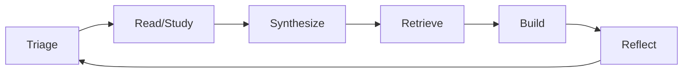
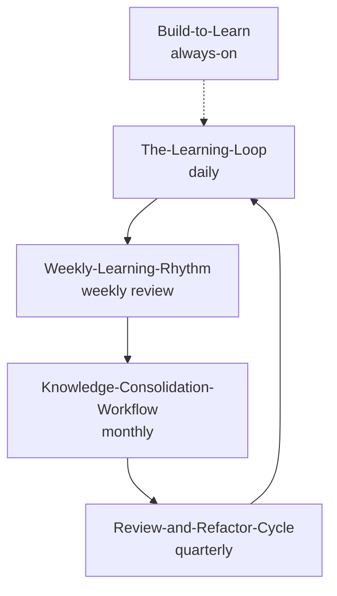

# 🔧 MOC — Workflows

> *Operational protocols that turn theory into daily practice.*

---

## The Operating Loop

The single most important workflow: [[The-Learning-Loop]]. Read that first.

This is the unit cycle. Run it daily.

---

## Notes in This Section

- [[The-Learning-Loop]] — the daily operating loop
- [[Weekly-Learning-Rhythm]] — weekly structure
- [[Knowledge-Consolidation-Workflow]] — converting notes into schemas
- [[Build-to-Learn]] — implementation as the highest form of consolidation
- [[Review-and-Refactor-Cycle]] — periodic re-evaluation

---

## The Principle: Workflow > Willpower

You will not consistently do hard things by willpower. You will do them by workflow.

A workflow is:
1. **Triggered** by a specific cue (time, event, calendar entry)
2. **Scripted**: clear steps, no decisions
3. **Bounded**: clear start and end
4. **Logged**: produces a record
5. **Reviewed**: periodically evaluated

If any of these is missing, it's not a workflow — it's a habit, which is much weaker.

---

## The Hierarchy of Workflows

- Daily: the loop
- Weekly: review and adjust
- Monthly: consolidate knowledge
- Quarterly: refactor your approach
- Always-on: build things

---

## Cross-Links

- [[MOC-Foundations]] — the cognitive science behind these workflows
- [[MOC-Reading-and-Synthesis]] · [[MOC-Information-Triage]] · [[MOC-Load-Management]] · [[MOC-Schema-Construction]] — the workflow source material
- [[09-Templates/]] — Obsidian templates supporting these workflows

← Back to [[Home]]
