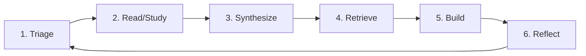

# The Learning Loop

> *The single most important workflow in the vault.*

---

## The Loop



This is the unit cycle of deliberate learning. Run it 1-3 times per day. Each iteration is a 60-90 min block.

---

## Stage 1 — Triage (5-10 min)

Decide what to work on.

**Inputs**: your reading list, current projects, friction notes from yesterday.

**Decision tree** (see [[Triage-Decision-Tree]] for full version):
- Do I have a Tier 1 resource queued? → Read it.
- Do I have a build in progress? → Continue it.
- Do I have an unresolved concept? → Re-attack it.
- None of the above? → Triage a new resource.

**Output**: a one-line target for this block.

```markdown
Today's block 1 target: Read Lamport 1978 §1-3, write summary
Today's block 2 target: Continue implementing the B-tree
Today's block 3 target: Review yesterday's notes + 30 min SR
```

---

## Stage 2 — Read / Study (40-60 min)

Apply the appropriate reading protocol:
- Paper → [[Three-Pass-Reading-Protocol]] (usually Pass 2)
- RFC → [[Reading-RFCs-and-Standards]]
- Code → [[Reading-Codebases-Systematically]]
- Textbook chapter → [[Schema-Driven-Querying]]
- Building → just build (no reading protocol)

**Critical**: apply [[Environmental-Design]] before starting. Phone in another room, DND on, tabs closed.

Take breaks if [[Working-Memory-Saturation|saturation]] hits.

---

## Stage 3 — Synthesize (10-15 min)

At the end of the reading block, produce a synthesis artifact:

- For a paper: 1-page summary in [[Concept-Note-Template]]
- For a codebase section: 1-paragraph architectural note
- For a textbook chapter: reformulation in your own words + 3 problems solved
- For a build session: status + key decisions

The artifact is non-negotiable. Reading without synthesis produces zero retention.

---

## Stage 4 — Retrieve (5-10 min)

After synthesis, retrieve:

- Close the source and your notes
- Write what you remember
- Compare to your notes; note what you forgot
- Add forgotten items to your [[Spaced-Repetition-Queue]]

This is the [[Testing-Effect-Retrieval-Practice|testing effect]] in action. Without retrieval, synthesis is fragile.

---

## Stage 5 — Build (separate block)

If the concept is buildable, build it in a separate block (or next day):
- For an algorithm: implement it
- For a system concept: build a minimal version
- For a paper: reproduce a result

Implementation is the highest form of retrieval. See [[Build-to-Learn]].

---

## Stage 6 — Reflect (5-10 min)

End each block with a [[Daily-Learning-Log]] entry:

```markdown
## Block — YYYY-MM-DD HH:MM
- Target: <one line>
- Time: <X min>
- What was at the edge: <what was hard>
- Failures: <what I got wrong>
- Feedback received: <from where>
- Schemas acquired/extended: <which>
- Next: <what to change tomorrow>
```

Patterns emerge in 2-3 weeks. You'll see what's working, what isn't, what you avoid.

---

## The Daily Composition

A typical sustainable day runs the loop 2-3 times:

```mermaid
gantt
    title Sample Day
    dateFormat X
    axisFormat %H:%M
    section Morning
    Loop 1: Read paper (90m) :a1, 0, 90m
    Break (walk) :a2, after a1, 30m
    section Afternoon
    Loop 2: Build (90m) :a3, after a2, 90m
    Break :a4, after a3, 30m
    section Evening
    Loop 3: Review + SR (60m) :a5, after a4, 60m
```



Each loop produces a log entry. End of day: weekly aggregate.

---

## The Anti-Patterns

### Skipping Stage 3 (synthesis)
Symptoms: you've "read" 100 papers but can't recall any. Cause: no synthesis artifact. Fix: mandatory 1-page note per paper.

### Skipping Stage 4 (retrieval)
Symptoms: you can read your own notes and nod along, but can't recall without them. Cause: no retrieval practice. Fix: mandatory 5-min retrieval after each synthesis.

### Skipping Stage 6 (reflection)
Symptoms: you work hard but don't improve. Cause: no feedback loop on the practice itself. Fix: mandatory log entry per block.

### Reading without building
Symptoms: deep theoretical knowledge, no working code. Cause: skipping Stage 5. Fix: every concept must be built within 1 week of learning.

### Building without reading
Symptoms: working code, shallow understanding. Cause: skipping Stage 2. Fix: read the source material before building.

---

## Cross-Links

- [[Session-Architecture]] — the 90-min block format
- [[Daily-Learning-Log]] — the reflection template
- [[Resource-Triage-Card]] — Stage 1 template
- [[Concept-Note-Template]] — Stage 3 template
- [[Weekly-Learning-Rhythm]] — the weekly aggregate

← Back to [[MOC-Workflows]]
