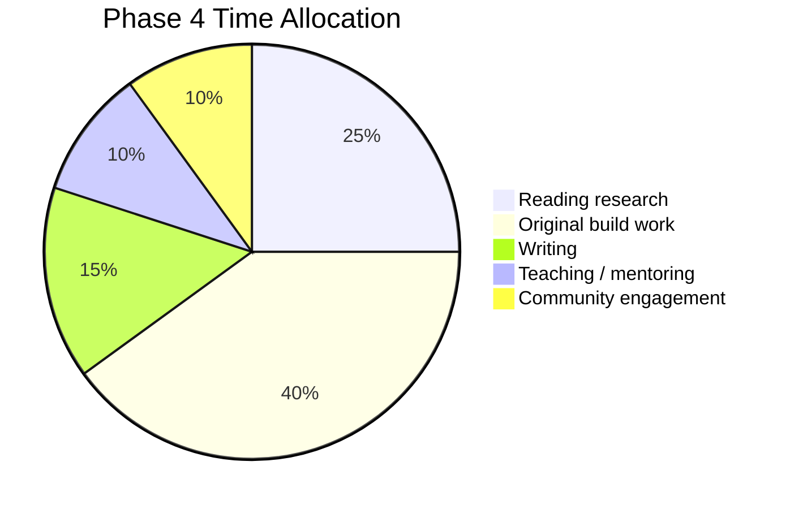

# Phase 4 — Convergence (Year 6-7)

> *Original work, integration, expertise maturation.*

---

## Goal

Move from "deep specialist" to "independent contributor to the field." By end of Phase 4, you should:

- Be able to identify open problems in your specialization
- Be able to design and execute a research or engineering project from scratch
- Have an integrated view across CS subdomains
- Be able to mentor others
- Have produced original work (paper, open-source project, system)

---

## Active Topics

By Phase 4, you're no longer "learning topics." You're:

- Reading current research (~3-5 papers/week)
- Building original systems
- Writing (papers, blog posts, documentation)
- Mentoring / teaching
- Engaging with the community

Time allocation shifts:

---

## The Convergence Activities

### 1. Original work

Pick a problem in your specialization that:
- Is genuinely open (no canonical solution)
- Is tractable in 6-12 months of focused work
- Connects to your existing schemas
- Has measurable success criteria

Examples:
- Build a distributed system with a novel consistency model
- Implement a known algorithm in a new context
- Reproduce and extend a recent research paper
- Build a tool that solves a problem you've encountered

### 2. Writing

Write about what you've learned and what you're building:
- A blog (public, regular cadence)
- Documentation for your projects
- Internal design docs
- Eventually: papers, talks, a book

Writing is the [[Knuth-Workflow|Knuth principle]]: writing is thinking. The act of writing reveals gaps.

### 3. Teaching

Teach what you know:
- Mentor a junior learner
- Give talks at meetups
- Write tutorials
- TA a course
- Contribute to educational materials

Teaching forces schema clarity. If you can't explain it, you don't really know it.

### 4. Community engagement

- Participate in conferences (attend, then present)
- Engage in forums (HN, /r/programming, Discord, mailing lists)
- Review papers / PRs
- Collaborate with peers

Community is the [[Bell-Labs-Culture|Bell Labs principle]]: thinking is social.

---

## The Integrated View

By Phase 4, you should see CS as an integrated whole:

- Algorithms ↔ type theory (Curry-Howard, dependent types)
- Distributed systems ↔ databases (consensus, replication)
- Compilers ↔ ML (differentiable programming, program synthesis)
- Networks ↔ OS (kernel bypass, RDMA)
- ML ↔ systems (ML systems, training infrastructure)

These cross-connections were always there; Phase 4 is when you can *use* them.

---

## Original Build Projects (5-10)

1. A system that integrates 2+ of your subdomains (e.g., a distributed ML training system)
2. A novel tool in your specialization
3. A reproduction + extension of a research paper
4. A library that fills a gap you've identified
5. A teaching artifact (course, book, video series)
6. A research paper (if applicable)
7. Open-source contributions to major projects
8. A talk at a conference
9. A blog series on your specialization
10. Mentorship of 1-3 junior learners

---

## Phase 4 Reading

By Phase 4, you should be reading:
- 2-3 papers/week in your specialization
- 1-2 papers/week in adjacent fields
- 1 book/month (broadening, not deepening)
- Regular blog posts from practitioners in your field

See [[Selective-Ignorance]] — by Phase 4, your triage is fast and accurate.

---

## Common Phase 4 Failure Modes

- **Perpetual learning**: never producing original work, always "still learning"
- **Avoiding writing**: writing is the consolidation mechanism; without it, schemas stay private
- **Avoiding teaching**: teaching is the test of understanding; without it, gaps remain hidden
- **Isolation**: not engaging with community; missing feedback loops
- **Scope creep**: original projects that never finish; ship something

---

## Phase 4 Exit Criteria

You've completed the 3-7 year arc when you can:

- [ ] Identify open problems in your specialization
- [ ] Design and execute an original project from start to finish
- [ ] Read any paper in your specialization fluently
- [ ] Write about your work for both technical and general audiences
- [ ] Teach your specialization to a motivated beginner
- [ ] Engage critically with current research
- [ ] Contribute to the field (paper, open-source, talk, book)
- [ ] See CS as an integrated whole, not isolated subdomains

After this, you're not "done" — you continue learning — but you've reached independent expertise. The arc is complete.

---

## The Lifelong Phase

Phase 4 doesn't really end. After the 7-year mark, you continue:

- Reading current research
- Building
- Writing
- Teaching
- Engaging

But the *foundational* learning is complete. You're now in the long tail of refinement, contribution, and depth.

This is what [[Knuth-Workflow|Knuth]] (50+ years on TAOCP), [[Dijkstra-Workflow|Dijkstra]] (40+ years of EWDs), and [[McCarthy-Workflow|McCarthy]] (55+ years on AI) demonstrate. The arc completes; the work continues.

---

## Cross-Links

- [[Phase-3-Specialization]] — prerequisite
- [[The-3-7-Year-Arc]] — the overview
- [[Knuth-Workflow]] · [[Dijkstra-Workflow]] · [[McCarthy-Workflow]] · [[Norvig-10000-Pages]] — exemplars of the lifelong phase
- [[Modern-Practitioners]] — contemporary examples

← Back to [[The-3-7-Year-Arc]]
