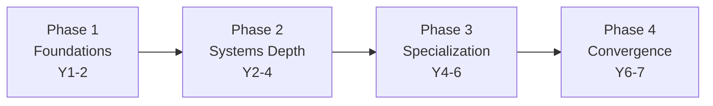
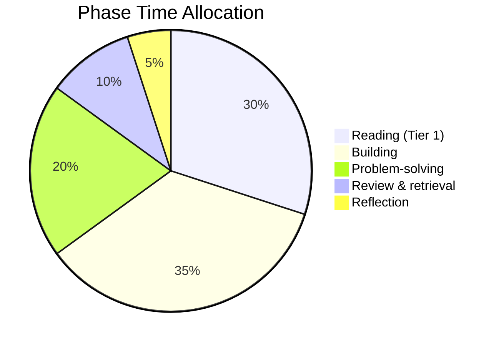

# 🛣️ The 3–7 Year Arc

> *How the daily loop composes into multi-year expertise.*

---

## The Numbers

From [[Expertise-Research-Ericsson|Ericsson's research]]:

- **3,000-7,000 hours of deliberate practice** → solid expertise (top 5% of practitioners)
- At 25 hours/week sustainable → **2.5-5.5 years**
- At 15 hours/week sustainable → **4-9 years**
- At 10 hours/week sustainable → **6-13 years**

The "3-7 year" range in the original prompt corresponds to:
- 3 years = ~50 hours/week (very intense, hard to sustain)
- 5 years = ~30 hours/week (challenging but sustainable)
- 7 years = ~20 hours/week (sustainable indefinitely for most people)

The sustainable ceiling for most adults with jobs/lives is ~25 hours/week of true deliberate practice. Plan accordingly.

---

## The Phases

### [[Phase-1-Foundations]] (Year 1-2)
Math + algorithms + intro systems. Build the substrate.

### [[Phase-2-Systems-Depth]] (Year 2-4)
OS + networks + databases + compilers. Build real systems.

### [[Phase-3-Specialization]] (Year 4-6)
Distributed systems + ML + one chosen depth area.

### [[Phase-4-Convergence]] (Year 6-7)
Original work, integration, expertise maturation.

---

## The Phase Map

| Phase | Year | Hours/week | Active topics | Build count |
|---|---|---|---|---|
| 1 | 1-2 | 15-25 | Math, algorithms, intro systems | 8-12 |
| 2 | 2-4 | 20-25 | OS, networks, databases, compilers | 12-18 |
| 3 | 4-6 | 20-25 | Distributed, ML, +1 depth area | 10-15 |
| 4 | 6-7 | 15-25 | Integration, original work | 5-10 |

Total: ~3,000-5,000 hours of deliberate practice + ~40-60 substantial builds.

---

## The Time Allocation Per Phase

Within each phase, time splits roughly:

The exact split varies by phase:
- Phase 1: more reading (foundations)
- Phase 2: more building (systems)
- Phase 3: more problem-solving (research-level)
- Phase 4: more reflection (integration)

---

## The Constraints

### Hard constraints (cannot be compressed)
- **Sleep and recovery**: ~8 hours/day, 1 rest day/week, 1 light week/month, 1 off-week/quarter (see [[Burnout-Prevention]])
- **Schema consolidation time**: schemas form over weeks, not hours. You cannot rush consolidation.
- **Biological adaptation**: ~7 years minimum for *broad* expertise (myelination, neural reorganization)

### Soft constraints (negotiable)
- **Job and life commitments**: reduce hours/week, extend timeline
- **Prior knowledge**: skip prerequisites, compress early phases
- **Talent**: ~1.2-1.5x multiplier on rate; doesn't change the ceiling

---

## The Personal Calibration

Your personal timeline depends on:

1. **Prior knowledge**: Have you done some programming? Math? Physics?
2. **Available hours**: How many hours/week can you *sustainably* commit?
3. **Talent multiplier**: Are you faster or slower than average at technical material?
4. **Recovery capacity**: How well do you recover? (Varies by age, health, lifestyle)
5. **Community access**: Are you learning alone, or with peers/mentors?

Estimate each, then compute:

> (3000-7000 hours) / (your hours/week) = your timeline in weeks

Add 30% buffer for rest, illness, life.

---

## Common Failure Modes

### The "I'll do it in 2 years" failure
Trying to compress below ~3 years. Result: burnout, shallow schemas, no retention.

### The "I'll do it eventually" failure
No timeline. Result: drift, no urgency, no completion.

### The "I'm behind" failure
Comparing your timeline to others. Result: discouragement, over-training, burnout.

### The "I'm too old" failure
Starting at 35+ and assuming it's too late. Reality: 7 years from 35 = 42. You have 25+ working years after. Not too late.

### The "I need to do everything" failure
Trying to learn all subdomains simultaneously. Result: none go deep.

---

## The Exit Criterion

You're "done" with the arc when you can:

1. Read any paper in your specialization without struggle
2. Design and implement a non-trivial system in your specialization, end-to-end
3. Identify gaps in your knowledge and fill them autonomously
4. Critically evaluate work in your specialization
5. Contribute original work to the field
6. Teach your specialization to others

Most learners reach this in 5-7 years. The 3-year timeline is for those with prior background and full-time commitment.

---

## Cross-Links

- [[Phase-1-Foundations]] · [[Phase-2-Systems-Depth]] · [[Phase-3-Specialization]] · [[Phase-4-Convergence]]
- [[Expertise-Research-Ericsson]] — the underlying research
- [[Session-Architecture]] — the daily/weekly structure that composes into years
- [[Burnout-Prevention]] — why the constraints are hard
- [[Review-and-Refactor-Cycle]] — quarterly roadmap adjustment

← Back to [[Home]]
