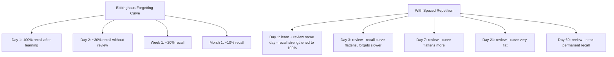
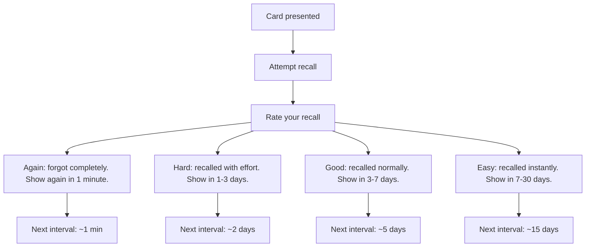
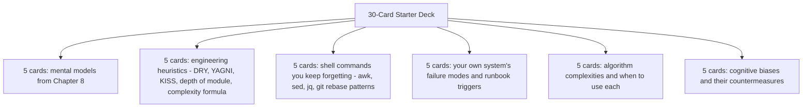

# 10.1. Spaced Repetition and Anki for Engineers

## 1. Background and Origin

Spaced repetition is a learning technique grounded in the *spacing effect*, first documented by Hermann Ebbinghaus in 1885. Ebbinghaus memorised lists of nonsense syllables and tracked how quickly he forgot them, discovering that forgetting follows a predictable curve (the "Ebbinghaus forgetting curve") and that reviewing material at increasing intervals dramatically flattens the curve. Modern spaced repetition software (Anki, SuperMemo, Mochi) uses algorithms based on Ebbinghaus's research to schedule reviews at the optimal moment — just before you would have forgotten the material.

For software engineers, spaced repetition is underused because most engineering knowledge feels like "things you would just look up." But there is a large class of knowledge that rewards being *in your head*: command-line flags you use daily, the signatures of standard library functions, the failure modes of your own system, the heuristics in this very vault. Looking these up every time costs minutes per lookup and breaks flow; having them in memory costs a few seconds per day of Anki review and produces a measurably faster engineer.

---

## 2. The Mechanics of Anki

Anki (and similar tools) presents cards at intervals determined by your performance. Each card has a front (question) and back (answer). When you see a card, you attempt to recall the answer, then reveal it and rate your recall:

The algorithm's intelligence is in the scheduling: easy cards disappear from your daily queue, while hard cards recur frequently. After a few weeks of consistent review, your daily queue stabilises at 15-30 minutes for a few thousand cards.

---

## 3. Practical Application: What Engineers Should Anki

The mistake most engineers make with Anki is anki-ing the wrong things. Trivia (exact API signatures that you can look up in 5 seconds) is low value. High-value targets are:

```mermaid
graph TD
    High[High-value Anki targets]
    High --> H1[H1: Mental models and decision rules - 'when does YAGNI apply?']
    High --> H2[H2: Your own system's failure modes and their signatures]
    High --> H3[H3: Shell commands and editor shortcuts you use weekly]
    High --> H4[H4: Algorithms and data structures - their complexity and use cases]
    High --> H5[H5: Network protocol mechanics - TCP, TLS, HTTP/2 specifics]
    High --> H6[H6: Database internals - index types, transaction isolation levels]
    High --> H7[H7: Heuristics from this vault - 'what does Hanlon's razor say?']
    Low[Low-value Anki targets - avoid]
    Low --> L1[L1: Specific library API signatures - look them up]
    Low --> L2[L2: One-off facts that you will not need in 6 months]
    Low --> L3[L3: Code snippets - too long, too context-dependent]
    Low --> L4[L4: Things you already recall perfectly]
```

The test for whether something belongs in Anki: *will I want to recall this from memory, rather than look it up, in 6 months?* If yes, anki it. If no, do not.

---

## 4. Concrete Exercise: The 30-Card Starter Deck

Build a 30-card Anki deck over the next week, drawing from this vault and from your current work. Target one deck per major theme:

After 30 days of consistent review (15 minutes per day), you will have these facts reliably in memory. The compound effect over a year is significant: an engineer who has internalised 300 high-value facts vs. one who looks them up each time will be measurably faster on every task.

---

## 5. Common Pitfalls and Student Misunderstandings

* **Anki-ing too much.** A deck of 5,000 cards sounds impressive but is unsustainable. Most people can review about 100-200 cards per day in 20-30 minutes. Cap your deck at what you can sustainably review.
* **Anki-ing low-value trivia.** Anki's value is in long-term retention of high-utility knowledge. Using it for trivia you could trivially look up wastes review time.
* **Making cards too long.** A good Anki card has a single, crisp answer. "List the SOLID principles" is a bad card because you will recall 3 of 5 and not know whether to mark it Again or Good. "What does the S in SOLID stand for?" is a good card.
* **Skipping reviews.** Spaced repetition only works if the intervals are respected. Skipping a week causes a backlog that snowballs. Review every day, even if just for 10 minutes.
* **Treating Anki as a substitute for understanding.** Anki is for *retention*, not *comprehension*. Use it after you understand a concept, to retain it; do not use it to learn concepts in the first place.

---

## 6. Essential Reminders

* Spaced repetition exploits the spacing effect (Ebbinghaus, 1885).
* Anki high-utility knowledge: mental models, your system's failure modes, algorithms, heuristics.
* Cap your deck at what you can review in 20-30 minutes per day.
* Cards should be atomic: one question, one crisp answer.
* Review every day. Skipping causes backlogs that snowball.
* Anki retains understanding; it does not produce it. Understand first, then anki.
