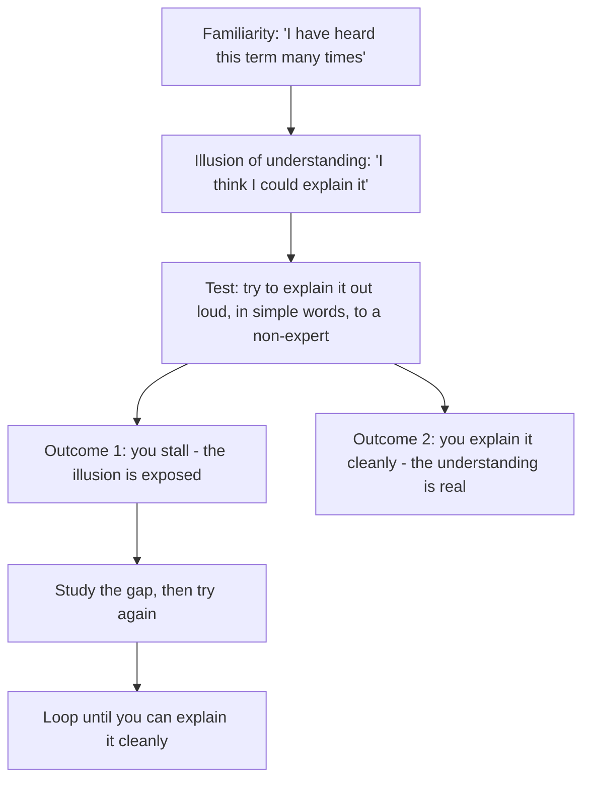
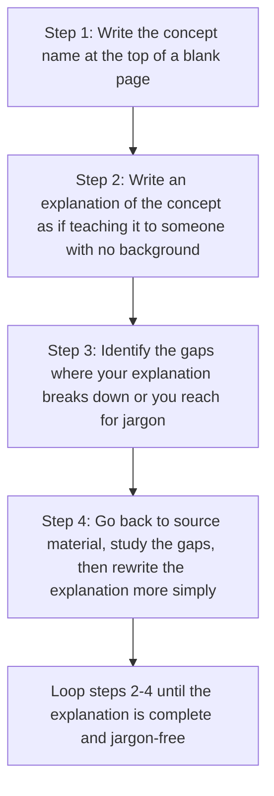

# 10.2. The Feynman Technique for Technical Concepts

## 1. Background and Origin

The Feynman Technique is named after physicist Richard Feynman, who was famous not just for his Nobel Prize but for his ability to explain complex physics to non-physicists. Feynman believed that the ability to explain something simply was the truest test of understanding it. If you could not explain it to a smart undergraduate, you did not understand it yourself — no matter how sophisticated your vocabulary sounded.

For software engineers, the Feynman Technique is the antidote to the *illusion of explanatory depth* — the cognitive bias where we mistake familiarity with a concept for genuine understanding. Most engineers can give a plausible-sounding explanation of how garbage collection works, or how TCP establishes a connection, but would stall on the third follow-up question. The Feynman Technique forces the gap between "I recognise this" and "I understand this" into the open.



---

## 2. The Four Steps of the Feynman Technique



The discipline is in Step 3. Every time you write "as you know" or use a technical term without defining it, you have hit a gap. Every time you hand-wave over a step ("and then the magic happens"), you have hit a gap. The gaps are where your real understanding stops and your vocabulary begins.

---

## 3. Practical Application: Feynman-ing a Distributed Systems Concept

Take "two-phase commit" as an example. A weak explanation: "It's a protocol where a coordinator asks all participants to prepare, and if they all say yes, it tells them to commit." This sounds right but hides all the interesting questions.

```mermaid
graph TD
    Weak[Weak explanation: 'coordinator asks participants to prepare, then to commit']
    Weak --> Q1[Q1: what happens if the coordinator dies between prepare and commit?]
    Weak --> Q2[Q2: what happens if a participant says yes to prepare but then crashes?]
    Weak --> Q3[Q3: how does the system recover?]
    Weak --> Q4[Q4: what is the liveness vs safety tradeoff?]
    Strong[Strong Feynman explanation]
    Strong --> S1[S1: '2PC is a protocol for making sure all nodes agree to commit or all agree to abort, never some-some.']
    Strong --> S2[S2: 'Phase 1: coordinator sends PREPARE. Each participant writes its vote to durable log, then replies YES or NO.']
    Strong --> S3[S3: 'If coordinator gets all YES, it writes COMMIT to its log and sends COMMIT to all. If any NO (or timeout), it writes ABORT and sends ABORT.']
    Strong --> S4[S4: 'Failure mode 1: coordinator dies after PREPARE but before COMMIT. Participants who voted YES are blocked - they cannot unilaterally commit or abort because they do not know what others voted.']
    Strong --> S5[S5: 'Failure mode 2: participant dies after voting YES. On recovery, it reads its log, sees its own YES, and must block waiting for coordinator.']
    Strong --> S6[S6: 'This blocking property is why 2PC is rarely used in practice at scale - the failure mode is "the whole system stops" rather than "the system keeps going with reduced consistency."']
```

The strong explanation is 6 sentences instead of 1, but it surfaces every important property of 2PC: the durability requirement, the failure modes, the blocking behaviour, and the practical implication. If you cannot produce this explanation, you do not understand 2PC — no matter how many times you have used the term in a design review.

---

## 4. Concrete Exercise: The Three-Concept Weekly Feynman

Pick three concepts per week that you "know" and run the Feynman Technique on each:

```mermaid
graph TD
    Weekly[Weekly Feynman Practice]
    Weekly --> Pick[Pick 3 concepts you claim to know but have never explained from scratch]
    Pick --> Write[For each: write the explanation on a blank page, no references]
    Write --> Identify[Identify gaps - every stall, every jargon-use, every hand-wave]
    Identify --> Study[Study the gaps - re-read source material, write the explanation again]
    Study --> Test[Test the explanation by reading it aloud to a teammate who does not know the concept]
    Test --> Outcome[Outcome: you either get clean questions that you can answer (good) or 'wait, what about X?' questions that expose new gaps (also good)]
```

After 6 months of three concepts per week, you will have Feynman-ed ~75 concepts. The cumulative effect is that your engineering vocabulary becomes a real understanding rather than a recognitional mask. In design reviews, code reviews, and interviews, this difference is immediately visible.

---

## 5. Common Pitfalls and Student Misunderstandings

* **Permitting jargon in the explanation.** Every time you use a term without defining it, you have moved from explaining to labelling. The discipline is to either define the term in the explanation or replace it with plain language.
* **Quitting at the first complete-sounding explanation.** The first explanation is almost always shallow. The Feynman Technique is iterative — keep rewriting until the explanation is clean.
* **Skipping the "explain to a real person" step.** Self-assessment is unreliable. A real audience forces you to confront gaps you would otherwise ignore. Use a teammate, a rubber duck, or a voice memo.
* **Treating the technique as a one-time event.** Understanding decays. Re-Feynman concepts you have not revisited in a year. You will discover that what felt solid has eroded.
* **Confusing Feynman with dumbing down.** The technique is not about simplifying to the point of inaccuracy. It is about finding the simplest *accurate* explanation. Simplicity is the goal; oversimplification is a failure mode.

---

## 6. Essential Reminders

* "If you can't explain it simply, you don't understand it well enough." — Einstein (attributed)
* The illusion of explanatory depth is the cognitive bias the technique defeats.
* Every use of jargon without definition is a gap. Define or replace.
* The first explanation is shallow. Iterate until the explanation is clean.
* Test the explanation on a real audience. Self-assessment is unreliable.
* Re-Feynman annually. Understanding decays without active maintenance.
