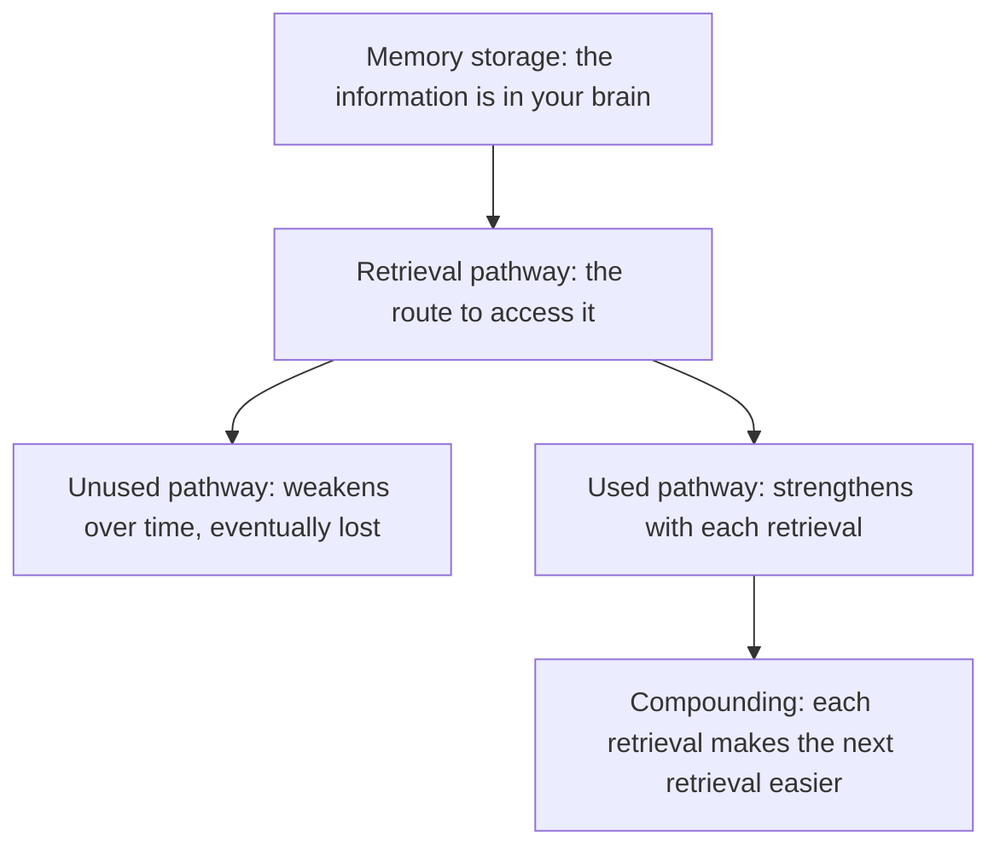
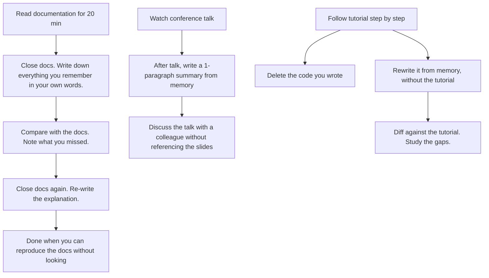
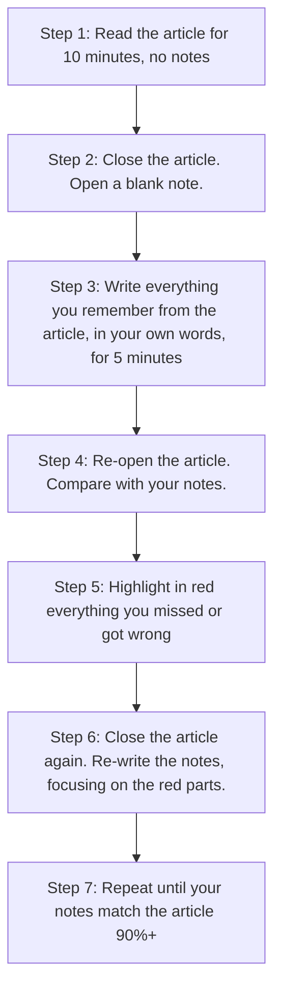

# 10.3. Active Recall vs. Passive Review

## 1. Background and Origin

Active recall (also called retrieval practice) is the cognitive technique of deliberately retrieving information from memory rather than passively re-reading it. The research basis is decades of cognitive psychology, summarised in the 2013 book *Make It Stick* by Brown, Roediger, and McDaniel. The core finding: retrieval — trying to remember something — strengthens memory far more than recognition — seeing the thing again. Re-reading notes feels productive but produces almost no learning. Self-testing feels harder and produces dramatic learning.

For software engineers, this matters because most engineering learning is passive. Engineers read documentation, watch conference talks, skim source code, and follow tutorials — all of which are passive. The result is a feeling of "I learned that" without the underlying retention. Switching to active recall (closing the docs and trying to reproduce the API call from memory, writing the algorithm from scratch after reading about it, explaining the talk to a colleague without the slides) produces 3-5x better retention for the same time investment.

```mermaid
graph TD
    Passive[Passive Review]
    Passive --> P1[Re-reading docs]
    Passive --> P2[Highlighting]
    Passive --> P3[Watching talks]
    Passive --> P4[Following tutorials step by step]
    Passive --> Feel[Feels easy and productive]
    Passive --> Result[Result: poor retention, illusion of learning]
    Active[Active Recall]
    Active --> A1[Closing docs and reproducing from memory]
    Active --> A2[Writing the code without the tutorial]
    Active --> A3[Explaining the concept out loud without notes]
    Active --> A4[Self-testing with flashcards]
    Active --> Feel2[Feels hard and slow]
    Active --> Result2[Result: 3-5x better retention, real learning]
```

---

## 2. Why Active Recall Works

When you retrieve information from memory, you are not just "checking" whether you remember it — you are *strengthening* the retrieval pathway itself. The act of retrieval modifies the memory, making it more accessible in the future. This is called the *testing effect* and it is one of the most robust findings in cognitive psychology.

Passive review exercises recognition (the brain sees the information and thinks "yes, I know this"). Recognition is much easier than recall and feels correspondingly more pleasant — but it does not exercise the retrieval pathway, so it does not strengthen memory. This is why engineers can read a book, feel they understood it, and be unable to apply any of its lessons three months later.

---

## 3. Practical Application: Active Recall in Engineering Learning

For every learning activity, build in a retrieval step:

The pattern is universal: after any passive learning, force an active retrieval. The retrieval is uncomfortable because it exposes what you did not actually learn. That discomfort is the technique working.

---

## 4. Concrete Exercise: The Read-Cover-Write-Check Loop

For the next technical article or documentation page you read, run this loop:

The first iteration of Step 3 will be humbling — most engineers capture 30-40% of what they just read. By the third iteration, retention is typically 80-90%, and the material is in long-term memory rather than short-term.

---

## 5. Common Pitfalls and Student Misunderstandings

* **Confusing ease with learning.** Passive review feels easy because it is recognition, not recall. Active recall feels hard because it is real learning. Do not let the ease of passive review trick you into thinking you are learning.
* **Skipping the retrieval step.** Engineers read a chapter, feel they understand it, and move on. Without the retrieval step, retention drops to ~30% within a day. Always retrieve after reading.
* **Retrieving immediately after reading.** Immediate retrieval tests short-term memory, not learning. Wait at least 10 minutes (better: a day) before retrieving, so the retrieval exercises the long-term pathway.
* **Giving up when retrieval is hard.** The difficulty is the point. If you could retrieve effortlessly, you would not need the technique. Struggle is the brain building the pathway.
* **Using only one mode.** Combine active recall with spaced repetition (10.1) for compounding benefits. Anki is essentially active recall with scheduling built in.

---

## 6. Essential Reminders

* Retrieval strengthens memory; recognition does not.
* Passive review (re-reading) feels productive but produces almost no retention.
* Active recall (self-testing) feels hard but produces 3-5x better retention.
* After any passive learning, force a retrieval step.
* Wait at least 10 minutes (better: a day) between learning and retrieval.
* "Learning is not the same as remembering what you read." — Brown, Roediger, McDaniel
