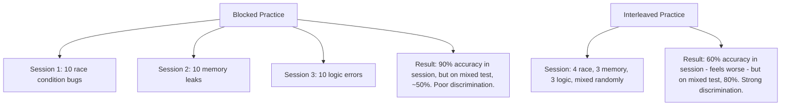
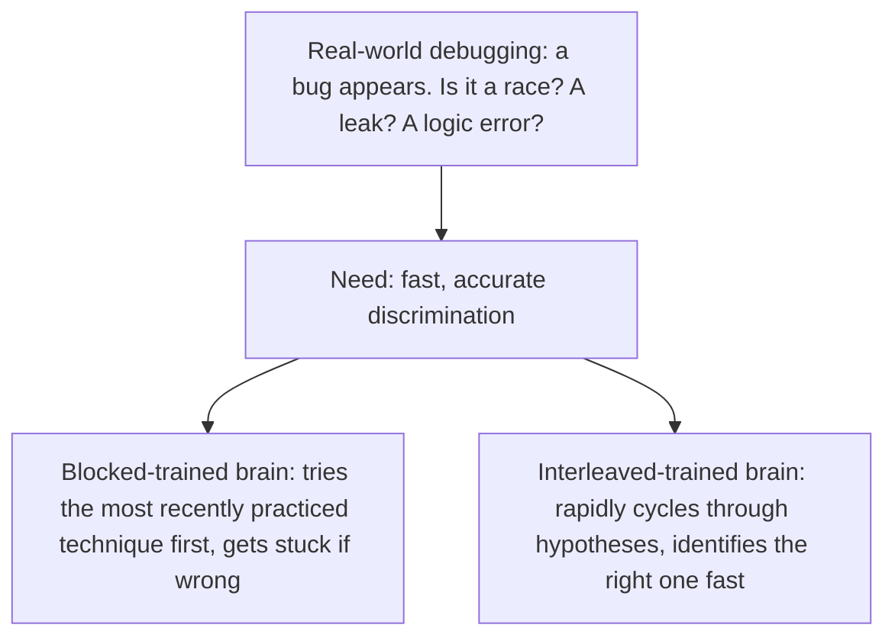
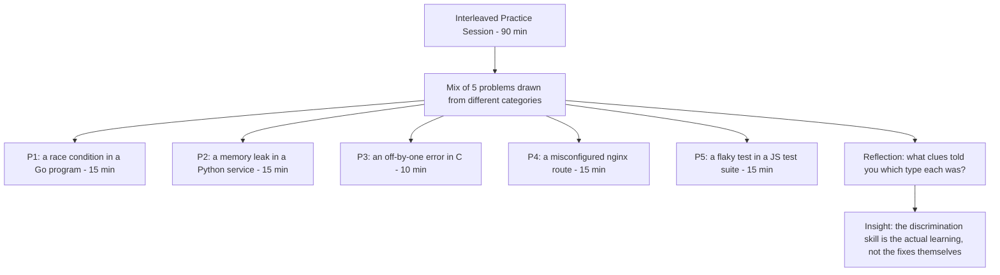
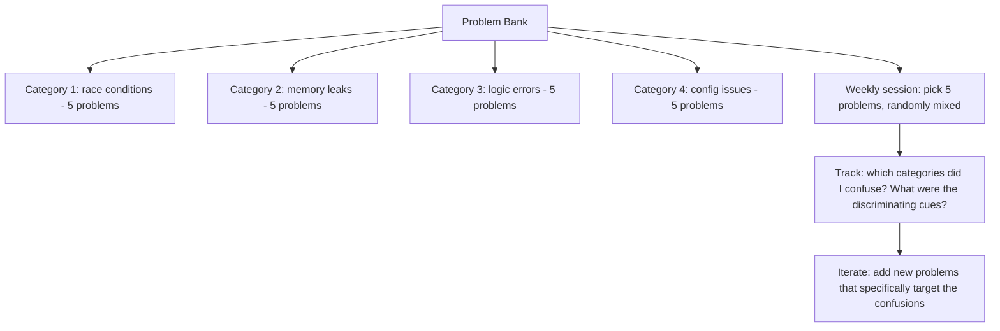

# 10.4. Interleaved Practice for Skill Transfer

## 1. Background and Origin

Interleaved practice is the technique of mixing different types of practice problems or skills within a single session, rather than blocking them (doing all of one type, then all of another). The research, much of it by psychologist Robert Bjork and colleagues at UCLA, shows that interleaving produces worse performance *during practice* but dramatically better performance *on later tests* — a phenomenon Bjork calls "desirable difficulties." The brain, forced to constantly re-identify which skill is needed, builds stronger discrimination and transfer.

For software engineers, interleaving matters because engineering problems rarely announce which technique they require. A bug could be a race condition, a memory issue, a logic error, or a misconfiguration. An engineer who has practiced only one type at a time will reach for their hammer regardless of the problem; an engineer who has interleaved will diagnose faster because their brain has been trained to discriminate.

---

## 2. Why Interleaving Feels Worse but Works Better

Blocked practice feels productive because the brain settles into a groove: "ah, this is a race condition problem, I will apply the race condition recipe." Each successive problem is easier because the previous problem primed the right mental model. But this groove is also the failure mode — the brain is not learning to *discriminate*, only to *execute* the most recently primed recipe.

Interleaved practice constantly forces the brain to re-identify the problem type. Each new problem requires retrieving the right mental model from scratch, which is harder and feels less fluent. But this repeated retrieval is exactly what builds the discrimination skill, and discrimination is what transfers to real-world problem solving.

---

## 3. Practical Application: Interleaved Debugging Practice

Instead of working through 10 problems of the same type, mix 3-4 types in each practice session:

The reflection step is critical. After each problem, write one sentence: "the signal that told me this was a [type] problem was ___." Over time, you build a library of diagnostic cues that operate at the pattern-recognition level (see Chapter 1.1 on crystallized intelligence).

---

## 4. Concrete Exercise: The Mixed Problem Set

Build a personal problem bank with 5 problems in each of 4 categories (race conditions, memory leaks, logic errors, configuration issues). Each week, do a 90-minute interleaved session drawing 5 random problems from the bank:

After 8 weeks, you will have done 40 interleaved problems and developed strong diagnostic discrimination. The next time a real production bug appears, you will identify its type in seconds rather than minutes.

---

## 5. Common Pitfalls and Student Misunderstandings

* **Judging the technique by in-session performance.** Interleaving feels worse during practice. If you abandon it because it feels unproductive, you lose the long-term benefit. Judge by retention and transfer, not session fluency.
* **Interleaving too many categories at once.** 2-4 categories is optimal. 10+ categories produces cognitive overload without discrimination benefit.
* **Using interleaving for brand-new material.** Interleaving works best when you have basic competence in each category. If you are still learning the basics of category 1, blocking is appropriate until you have a foothold, then switch to interleaving.
* **Skipping the reflection step.** The discrimination cues are the learning. If you do not articulate them, the interleaving produces less benefit.
* **Confusing interleaving with randomisation.** Random ordering is one form of interleaving, but not always the best. A schedule that ensures each category appears at least once per session, in a varied order, is often better than pure random.

---

## 6. Essential Reminders

* Interleaving produces worse in-session performance but better long-term retention and transfer.
* The brain learns to discriminate between problem types, which is the actual transfer skill.
* 2-4 categories per session is optimal.
* Reflect after each problem: "what cue told me which type this was?"
* Use interleaving once you have basic competence; block for initial learning.
* "Difficulties during practice are desirable because they promote deeper learning." — Robert Bjork
