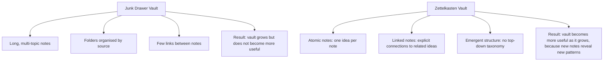
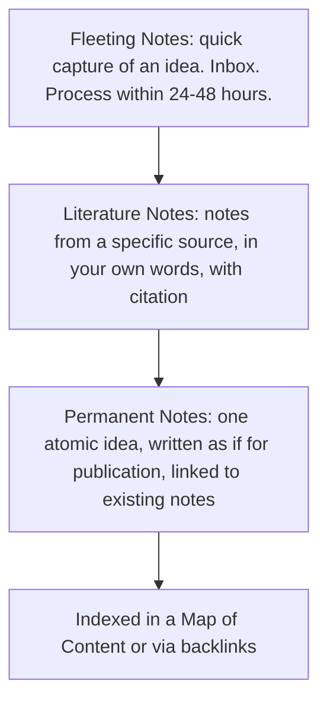
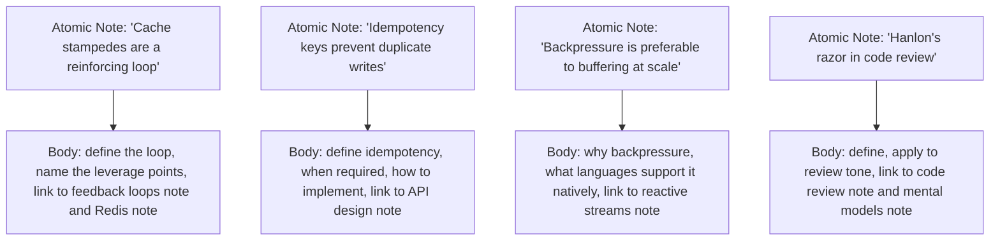
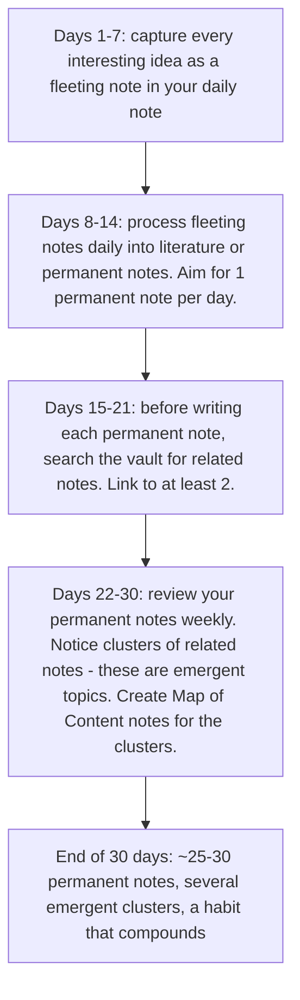

# 10.5. Building a Zettelkasten for Engineering Knowledge

## 1. Background and Origin

The Zettelkasten ("slip-box" in German) is a note-taking method developed by sociologist Niklas Luhmann, who used it to produce over 70 books and 400 scholarly articles across his career. The method has been popularised in the English-speaking world by Sönke Ahrens's book *How to Take Smart Notes* and by the zettelkasten.de community. The core idea: notes should be atomic (one idea per note), linked (connected to other notes by explicit references), and emergent (the structure of the note network is not pre-planned but emerges from the bottom up as you add notes).

For software engineers, the Zettelkasten method is the natural complement to Obsidian (which is essentially Zettelkasten software). Most engineers' Obsidian vaults are "junk drawers" — folders full of unrelated notes that you never revisit. A Zettelkasten vault is a "second brain" — a network of atomic, linked ideas that compounds in value as it grows, because every new note connects to existing notes and reveals new patterns.

---

## 2. The Three Types of Notes

A Zettelkasten distinguishes three types of notes that flow through different stages:

### 2.1. Fleeting Notes
These are quick captures — a thought in the shower, a question during a meeting, an idea while debugging. They go into an inbox (Obsidian's daily note works well). Their purpose is to get the idea out of your head without losing it. Most fleeting notes are processed within 1-2 days into either literature notes, permanent notes, or the trash.

### 2.2. Literature Notes
These are notes taken while reading (a book, a paper, a blog post, source code). Write them in your own words, not by copying. Include the citation. These notes are the raw material from which permanent notes are extracted.

### 2.3. Permanent Notes
These are the actual content of your Zettelkasten. Each permanent note contains exactly one idea, written as if it would be read by someone else (because it will be — future you). The note should make sense standalone, without needing the source. It should link to 1-5 existing notes that are conceptually related.

---

## 3. Practical Application: Atomic Engineering Notes

For an engineer, "one idea per note" means notes like:

Each note is short (200-500 words), standalone, and linked. After a year of consistent practice, you will have ~500-1000 atomic notes forming a personal knowledge graph that you can search, traverse, and build on.

---

## 4. Concrete Exercise: The 30-Day Zettelkasten Trial

For 30 days, run this minimal Zettelkasten practice:

The 30-day trial is enough to demonstrate the compounding effect. By day 20, you will start to notice that new notes connect to existing ones in surprising ways — and that surprising connection is the entire value proposition of the Zettelkasten method.

---

## 5. Common Pitfalls and Student Misunderstandings

* **Notes too long.** A 2000-word note is not atomic; it is an essay. Break it into 5-10 atomic notes linked together. Atomic notes are reusable; essays are not.
* **Notes that quote rather than rephrase.** Copying highlights from a book into your vault is not Zettelkasten — it is a clipping service. Rephrase in your own words; the rephrasing is where the understanding happens.
* **Notes without links.** An unlinked note is a dead end. Every permanent note should link to at least 1-2 related notes. If you cannot find a link, either the note is not actually useful, or you have not looked hard enough.
* **Top-down taxonomy.** Trying to pre-design the folder structure defeats the method. Let the structure emerge from the links, then create Map of Content notes to summarise clusters as they form.
* **Treating the Zettelkasten as a journal.** Daily logs are fine for capture, but the Zettelkasten itself is for permanent knowledge, not for "today I did X." Journal entries are time-bound; Zettelkasten notes are timeless.

---

## 6. Essential Reminders

* Atomic: one idea per note. 200-500 words is typical.
* Linked: every permanent note connects to at least 1-2 existing notes.
* Emergent: do not pre-design the structure. Let it form from the bottom up.
* Rephrase, never copy. The rephrasing is where the learning happens.
* Process fleeting notes within 1-2 days or they become a junk drawer.
* "Notes are not a record of what you read. They are the building blocks of what you think." — Sönke Ahrens (paraphrased)
