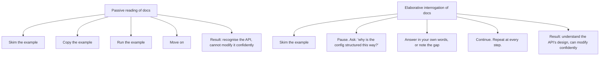

# 10.6. Elaborative Interrogation and Self-Explanation

## 1. Background and Origin

Elaborative interrogation is a learning technique researched extensively by educational psychologist Michael Pressley and colleagues in the 1980s and 1990s. The technique is simple: as you study a concept, pause periodically and ask yourself "why is this true?" or "why does this make sense?" Then answer the question, in your own words, before continuing. Self-explanation, a closely related technique researched by Michelene Chi, asks you to explain each step of a worked example to yourself as you read it.

Both techniques exploit the same cognitive mechanism: forcing the brain to integrate new information with existing knowledge produces deeper, more durable learning than passive reception. The act of asking "why" forces the brain to either retrieve relevant prior knowledge (strengthening the retrieval pathway) or confront the gap (revealing what you do not actually understand).

For software engineers, these techniques are especially valuable for learning new systems, frameworks, and algorithms. The default mode is to skim the docs, copy the example, and move on. The elaborative mode is to pause at every step and ask "why is this example structured this way?" — which is slower but produces actual understanding.



---

## 2. The Two Techniques in Detail

### 2.1. Elaborative Interrogation
As you encounter each new fact, ask "why?" and produce an answer. If you cannot answer, you have found a gap — go study it.

```mermaid
graph TD
    Fact[Fact: 'Go channels block on send when the buffer is full']
    Fact --> Q1[Q1: why does this happen?]
    Q1 --> A1[A1: because channels are designed as a synchronisation primitive, not just a queue. Blocking is the backpressure mechanism.]
    A1 --> Q2[Q2: why is backpressure important?]
    Q2 --> A2[A2: without backpressure, a fast producer would overwhelm a slow consumer, causing unbounded memory growth.]
    A2 --> Q3[Q3: what are the alternatives?]
    Q3 --> A3[A3: dropping messages (at-most-once), buffering unboundedly (OOM risk), or failing fast (errors instead of blocking). Each has a use case.]
```

Three levels of "why" take you from a fact to its design rationale to its alternatives. This is real understanding.

### 2.2. Self-Explanation
As you read a worked example (code, algorithm, math derivation), pause after each step and explain to yourself what that step does and why it is there. If you cannot, the step is opaque — go study it.

---

## 3. Practical Application: Self-Explaining Code

When you encounter unfamiliar code, do not just read it. Self-explain it line by line:

```mermaid
graph TD
    Code[Code line: 'const result = await fetch(url).then(r => r.json()).catch(() => null);']
    Code --> Q1[Q1: what does this line do?]
    Q1 --> A1[A1: makes an HTTP request, parses the response as JSON, returns null if anything fails]
    Code --> Q2[Q2: why use .then instead of await?]
    Q2 --> A2[A2: to chain the JSON parse inline without a separate await line - style choice]
    Code --> Q3[Q3: why .catch returns null?]
    Q3 --> A3[A3: to convert errors into a sentinel value the caller can check, instead of propagating exceptions]
    Code --> Q4[Q4: what failure modes does this hide?]
    Q4 --> A4[A4: network errors, 4xx/5xx responses, malformed JSON, empty body - all become null. The caller cannot distinguish them.]
    Code --> Q5[Q5: when would this pattern be appropriate vs inappropriate?]
    Q5 --> A5[A5: appropriate for 'best effort' fetches where any failure is equivalent. Inappropriate for write operations where you need to know if it failed and why.]
```

Five questions, five answers, and the line of code is now understood at a depth that passive reading would not have produced.

---

## 4. Concrete Exercise: The 5-Why Code Reading

Pick a non-trivial function from your codebase. For each line, ask "why" up to 5 times:

```mermaid
graph TD
    Line[For each line of code]
    Line --> Why1[Why 1: what does this line do?]
    Why1 --> Why2[Why 2: why is it written this way (vs. alternatives)?]
    Why2 --> Why3[Why 3: why is this the right approach for this context?]
    Why3 --> Why4[Why 4: what would break if we removed this line?]
    Why4 --> Why5[Why 5: under what conditions would this line be wrong?]
    Why5 --> Verdict[Verdict: if you can answer all 5, you understand the line. If not, you have found a learning target.]
```

This is uncomfortable and slow — a 50-line function can take an hour to fully self-explain. But the payoff is that you build a mental model of the codebase that is structural rather than surface-level. You stop being surprised by the codebase's behaviour.

---

## 5. Common Pitfalls and Student Misunderstandings

* **Stopping at the first plausible answer.** The first "why" answer is usually surface-level. Push to 3-5 levels to reach the actual design rationale.
* **Skipping questions you think you know.** "Why does this function exist?" sounds obvious but often is not. Asking it forces you to articulate the answer, which often reveals that you do not actually know.
* **Treating the technique as a one-time activity.** Self-explanation is a habit, not an event. Apply it routinely to unfamiliar code, not just once.
* **Confusing self-explanation with note-taking.** The point is not to write down what the code does — comments do that. The point is to force the brain to integrate the new information with existing knowledge.
* **Using it only for hard material.** Easy material is often easy because you have not looked closely. Self-explaining "easy" code often reveals assumptions and edge cases you would otherwise miss.

---

## 6. Essential Reminders

* Elaborative interrogation: ask "why is this true?" and answer in your own words.
* Self-explanation: explain each step of code/example to yourself as you read.
* Push "why" to 3-5 levels to reach design rationale, not surface facts.
* Apply routinely, not just once. The technique compounds over time.
* The first answer is usually surface-level. Push deeper.
* "The cure for boredom is curiosity. There is no cure for curiosity." — Dorothy Parker
