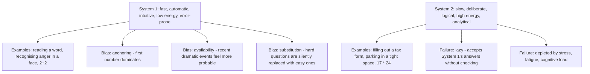

# 11.1. Thinking, Fast and Slow (Daniel Kahneman)

## 1. Book Metadata

* **Author:** Daniel Kahneman (Nobel Laureate in Economics, 2002)
* **Published:** 2011
* **Pages:** ~500
* **Core field:** Cognitive psychology, behavioural economics

## 2. Core Thesis

The human mind operates via two systems: System 1, fast and intuitive, and System 2, slow and deliberative. Most errors in judgment arise because we over-rely on the effortless, automatic System 1 and under-engage the lazy but disciplined System 2. The book maps the predictable biases this architecture produces and shows how hard it is to see them in ourselves.

For software engineers, the framing explains why estimates are systematically over-optimistic (anchoring on the first number), why architecture debates feel productive but go in circles (familiarity feels like truth), and why postmortems make failures look inevitable in hindsight (the illusion of understanding). Recognising that these biases are structural features of cognition — not personal failings — is the first step to building countermeasures.

---

## 3. Key Concepts

* **System 1 vs. System 2**: the two modes of cognition, with distinct properties and failure modes.
* **Cognitive ease**: familiarity feels like truth; repetition increases familiarity; therefore repetition feels like truth.
* **Substitution**: when asked a hard question, System 1 silently substitutes an easier one and answers that.
* **Anchoring**: the first number mentioned dominates all subsequent reasoning about quantity.
* **Availability heuristic**: probability judgments are dominated by how easily examples come to mind.
* **Prospect theory**: losses feel ~2x as bad as equivalent gains feel good.
* **Focusing illusion**: "nothing in life is as important as you think it is while you are thinking about it."

---

## 4. Verbatim Quotes

> "When you are asked what you are thinking about, you can normally answer. You believe you know what goes on in your mind, which often consists of one conscious thought leading in an orderly way to another. But that is not the only way the mind works, nor indeed is that the typical way." — Introduction / p. 3

> "A reliable way to make people believe in falsehoods is frequent repetition, because familiarity is not easily distinguished from truth. Authoritarian institutions and marketers have always known this fact." — Chapter 5, Cognitive Ease

> "One of the main functions of System 2 is to monitor and control thoughts and actions 'suggested' by System 1, allowing some to be expressed directly in behavior and suppressing or modifying others." — Chapter 3 / p. 44

> "Nothing in life is as important as you think it is, while you are thinking about it." — Chapter 37, The Focusing Illusion

> "The idea that the future is unpredictable is undermined every day by the ease with which the past is explained." — Part 4, Choices

---

## 5. Practical Application for Software Engineers

* **Estimates:** never accept the first number mentioned in an estimation meeting. The first number anchors everyone. Either collect estimates silently and independently before discussion, or explicitly state a wide range first to dilute the anchor.
* **Architecture debates:** when an opinion "feels right," ask what evidence would change your mind. If you cannot articulate it, you are running on familiarity, not analysis.
* **Postmortems:** write them in two passes. First, write what actually happened without hindsight. Then, after a week, write what "should have been visible at the time." The gap is the hindsight bias.
* **Hiring interviews:** the first 5 minutes of an interview dominate the final score. Force yourself to write down observations before forming an impression, and structure your scoring to delay the impression.

---

## 6. Engineering Anti-Patterns to Watch For

* **The architecture debate that goes in circles:** both sides are repeating their position. Familiarity is substituting for evidence. Force both sides to write down falsifiable predictions.
* **The estimate that everyone agrees with too quickly:** anchoring. Collect independent estimates first.
* **The postmortem that "explains everything":** hindsight bias. The future was never as predictable as the postmortem makes it look.
* **The hire that "just felt right":** affect heuristic. The feeling is System 1. Ask for the evidence.

---

## 7. Essential Reminders

* System 1 is always running. System 2 is lazy.
* Familiarity feels like truth. Repetition makes things feel true.
* The first number mentioned dominates all subsequent reasoning.
* Hindsight makes the past look more predictable than it was.
* When you cannot articulate what would change your mind, you are not reasoning — you are feeling.
