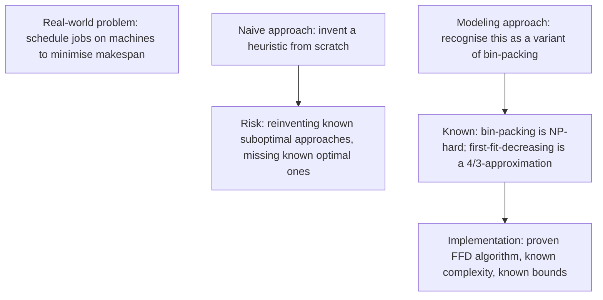

# 11.10. The Algorithm Design Manual (Steven Skiena)

## 1. Book Metadata

* **Author:** Steven S. Skiena (Professor of Computer Science, Stony Brook)
* **Published:** 1997 (1st edition), 2020 (3rd edition)
* **Pages:** ~800
* **Core field:** Algorithms, practical computer science

## 2. Core Thesis

Real-world algorithm design requires two bodies of knowledge: a toolkit of *techniques* (data structures, dynamic programming, graph search, heuristics, modeling) and a *catalog of known problems* so you can recognise, name, and reuse prior solutions rather than reinventing them. The single most important skill is *modeling* — abstracting a messy application into a clean, well-studied problem. The book stresses design and practical implementation over formal theorem-proving, illustrated through "war stories" from real projects.

For software engineers, this book is the antidote to the "I will just Google it" approach to algorithmic problems. Most production algorithmic problems are instances of well-studied problems (shortest path, set cover, interval scheduling, etc.). Recognising the problem lets you reuse proven implementations and reason about complexity for free.

---

## 3. Key Concepts

* **Modeling**: mapping a real problem onto a known abstract structure (graphs, sets, permutations).
* **The "Hitchhiker's Guide" catalog** of ~75 classic algorithmic problems.
* **"War stories"**: real-world case studies showing where algorithms actually arise.
* **Design techniques**: divide-and-conquer, dynamic programming, greedy, backtracking, heuristics.
* **Big-O / worst-case analysis** as a machine-independent comparison tool.
* **"Stop and Think" / "False Starts"**: exposing the reasoning (and dead ends) behind a solution.

---

## 4. Verbatim Quotes

> "Most professional programmers that I've encountered are not well prepared to tackle algorithm design problems. This is a pity, because the techniques of algorithm design form one of the core practical technologies of computer science." — Preface

> "Modeling is the art of formulating your application in terms of precisely described, well-understood problems. Proper modeling is the key to applying algorithmic design techniques to real-world problems." — Ch. 1.4

> "Modeling your application in terms of well-defined structures and algorithms is the most important single step towards a solution." — Ch. 1, Take-Home Lesson

> "Problem-solving is not a science, but part art and part skill. It is one of the skills most worth developing." — Ch. 1

> "The moral of these stories is that algorithm design and analysis is not just theory, but an important tool to be pulled out and used as needed." — Preface, "About the War Stories"

---

## 5. Practical Application for Software Engineers

* **Before writing nontrivial code, invest the first hour in *modeling*.** Can your task be rephrased as shortest-path, sorting, interval scheduling, set cover, or another catalog problem?
* **Build the habit of "false starts."** Sketch a naive solution, identify why it is too slow, then iterate toward a better technique rather than committing to the first idea.
* **Study your own postmortems as "war stories."** Concrete, memorable cases are how algorithmic intuition actually accrues over a career.
* **Recognise the standard problem classes**: graph problems, sorting, searching, dynamic programming, greedy, divide-and-conquer, string algorithms, geometric algorithms. Knowing the class is half the work.

---

## 6. Engineering Anti-Patterns to Watch For

* **The "I will just write a loop" approach:** for any non-trivial problem, you are likely reinventing a known algorithm with known complexity. Model first.
* **The "premature optimisation" excuse for never learning algorithms:** Knuth's quote is not a license to be algorithmically illiterate. Learn the catalog; use it when it matters.
* **The "complexity does not matter" trap:** for small inputs, complexity does not matter. For large inputs, it dominates everything. Know which case you are in.
* **The "no war stories" team:** every postmortem is filed and forgotten. The team never builds the war-story library that drives intuitive algorithmic thinking.

---

## 7. Essential Reminders

* Model first. Most production problems are instances of catalog problems.
* Learn the catalog: ~75 classic problems cover ~90% of real cases.
* False starts are part of the process. Iterate.
* Treat postmortems as war stories. They are how intuition accrues.
* "Modeling is the art of formulating your application in terms of precisely described, well-understood problems."
