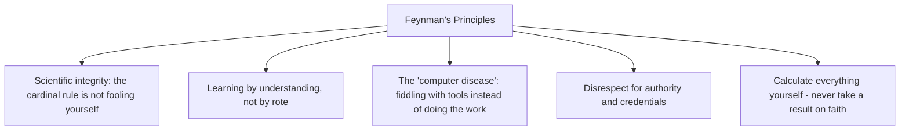

# 11.11. Surely You're Joking, Mr. Feynman! (Richard Feynman)

## 1. Book Metadata

* **Author:** Richard P. Feynman (Nobel Laureate in Physics, 1965)
* **Published:** 1985
* **Pages:** ~400
* **Core field:** Memoir, scientific method, education

## 2. Core Thesis

A Nobel-winning physicist's anecdotal memoir arguing that genuine understanding, irreverent curiosity, and intellectual honesty matter more than credentials or rote expertise. Through pranks, safecracking, drumming, and physics, Feynman models a life driven by playful first-principles inquiry and a refusal to fool oneself or conform to empty institutional prestige.

For software engineers, this book is the source of the Feynman Technique (see Chapter 10.2), the warning against "cargo cult" practices (doing what looks like science without understanding why), and the "computer disease" — the seductive trap of fiddling with tools instead of doing the work.

---

## 3. Key Concepts

* **Scientific integrity**: the cardinal rule is not fooling yourself — and you are the easiest person to fool.
* **Learning by understanding vs. learning by rote/memorization**: rote knowledge is fragile.
* **The "computer disease"**: the seductive trap of fiddling with tools instead of doing the work.
* **Disrespect for authority and credentials**: calculate everything yourself.
* **Intellectual integrity and freedom** from the expectations of others.
* **Cargo cult science**: going through the motions of science without the underlying integrity that makes it work.

---

## 4. Verbatim Quotes

> "The first principle is that you must not fool yourself—and you are the easiest person to fool. So you have to be very careful about that. After you've not fooled yourself, it's easy not to fool other scientists. You just have to be honest in a conventional way after that." — "Cargo Cult Science"

> "You have no responsibility to live up to what other people think you ought to accomplish. I have no responsibility to be like they expect me to be. It's their mistake, not my failing." — "Cargo Cult Science"

> "Well, Mr. Frankel, who started this program, began to suffer from the computer disease that anybody who works with computers now knows about. It's a very serious disease and it interferes completely with the work. The trouble with computers is you *play* with them. They are so wonderful." — "Los Alamos from Below"

> "I don't know what's the matter with people: they don't learn by understanding; they learn by some other way—by rote, or something. Their knowledge is so fragile!" — "O Americano, Outra Vez!"

> "I couldn't claim that I was smarter than sixty-five other guys—but the average of sixty-five other guys, certainly!" — "He Fixes Radios by Thinking!"

---

## 5. Practical Application for Software Engineers

* **The "computer disease" is recognizably our own tendency** to fiddle endlessly with tooling, frameworks, and configuration instead of solving the real problem. Notice when you are fiddling and refocus on the actual work.
* **Refuse rote learning.** When you find yourself memorising without understanding, stop. Read source code, derive behavior from first principles, do not cargo-cult Stack Overflow answers.
* **Treat every assumption as something to be verified, not dignified by authority.** "The senior engineer said it" is not verification.
* **Be ruthlessly honest in code reviews, testing, and estimates** — especially about your own work. The first person you must not fool is yourself.
* **Calculate it yourself.** When you read a performance claim, a complexity bound, or a latency number, derive it. Trust built on derivation is durable; trust built on faith is fragile.

---

## 6. Engineering Anti-Patterns to Watch For

* **The cargo-cult engineer:** copies patterns (microservices! event sourcing! DDD!) without understanding why those patterns exist or whether their problem requires them.
* **The tool-fiddler:** spends days configuring Vim/Emacs/VSCode, never ships. Computer disease.
* **The rote learner:** memorises APIs without understanding the underlying model. Knowledge is fragile; any novel input breaks it.
* **The authority-deferring engineer:** "X said it, so it must be true." Calculate it yourself.

---

## 7. Essential Reminders

* The first principle: you must not fool yourself, and you are the easiest person to fool.
* Understanding beats rote. Rte knowledge is fragile.
* The computer disease: fiddling with tools instead of doing the work.
* Disrespect credentials. Calculate everything yourself.
* Cargo cult science looks like science but produces nothing.
* "Their knowledge is so fragile!"
