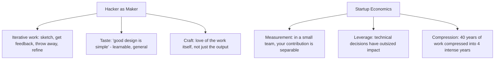

# 11.12. Hackers and Painters (Paul Graham)

## 1. Book Metadata

* **Author:** Paul Graham (Co-founder, Y Combinator)
* **Published:** 2004
* **Pages:** ~330
* **Core field:** Essays on software, technology, wealth, design

## 2. Core Thesis

Hackers are *makers* — closer to painters, composers, and architects than to scientists — and great software, like great art, is produced through iterative work, taste, and a maker's love of the craft. Graham argues that creating wealth (building things people want) is the legitimate, scalable path to getting rich, and that startups compress a lifetime of work into a few intense years by combining *measurement* (your contribution is separable) with *leverage* (decisions have large effect). The book is a defense of hacking as a creative, economically powerful, and intellectually serious activity.

For software engineers, this book is the source of the "hacker as maker" identity, the "taste for makers" framework, and the economic analysis of why startups work. It is also a strong argument for iterative development over upfront design.

---

## 3. Key Concepts

* **Hackers as makers, not scientists**: hacking is a creative art like painting.
* **Wealth ≠ money**: wealth is "stuff people want"; you create it by building, not by capturing a fixed pie.
* **The startup equation**: measurement + leverage + small team = compressed earning.
* **Taste and good design as learnable, general principles**: "Good design is simple."
* **"Revenge of the Nerds"**: Lisp/macros and programmer empowerment; the right tools matter.
* **Iterative development and inspiration cycles** rather than upfront "ditch-digging."

---

## 4. Verbatim Quotes

> "What hackers and painters have in common is that they're both makers. Along with composers, architects, and writers, what hackers and painters are trying to do is make good things." — Ch. 2, "Hackers and Painters"

> "I've never liked the term 'computer science.' The main reason I don't like it is that there's no such thing." — Ch. 2

> "A startup is a small company that takes on a hard technical problem." — Ch. 6

> "Economically, you can think of a startup as a way to compress your whole working life into a few years. Instead of working at a low intensity for forty years, you work as hard as you possibly can for four." — Ch. 6

> "The same principles of good design crop up again and again. Good design is simple. You hear this from math to painting. In math it means that a shorter proof tends to be a better one… It means much the same thing in programming." — Ch. 9, "Taste for Makers"

---

## 5. Practical Application for Software Engineers

* **Treat programming as a craft you iterate on.** Sketch, get feedback, throw away the bad version, refine the way a painter revises a canvas. Do not "dig a ditch" from one end to the other.
* **Pick tools (languages, abstractions) that let you have your way with the problem.** Empowerment and brevity compound across a codebase the way a shorter, cleaner proof beats a longer one.
* **If you want outsized impact, put yourself in a position where your work is *measurable* and *leveraged*** — a small team owning a hard problem. That is the economic structure that converts effort into disproportionate results.
* **Focus relentlessly on making *good things* people actually want.** Creating real value is more durable than chasing money for its own sake.
* **Cultivate taste.** Good design is simple, consistent, and learns from the best in other fields (math, painting, architecture). Read broadly; the principles transfer.

---

## 6. Engineering Anti-Patterns to Watch For

* **The ditch-digger engineer:** plans the entire system upfront, then implements from start to finish without iteration. Produces a system that does not match reality.
* **The tool-poor engineer:** uses whatever language the team uses by default, never explores alternatives. Misses the empowerment that comes from the right tool.
* **The salary-maximiser:** optimises for the highest paying job, not the most leveraged or measured one. Income without wealth creation.
* **The taste-less engineer:** cannot articulate why one design is better than another. "It works" is the only criterion. Plateaus at senior.

---

## 7. Essential Reminders

* Hackers are makers, like painters. Iterate, do not ditch-dig.
* Wealth is stuff people want. Build it; do not just capture it.
* Startups = measurement + leverage + small team. Compress work into years.
* Good design is simple. Cultivate taste across fields.
* Pick tools that empower you. The right tool compounds.
* "Good design is simple. You hear this from math to painting."
