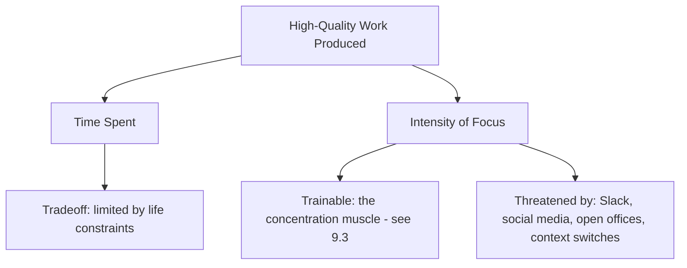

# 11.2. Deep Work (Cal Newport)

## 1. Book Metadata

* **Author:** Cal Newport (Professor of Computer Science, Georgetown)
* **Published:** 2016
* **Pages:** ~300
* **Core field:** Productivity, cognitive science

## 2. Core Thesis

"Deep work" — professional activity performed in a state of distraction-free concentration that pushes your cognitive limits — is both increasingly rare and increasingly valuable in the knowledge economy. The ability to produce high-quality work and learn hard skills fast is a function of focused intensity, not total hours logged. Those who systematically protect and train this capacity will thrive; those who default to shallow, connected work will not.

For software engineers, this is the foundational text for the concentration muscle (see Chapter 9.3). Newport's formula — High-Quality Work Produced = (Time Spent) x (Intensity of Focus) — explains why an engineer who works 6 focused hours outperforms one who works 10 fragmented hours. The book is also the source of the four deep-work scheduling philosophies (monastic, bimodal, rhythmic, journalistic) that engineers can choose between based on their life situation.

---

## 3. Key Concepts

* **Deep Work vs. Shallow Work**: deep work pushes cognitive limits and creates new value; shallow work does not.
* **The Deep Work Hypothesis**: deep work is rare and valuable, and becoming more so.
* **High-Quality Work Produced = (Time Spent) x (Intensity of Focus)**: the core formula.
* **Attention is a trainable skill**, not a fixed trait.
* **Embracing boredom**: the concentration muscle requires practicing *not* reaching for the phone at every free moment.
* **Four scheduling philosophies**: monastic, bimodal, rhythmic, journalistic.
* **The shutdown ritual**: a definitive end to the workday, allowing the unconscious to process.

---

## 4. Verbatim Quotes

> "Deep Work: Professional activities performed in a state of distraction-free concentration that push your cognitive capabilities to their limit. These efforts create new value, improve your skill, and are hard to replicate." — Introduction / p. 3

> "The Deep Work Hypothesis: The ability to perform deep work is becoming increasingly rare at exactly the same time it is becoming increasingly valuable in our economy. As a consequence, the few who cultivate this skill, and then make it the core of their working life, will thrive." — Chapter 1 / p. 14

> "High-Quality Work Produced = (Time Spent) x (Intensity of Focus)." — Chapter 1 / p. 40

> "If you don't produce, you won't thrive – no matter how skilled or talented you are." — Chapter 1 / p. 32

> "The ability to concentrate intensely is a skill that must be trained." — Chapter 2 / p. 157

> "Don't take breaks from distraction. Instead take breaks from focus." — Chapter 2 / p. 159

---

## 5. Practical Application for Software Engineers

* **Schedule deep work blocks at the same time every day** (rhythmic philosophy). For most engineers, 9:00-11:00 AM is the natural slot.
* **Treat concentration as a muscle**: train up gradually (see Chapter 9.3 for the 6-week protocol).
* **Embrace boredom**: do not reach for your phone in lines, in elevators, or during compile times. The impulse to do so is the concentration muscle atrophying in real time.
* **Build a shutdown ritual**: at the end of the workday, write tomorrow's top 3 priorities, close all work apps, and say "shutdown complete." This signals to your brain that work is over and unconscious processing can begin.
* **Schedule Internet use in blocks**: do not check Slack between compiles. Batch all shallow work into defined windows.

---

## 6. Engineering Anti-Patterns to Watch For

* **The Slack-always-open engineer:** cannot enter deep work because the next notification is always seconds away. Close Slack during deep blocks.
* **The "I work best under pressure" engineer:** actually works best under deadline-induced shallow panic. Produces low-quality code that ships because it has to.
* **The meeting-heavy day that "leaves no time for deep work":** the meeting schedule is your fault (or your manager's). Negotiate a meeting-free morning.
* **The evening coding session that feels productive:** usually shallow work dressed as deep work. The brain is too depleted for true depth after 8 hours of work.

---

## 7. Essential Reminders

* Deep work = distraction-free concentration that pushes your cognitive limits.
* HQW = Time x Intensity. Intensity is the lever most engineers ignore.
* Concentration is trainable. Train up gradually over 6 weeks.
* Do not take breaks from distraction. Take breaks from focus.
* Shutdown ritual: end the workday definitively so unconscious processing can begin.
* "The ability to perform deep work is becoming increasingly rare at exactly the same time it is becoming increasingly valuable."
