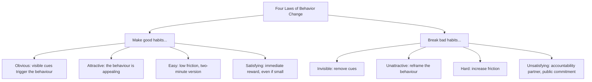

# 11.3. Atomic Habits (James Clear)

## 1. Book Metadata

* **Author:** James Clear
* **Published:** 2018
* **Pages:** ~300
* **Core field:** Behavioural psychology, habit formation

## 2. Core Thesis

Lasting change does not come from setting bigger goals but from building better systems of small, compounding habits. Every action is a vote for the type of person you wish to become, so behavior change is ultimately identity change. Make good habits obvious, attractive, easy, and satisfying; make bad habits invisible, unattractive, hard, and unsatisfying.

For software engineers, this is the antidote to the motivation-dependent approach (see Chapter 3.5). Engineers who rely on motivation to write tests, refactor, or review PRs will be inconsistent. Engineers who design their environment so that the right behaviour is the path of least resistance will be consistent regardless of mood.

---

## 3. Key Concepts

* **Outcomes, processes, and identity**: three layers of behavior change. Identity (who you are) is the deepest and most durable.
* **Four Laws of Behavior Change**: cue, craving, response, reward.
* **"You do not rise to the level of your goals; you fall to the level of your systems."**
* **Habit stacking**: attach a new habit to an existing one ("after I pour my morning coffee, I will write my top 3 priorities").
* **Environment design**: behaviour follows the path of least resistance. Design the path.
* **The 1% compounding model**: small improvements compound exponentially.
* **Never miss twice**: missing one day is an accident; missing two is the start of a new habit.

---

## 4. Verbatim Quotes

> "You do not rise to the level of your goals. You fall to the level of your systems." — Chapter 1 / p. 27

> "A habit is a behavior that has been repeated enough times to become automatic." — Chapter 3 / p. 44

> "Behavior that is incongruent with the self will not last." — Chapter 2 / p. 32

> "Environment is the invisible hand that shapes human behavior." — Chapter 6 / p. 82

> "If you only do the work when it's convenient or exciting, then you'll never be consistent enough to achieve remarkable results." — Chapter 17 / p. 236

> "The first mistake is never the one that ruins you. It is the spiral of repeated mistakes that follows." — Chapter 15

---

## 5. Practical Application for Software Engineers

* **Identity-based habits**: instead of "I want to write more tests," adopt the identity "I am the kind of engineer who writes tests for every new function." Then prove it with one test per day.
* **Environment design for deep work**: phone in a drawer, Slack closed, single browser tab. Make distraction harder than focus.
* **Habit stacking**: "After I open my laptop in the morning, I will review yesterday's PR comments before checking Slack."
* **Two-minute rule for new habits**: start with "I will write one test per day" for two weeks, then scale up. The goal is consistency, not volume.
* **Never miss twice**: missed yesterday's deep work block? Today's block is non-negotiable. Missing one day is forgivable; missing two is a new pattern.

---

## 6. Engineering Anti-Patterns to Watch For

* **The New Year's resolution engineer:** "Starting Monday, I will write tests for everything." Lasts 9 days. Identity change requires gradual evidence, not willpower.
* **The motivation-dependent refactor:** "I will refactor this when I feel like it." You will never feel like it. Schedule it.
* **The environment that fights you:** Slack open, phone on desk, tabs scattered, meetings scattered. No habit survives this environment. Design the environment first.
* **The "I missed yesterday so what is the point" spiral:** missing one day is normal. Missing two days is the new habit. Recover immediately.

---

## 7. Essential Reminders

* Systems beat goals. Identity beats systems.
* Make good habits obvious, attractive, easy, satisfying.
* Make bad habits invisible, unattractive, hard, unsatisfying.
* Never miss twice.
* Environment design beats willpower.
* "You do not rise to the level of your goals. You fall to the level of your systems."
