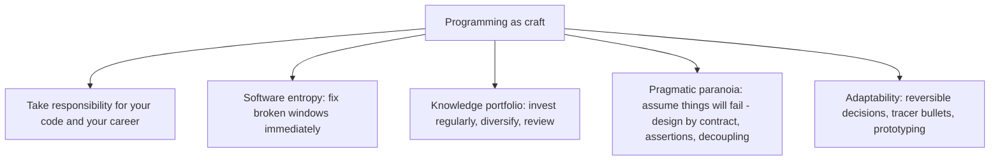

# 11.4. The Pragmatic Programmer (Andy Hunt and Dave Thomas)

## 1. Book Metadata

* **Authors:** Andy Hunt and Dave Thomas
* **Published:** 1999 (1st edition), 2019 (20th anniversary edition)
* **Pages:** ~350 (20th anniversary)
* **Core field:** Software craftsmanship

## 2. Core Thesis

Programming is a craft, not a rote procedure: a pragmatic programmer takes responsibility, fixes small problems before they compound, and continuously invests in their knowledge portfolio. Good software comes from adaptability, feedback, and a healthy paranoia that assumes things will go wrong. The book distills timeless habits — from broken windows to DRY to tracer bullets — that turn code into something you can confidently evolve.

For software engineers, this is the foundational text on engineering craftsmanship. It is also the source of the most-quoted aphorisms in software engineering: "Don't leave broken windows," "DRY," "tracer bullets," "design by contract," "you can't write perfect software."

---

## 3. Key Concepts

* **Broken windows**: bad designs, wrong decisions, or poor code left unrepaired accelerate further decay.
* **DRY (Don't Repeat Yourself)**: every piece of knowledge must have a single, unambiguous representation.
* **Orthogonality**: decoupled components can change independently.
* **Reversibility**: avoid decisions that cannot be undone.
* **Tracer bullets**: build end-to-end thin slices first to validate the architecture.
* **Pragmatic paranoia**: design by contract, assertions, decoupling — assume things will go wrong.
* **Knowledge portfolio**: invest regularly, diversify, review, take risks.
* **You can't write perfect software**: accept it as an axiom. Embrace it.

---

## 4. Verbatim Quotes

> "Don't leave 'broken windows' (bad designs, wrong decisions, or poor code) unrepaired. Fix each one as soon as it is discovered. If there is insufficient time to fix it properly, then board it up." — Chapter 1, Topic 3: Software Entropy

> "You Can't Write Perfect Software. Did that hurt? It shouldn't. Accept it as an axiom of life. Embrace it. Celebrate it. Because perfect software doesn't exist." — Chapter 4: Pragmatic Paranoia

> "Great software today is often preferable to perfect software tomorrow." — Chapter 4: Pragmatic Paranoia

> "Tools amplify your talent. The better your tools, and the better you know how to use them, the more productive you can be." — Chapter 3: The Basic Tools

> "Don't gloss over a routine or piece of code involved in the bug because you 'know' it works. Prove it. Prove it in this context, with this data, with these boundary conditions." — Chapter 4: Pragmatic Paranoia (Debugging)

---

## 5. Practical Application for Software Engineers

* **Fix broken windows immediately.** When you see a typo, a bad variable name, a missing test, fix it now or commit to fixing it within the same PR. Leaving it sends the signal that sloppiness is acceptable.
* **Build a knowledge portfolio.** Learn at least one new language, tool, or technique per quarter. Read at least one technical book per quarter. Diversify across paradigms (functional, OO, logic).
* **Use tracer bullets for new systems.** Build a thin end-to-end slice (UI to database) before fleshing out any layer. This validates the architecture with the smallest possible investment.
* **Prove it, do not assume it.** When debugging, never skip a function because you "know" it works. Prove it in the failing context.
* **Design by contract.** Specify preconditions, postconditions, and invariants. Assertions are not optional.

---

## 6. Engineering Anti-Patterns to Watch For

* **The "I'll fix it later" broken window:** never gets fixed. The next PR adds another broken window. The codebase rots.
* **The "I know this code works" skip:** the function you skipped in debugging is the one with the bug. Prove it, do not assume it.
* **The perfect software delusion:** spending weeks on a refactor that "must be done right." Ship great-today over perfect-tomorrow.
* **The single-tool engineer:** refuses to learn new tools, language, or paradigms. Knowledge portfolio stagnates; career plateaus.

---

## 7. Essential Reminders

* Fix broken windows immediately.
* DRY: every piece of knowledge has one representation.
* Tracer bullets: thin end-to-end slices before fleshing out layers.
* Prove it, do not assume it. The function you skip is the bug.
* Invest in your knowledge portfolio quarterly.
* "Great software today is often preferable to perfect software tomorrow."
