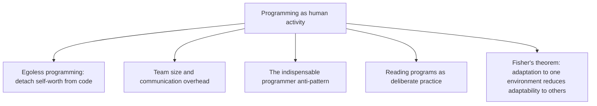

# 11.5. The Psychology of Computer Programming (Gerald Weinberg)

## 1. Book Metadata

* **Author:** Gerald M. Weinberg
* **Published:** 1971 (1st edition), 1998 (Silver Anniversary edition)
* **Pages:** ~300
* **Core field:** Software engineering, social psychology

## 2. Core Thesis

Programming is fundamentally a human activity, not a machine one. The quality of software is determined by the psychology, social dynamics, and organization of the people who write it. Weinberg argues that programmers' egos, team structures, communication patterns, and environments dominate technical factors in determining outcomes — so we must study programming as a human and social science.

For software engineers, this is the original text on egoless programming, team dynamics, and the social aspects of the craft. Written in 1971, it remains astonishingly relevant because the human brain has not changed in 50 years even as the technology has.

---

## 3. Key Concepts

* **Egoless programming**: separating one's self-worth from one's code, so that errors in the code are not threats to the self.
* **Programs as human communication**: code is read by humans more than by machines; write accordingly.
* **Team size and communication overhead**: coordination costs scale superlinearly with team size.
* **Fisher's Fundamental Theorem applied to systems**: adaptation to one environment reduces adaptability to others.
* **The indispensable-programmer anti-pattern**: if you cannot be removed, you are a liability.
* **The Hawthorne Effect**: people behave differently when they know they are being observed.

---

## 4. Verbatim Quotes

> "The material which follows is food for thought, not a substitute for it." — Preface

> "Programming is, among other things, a kind of writing. One way to learn writing is to write, but in all other forms of writing, one also reads. We read examples—both good and bad—to facilitate learning. But how many programmers learn to write programs by reading programs? A few, but not many." — Ch. 1, "Reading Programs"

> "The average programming manager would prefer that a project be estimated at twelve months and take twelve than that the same project be estimated at six months and take nine." — Ch. 7, "Programming as a Group Activity"

> "If a programmer is indispensable, get rid of him as quickly as possible." — Ch. 9, "The Team Leader"

> "A programmer who truly sees his program as an extension of his own ego is not going to be trying to find all the errors in that program. On the contrary, he is going to be trying to prove that the program is correct—even if this means the oversight of errors which are monstrous to another eye." — Ch. 4, "Egoless Programming"

> "Fisher's Fundamental Theorem states—in terms appropriate to the present context—that the better adapted a system is to a particular environment, the less adaptable it is to new environments." — Ch. 13

---

## 5. Practical Application for Software Engineers

* **Practice egoless programming.** When your code is critiqued, the critique is of the code, not of you. Defending the code as if it were your personhood destroys the review's value.
* **Read programs as deliberate practice.** Pick one high-quality open-source project per month. Read 100 lines per day. Write a one-paragraph summary of what you learned.
* **Reduce bus factor.** If you are the only one who understands a critical system, you are a liability. Pair-program, document, share knowledge until you are replaceable.
* **Resist over-adaptation.** A codebase that has been perfectly tuned for one workload is fragile to workload changes. Leave some generality in the design.
* **Schedule honest estimates.** Managers prefer overestimates to underestimates. Use this. Pad estimates by 30% and deliver early; do not under-estimate to look good and deliver late.

---

## 6. Engineering Anti-Patterns to Watch For

* **The defensive author:** treats code review as personal attack. Code review becomes theatre; defects accumulate.
* **The indispensable engineer:** becomes a single point of failure. The organisation is at risk; the engineer's career is at risk.
* **The non-reading programmer:** has been writing code for 10 years but has never read 100 lines of someone else's code. Skills plateau at year 2.
* **The hyper-optimised system:** perfectly tuned for the current workload, brittle to any change. Adaptation has reduced adaptability.

---

## 7. Essential Reminders

* Programming is a human activity. The code is the easy part.
* Egoless programming: detach self-worth from code.
* Read programs deliberately. Most engineers never do this.
* Reduce bus factor. If you are indispensable, you are a liability.
* Fisher's theorem: hyper-adaptation reduces adaptability.
* "If a programmer is indispensable, get rid of him as quickly as possible."
