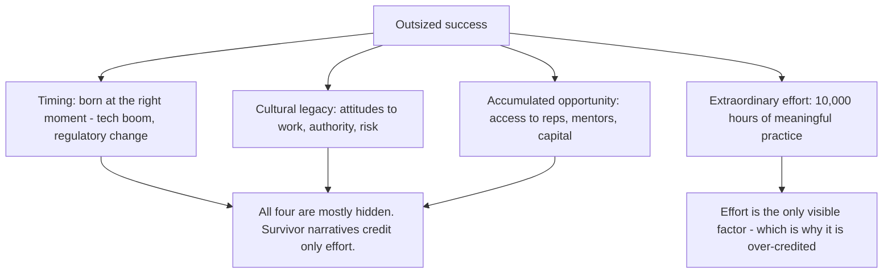

# 11.6. Outliers: The Story of Success (Malcolm Gladwell)

## 1. Book Metadata

* **Author:** Malcolm Gladwell
* **Published:** 2008
* **Pages:** ~300
* **Core field:** Sociology, success research

## 2. Core Thesis

Outsized success is not the product of solo genius; it emerges from hidden advantages — timing, culture, family, and accumulated opportunity — interacting with extraordinary effort. The "10,000-hour rule" is really a statement about meaningful, sustained practice enabled by access most people never get. To understand success we must look at the ecology around a person, not just the person.

For software engineers, this matters because most career advice is survivorship-biased. "I worked hard and got promoted, therefore hard work produces promotion" ignores the timing, mentors, projects, and luck that made the promotion possible. Reading Outliers inoculates you against the survivorship bias and lets you engineer your own accumulative advantage by deliberately seeking the conditions that compound.

---

## 3. Key Concepts

* **The 10,000-hour rule**: ~10,000 hours of meaningful, deliberate practice is associated with world-class expertise. (Often mis-stated as "10,000 hours of any practice.")
* **Accumulative advantage (the Matthew Effect)**: small early advantages compound over time.
* **Demographic luck**: birth date, birthplace, and generation matter disproportionately.
* **Meaningful work**: autonomy, complexity, and a link between effort and reward.
* **Practical intelligence vs. analytic IQ**: knowing how to navigate social systems is at least as important as raw intelligence.
* **Cultural legacies**: attitudes toward work, authority, and risk are inherited from cultural context.

---

## 4. Verbatim Quotes

> "Practice isn't the thing you do once you're good. It's the thing you do that makes you good." — Chapter 2: The 10,000-Hour Rule

> "In fact, researchers have settled on what they believe is the magic number for true expertise: ten thousand hours." — Chapter 2

> "Achievement is talent plus preparation." — Chapter 2

> "Who we are cannot be separated from where we're from." — Chapter 5

> "Those three things — autonomy, complexity, and a connection between effort and reward — are, most people will agree, the three qualities that work has to have if it is to be satisfying." — Chapter 5

> "No one who can rise before dawn three hundred sixty days a year fails to make his family rich." — Chapter 8

---

## 5. Practical Application for Software Engineers

* **Engineer your own accumulative advantage.** Seek hard projects, sharp reviewers, mentors who push you. The compounding starts now.
* **Get your 10,000 hours of *meaningful* practice.** Mindless repetition of CRUD apps does not count. Practice at the edge of your ability on problems that stretch you.
* **Audit your work for autonomy, complexity, and effort-reward link.** If your job lacks these, your growth will plateau regardless of effort.
* **Beware survivorship bias in career advice.** Senior engineers credit their effort; they often do not see the timing, mentors, and lucky projects that mattered. Reproduce the conditions, not just the effort.
* **Cultural legacies cut both ways.** Recognise the inherited attitudes you bring to authority, risk, and conflict. Some help; some hurt.

---

## 6. Engineering Anti-Patterns to Watch For

* **The "I just worked hard" senior:** ignores the timing, mentors, and projects that compounded. Reproducing their effort without their conditions produces frustration.
* **The 10,000-hours-of-anything fallacy:** 10,000 hours of repetitive CRUD is not 10,000 hours of deliberate practice. Practice at the edge.
* **The dead-end job that "pays well":** lacks autonomy, complexity, and effort-reward link. Money now, plateau later.
* **The lone-genius career:** refuses mentorship, refuses collaboration. Compounding requires ecosystem.

---

## 7. Essential Reminders

* Success = timing + culture + opportunity + effort. Effort is the only visible factor.
* 10,000 hours must be *meaningful* practice, not just repetition.
* Engineer your own accumulative advantage: hard projects, sharp reviewers, mentors.
* Audit your work for autonomy, complexity, effort-reward link.
* Survivorship bias dominates career advice. Reproduce conditions, not just effort.
* "Practice isn't the thing you do once you're good. It's the thing you do that makes you good."
