# 11.7. Mindset (Carol Dweck)

## 1. Book Metadata

* **Author:** Carol S. Dweck (Professor of Psychology, Stanford)
* **Published:** 2006
* **Pages:** ~280
* **Core field:** Cognitive psychology, motivation

## 2. Core Thesis

People hold one of two implicit beliefs about ability: a *fixed mindset* (intelligence/talent are static traits you are born with) or a *growth mindset* (abilities can be cultivated through effort, strategy, and learning). The belief you adopt powerfully shapes how you interpret challenges, failure, and criticism, and therefore the trajectory of your achievement. Dweck argues the growth mindset is the engine of sustained learning and resilience.

For software engineers, the fixed-vs-growth mindset distinction is unusually load-bearing because the field constantly puts you in situations where you do not know what you are doing: a new language, a new domain, a bug you cannot crack, a code review that exposes your ignorance. A fixed mindset reads these as evidence of inadequacy; a growth mindset reads them as the workout that builds the muscle.

```mermaid
graph TD
    Fixed[Fixed Mindset]
    Fixed --> Belief1[Belief: intelligence is static]
    Fixed --> Response1[Response to challenge: avoid, to protect self-image]
    Fixed --> Response2[Response to failure: 'I am not smart enough']
    Fixed --> Response3[Response to criticism: defensive]
    Fixed --> Outcome1[Outcome: plateau, defensive avoidance]
    Growth[Growth Mindset]
    Growth --> Belief2[Belief: abilities are cultivated through effort and strategy]
    Growth --> Response4[Response to challenge: engage, to grow]
    Growth --> Response5[Response to failure: 'what strategy did not work?']
    Growth --> Response6[Response to criticism: extract the useful signal]
    Growth --> Outcome2[Outcome: continuous growth over decades]
```

---

## 3. Key Concepts

* **Fixed vs. growth mindset**: implicit self-theories of intelligence.
* **Effort as the path to mastery**, not a sign of inadequacy.
* **The power of "yet"**: "I cannot do this yet" vs. "I cannot do this."
* **Process-oriented praise vs. person/ability praise**: praising strategy and effort builds growth; praising talent builds fixed.
* **The "false growth mindset"**: everyone is a mixture; mindsets are triggered by situations. Naming the trigger is the first step.

---

## 4. Verbatim Quotes

> "The view you adopt for yourself profoundly affects the way you live your life." — Ch. 1 / p. 6

> "This growth mindset is based on the belief that your basic qualities are things you can cultivate through your efforts, your strategies, and help from others. Although people may differ in every which way – in their initial talents and aptitudes, interests, or temperaments – everyone can change and grow through application and experience." — Ch. 1 / p. 7

> "In one world, effort is a bad thing. It, like failure, means you're not smart or talented. If you were, you wouldn't need effort. In the other world, effort is what makes you smart or talented." — Ch. 2 / p. 16

> "Those with the growth mindset found setbacks motivating. They're informative. They're a wake-up call." — Ch. 4 / p. 99

> "The great teachers believe in the growth of the intellect and talent, and they are fascinated with the process of learning." — Ch. 7 / p. 197

---

## 5. Practical Application for Software Engineers

* **Treat every bug, failed review, and incident as data about your process, not a verdict on your talent.** This single reframe keeps you improving over a decades-long career.
* **Choose code reviewers who challenge you to grow** rather than those who validate you. The discomfort is the workout.
* **Praise teammates' strategies and persistence, not their "smartness."** "Great debugging strategy" builds growth; "you are so smart" builds fixed.
* **When a new language or domain feels hard, that discomfort is the growth mindset working.** Push through, do not retreat to what you are "naturally good at."
* **Notice your fixed-mindset triggers.** A harsh review, an intimidating codebase, a public mistake — these can temporarily flip you into fixed mindset. Naming the trigger lets you switch back.

---

## 6. Engineering Anti-Patterns to Watch For

* **The "I am just not a systems person" engineer:** fixed mindset about a domain. With effort and strategy, you can become one. The declaration is self-fulfilling.
* **The reviewer who praises "smart" code:** primes the author for fixed mindset. Praise strategy and effort instead.
* **The engineer who avoids hard projects to protect their reputation:** fixed mindset. Reputation built on safe work plateaus.
* **The "I am naturally good at X" identity:** fragile. The first failure crushes it. Build identity around effort and learning instead.

---

## 7. Essential Reminders

* Fixed mindset: intelligence is static. Growth mindset: intelligence is cultivated.
* Effort is the path to mastery, not a sign of inadequacy.
* Praise strategy and persistence, not talent.
* Add "yet" to "I cannot do this."
* Notice your fixed-mindset triggers. Naming them lets you switch back.
* "Those with the growth mindset found setbacks motivating. They're informative. They're a wake-up call."
