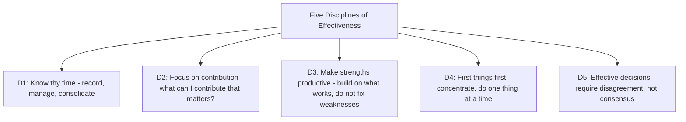

# 11.8. The Effective Executive (Peter Drucker)

## 1. Book Metadata

* **Author:** Peter F. Drucker
* **Published:** 1967 (revised 2006)
* **Pages:** ~200
* **Core field:** Management, knowledge work

## 2. Core Thesis

Effectiveness is not an innate gift but a set of practices that can — and must — be learned by every knowledge worker whose decisions affect an organisation's performance. Effectiveness rests on a few disciplines: managing time, focusing on contribution, building on strengths, setting priorities, and making effective decisions. The effective executive concentrates effort on the few things that actually produce results.

For software engineers, especially those transitioning to senior or staff roles, Drucker's five disciplines are the playbook. Engineers who treat their work as "writing code" plateau; engineers who treat their work as "producing contribution through code" keep rising.

---

## 3. Key Concepts

* **Five habits**: know thy time, focus on contribution, make strengths productive, first things first, effective decisions.
* **Time as the scarcest, most inelastic resource.** Record, manage, consolidate.
* **Decisions require disagreement; consensus is suspect.**
* **Systematic abandonment**: continually ask "what should we stop doing?"
* **Knowledge work is effective only when focused on the right things, not the most things.**

---

## 4. Verbatim Quotes

> "Intelligence, imagination, and knowledge are essential resources, but only effectiveness converts them into results." — Ch. 1, "Effectiveness Can Be Learned"

> "Effective executives, in my observation, do not start with their tasks. They start with their time. And they do not start with planning. They start by finding out where their time actually goes." — Ch. 2, "Know Thy Time"

> "If there is any one 'secret' of effectiveness, it is concentration. Effective executives do first things first and they do one thing at a time." — Ch. 5, "First Things First"

> "It is more productive to convert an opportunity into results than to solve a problem – which only restores the equilibrium of yesterday." — Ch. 3, "What Can I Contribute?"

> "The first rule in decision-making is that one does not make a decision unless there is disagreement." — Ch. 7, "Effective Decisions"

---

## 5. Practical Application for Software Engineers

* **Audit your calendar and your Slack/CI notifications the way Drucker audits time.** Most engineers discover huge chunks vanish on "operating" rather than contributing. Cut, delegate, batch.
* **Before each sprint, ask "what can I contribute that most advances the product?"** Put your best effort on the one opportunity that matters most, not the loudest bug.
* **Run design reviews that surface dissenting views.** Quick consensus is a red flag, not a sign of alignment.
* **Practice "systematic abandonment."** Kill the dead-code branches, stale dashboards, and recurring meetings that only restore "the equilibrium of yesterday."
* **Treat any decision without an explicit owner, deadline, and affected parties as not-yet-decided.** Decisions without these three are noise.

---

## 6. Engineering Anti-Patterns to Watch For

* **The busy engineer who produces no contribution:** 60-hour weeks of operating, no contribution. Time is logged but nothing moves.
* **The consensus-seeking design review:** produces watered-down decisions that satisfy everyone and advance nothing. Demand disagreement.
* **The eternal legacy maintenance:** keeps yesterday's system running, blocks no opportunity. Drucker's question: "if we were not already doing this, would we start?"
* **The decision-by-meeting without owner or deadline:** not a decision, just a discussion. Require owner and deadline.

---

## 7. Essential Reminders

* Effectiveness is learned, not innate.
* Five disciplines: time, contribution, strengths, priorities, decisions.
* Concentration is the secret. One thing at a time.
* Decisions require disagreement. Consensus is suspect.
* Systematically abandon what no longer contributes.
* "It is more productive to convert an opportunity into results than to solve a problem."
