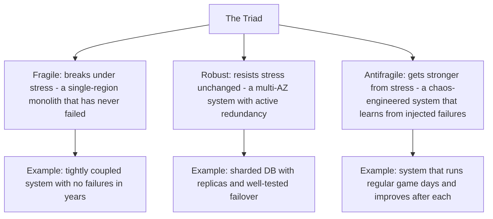

# 11.9. Antifragile (Nassim Nicholas Taleb)

## 1. Book Metadata

* **Author:** Nassim Nicholas Taleb
* **Published:** 2012
* **Pages:** ~520
* **Core field:** Risk, systems theory, epistemology

## 2. Core Thesis

Beyond the fragile (which breaks under stress) and the robust (which resists stress unchanged), there is a third category — the *antifragile*, which actually gets stronger, better, or more resilient from volatility, shocks, and disorder. Modernity's obsession with predicting, optimising, and smoothing away randomness makes systems fragile, because it removes the small stresses that build resilience. The remedy is to expose yourself to *bounded* volatility and downside (have "skin in the game"), embrace trial-and-error, and structure life so that you gain more from upside than you lose from downside — the "barbell strategy."

For software engineers, this is the conceptual foundation for chaos engineering, canary deploys, and self-healing systems. It also explains why perfectly tuned systems that have never failed are the most dangerous — they have not built the antifragility that comes from small, regular stressors.

---

## 3. Key Concepts

* **The fragile–robust–antifragile triad**: three categories of response to stress.
* **"Skin in the game"**: the only true mitigator of fragility. People who bear the downside of their decisions make better decisions.
* **Optionality and convexity**: small downside, large upside. Antifragile systems are convex.
* **The barbell strategy**: combine extreme safety with small risky bets. Avoid the "middle risk" that has hidden fragility.
* **Via negativa**: what to avoid matters more than what to add.
* **Iatrogenics / intervention bias**: doing something often harms more than doing nothing.

---

## 4. Verbatim Quotes

> "Antifragility is beyond resilience or robustness. The resilient resists shocks and stays the same; the antifragile gets better." — Book 1

> "I want to live happily in a world I don't understand." — Prologue / p. 6

> "Difficulty is what wakes up the genius." — Book 2

> "Few understand that procrastination is our natural defense, letting things take care of themselves and exercise their antifragility; it results from some ecological or naturalistic wisdom, and is not always bad." — Book 4

> "In accord with the practitioner's ethos, the rule in this book is as follows: I eat my own cooking." — Prologue / p. 14

---

## 5. Practical Application for Software Engineers

* **Design systems that *gain* from failure rather than merely survive it.** Chaos engineering, canary deploys, self-healing autoscaling are antifragile; a perfectly tuned single-region monolith that has never failed is fragile.
* **Keep your downside bounded** (feature flags, fast rollbacks, immutable infrastructure) while preserving large upside optionality (cheap experiments, easy roll-forward).
* **Treat code reviews, on-call rotations, and postmortems as small, regular stressors** that strengthen the team's "immune system" rather than inconveniences to smooth away.
* **Never trust architecture advice from anyone without skin in the game.** If they will not be paged at 3 a.m. when it breaks, weight their opinion accordingly.
* **Use the barbell strategy for career and learning.** Keep a safe job (90%) and take small risky bets (10%) — open-source contributions, side projects, conference talks. The bets are capped in downside but uncapped in upside.

---

## 6. Engineering Anti-Patterns to Watch For

* **The "perfectly tuned" system that has never failed:** fragile. The first failure will be catastrophic.
* **The architecture consultant without skin in the game:** opinions without consequences. Discount heavily.
* **The middle-risk career:** safe job, safe projects, safe everything. No fragility exposure, no antifragility gains. Plateau.
* **The interventionist postmortem:** "we must do something to prevent this." Sometimes the right response is to do nothing and let the system's antifragility handle the next event.

---

## 7. Essential Reminders

* Fragile breaks; robust resists; antifragile gains.
* Skin in the game is the only true mitigator of fragility.
* Barbell strategy: extreme safety + small risky bets.
* Via negativa: subtract, do not just add.
* Bounded downside, uncapped upside = convex = antifragile.
* "Difficulty is what wakes up the genius."
