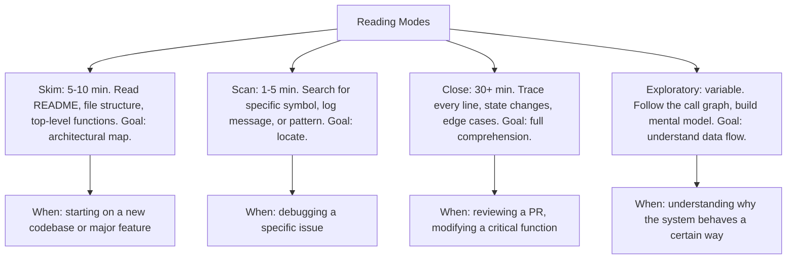
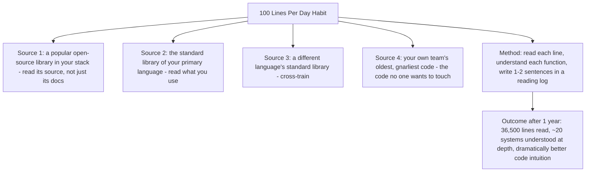
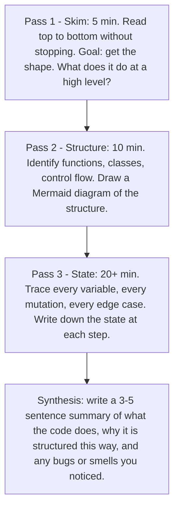

# 12.1. Reading Code as a Skill

## 1. Background and Why It Matters

Most engineers are never taught to read code. They are taught to write it. Yet the majority of professional engineering time is spent reading — existing codebases, dependencies, code reviews, library source — not writing. An engineer who reads 10x faster and with 10x better comprehension than their peers has a structural advantage that compounds across their career.

Gerald Weinberg observed in *The Psychology of Computer Programming* (see Chapter 11.5): "Programming is, among other things, a kind of writing. One way to learn writing is to write, but in all other forms of writing, one also reads. We read examples—both good and bad—to facilitate learning. But how many programmers learn to write programs by reading programs? A few, but not many."

Reading code is a skill with sub-skills: skimming (architectural overview), scanning (finding a specific thing), close reading (understanding every line), and exploratory reading (following the call graph to build a mental model). Each is appropriate for different situations, and most engineers default to only one mode.



---

## 2. The Four-Stage Reading Process

When approaching an unfamiliar codebase, work through the stages deliberately rather than jumping into source files:

```mermaid
graph TD
    Stage1[Stage 1: Read the README, docs, and any architecture docs. Goal: understand what the system does and how it is structured.]
    Stage1 --> Stage2[Stage 2: Read the directory tree and identify the major modules. Goal: build a mental map of where things live.]
    Stage2 --> Stage3[Stage 3: Read the entrypoints - main(), route handlers, API definitions. Goal: understand the system's interface with the world.]
    Stage3 --> Stage4[Stage 4: Trace one end-to-end flow. Pick a representative request or operation and follow it from entry to exit. Goal: understand the system's interior.]
    Stage4 --> Outcome[Outcome: a mental model that lets you locate anything quickly and predict where new functionality belongs]
```

Most engineers skip stages 1-3 and dive into stage 4 immediately. This is why they get lost and frustrated. The early stages build the map that makes stage 4 productive.

---

## 3. Practical Application: The 100-Line-Per-Day Habit

Build the code-reading habit by committing to read 100 lines of high-quality code per day:



The reading log is the key. Without writing down what you learned, you will forget 90% within a week. With a log, you build a searchable library of insights that compounds.

---

## 4. Concrete Exercise: The Three-Pass Code Read

For any non-trivial file you need to understand deeply (e.g., a critical algorithm, a tricky piece of business logic), use the three-pass method:



The three-pass method defeats the illusion of understanding that comes from reading once and feeling "yeah I get it." The third pass almost always surfaces something the first pass missed — usually an edge case, a mutation, or a coupling the skimmer's eye skipped over.

---

## 5. Common Pitfalls and Student Misunderstandings

* **Reading only when forced.** Most engineers read code only when debugging or modifying. This means they read in panic mode, with a specific goal, and miss most of what the code is teaching them. Read proactively, without a goal, to build intuition.
* **Treating all code as equally worth reading.** Some code is well-written and teaches good patterns. Some code is badly-written and teaches what to avoid. Some code is just noise. Be selective. Read high-quality codebases (standard libraries, well-regarded open-source projects) more than average ones.
* **Not reading your own team's old code.** The oldest, gnarliest code in your repo is the code that everyone is afraid to touch. Reading it carefully — without modifying — is one of the highest-leverage activities for understanding the system's actual history and constraints.
* **Reading without a log.** Reading without writing is consumption, not learning. Write 1-2 sentences per session about what you learned.
* **Confusing reading speed with reading skill.** Fast skimming is one skill; close reading is another. Both matter. Do not optimise for speed at the expense of depth.

---

## 6. Essential Reminders

* Most engineering time is spent reading, not writing. Train reading as a skill.
* Four modes: skim, scan, close, exploratory. Pick the right one.
* Three-pass method for deep understanding: skim, structure, state.
* 100 lines per day of high-quality code = 36,500 lines/year = dramatic skill growth.
* Keep a reading log. Without writing, you forget 90%.
* "How many programmers learn to write programs by reading programs? A few, but not many." — Gerald Weinberg
