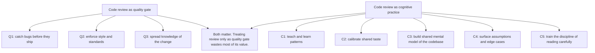
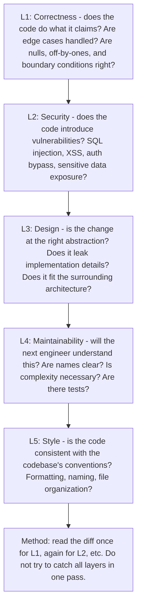
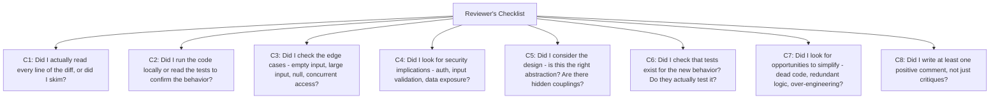
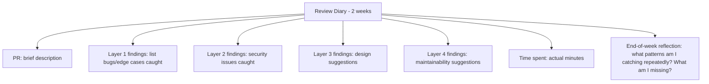

# 12.2. Code Review as Cognitive Practice

## 1. Background and Why It Matters

Code review is not (only) a quality gate. It is the primary venue where engineers learn from each other, calibrate their taste, and build a shared mental model of the codebase. Treated as a quality gate, code review is a chore that slows shipping. Treated as cognitive practice, it is one of the highest-leverage learning activities in an engineer's week.

For software engineers, the skill of *reviewing well* is distinct from the skill of *writing well*. A good reviewer reads code as if they would have to maintain it (because they will), asks questions that expose assumptions, catches bugs that tests would miss, and teaches through suggestions rather than directives. A good reviewer also receives feedback gracefully, treating each comment as data rather than attack.

---

## 2. The Five-Layer Review

A thorough code review operates at five layers, each catching different issues:

Most engineers try to do all five layers in one pass and miss most of L2-L5 because L1 dominates their attention. Layered review is slower per pass but catches far more.

---

## 3. Practical Application: The Reviewer's Checklist

Before approving a PR, run this checklist explicitly:

C8 is undervalued. Code review that is only critique trains authors to dread review; code review that includes positive observations trains authors to share work and to internalise what good looks like.

---

## 4. Concrete Exercise: The Review Diary

For two weeks, keep a review diary. For each PR you review, write down:

After two weeks, you will have data on which layers you consistently catch and which you consistently miss. Most engineers discover they catch L1 (correctness) reliably but miss L3 (design) and L4 (maintainability) because those require more thought per line. Targeted improvement follows naturally.

---

## 5. The Author's Side: Receiving Review Well

Reviewing well is half the skill; receiving well is the other half. As an author:

* **Do not defend.** When a reviewer points out an issue, the first response is "good catch" or "let me check that." Defending the code as written is ego-driven; the code is not you.
* **Distinguish "must fix" from "consider."** Some comments require changes (bugs, security). Others are suggestions (style, alternative approaches). Engage with both, but do not treat every suggestion as mandatory.
* **Ask for explanation when comments are terse.** "Wrong" is not feedback. "This will fail if X is null because Y" is feedback. Push for the latter, gracefully.
* **Resolve threads explicitly.** Do not leave comment threads open with no resolution. Either fix the code or explain why you did not.

---

## 6. Common Pitfalls and Student Misunderstandings

* **Rubber-stamping.** Approving without reading thoroughly defeats the entire purpose. If you do not have time to review properly, say so — do not approve to clear the queue.
* **Bike-shedding.** Spending 20 minutes on naming conventions and 2 minutes on the actual logic. Naming matters, but correctness and design matter more. Allocate attention proportional to importance.
* **Comment-only reviews.** Leaving 15 nitpick comments and no high-level feedback. The author learns nothing about whether the design is sound.
* **Defensive authoring.** Treating every comment as an attack. This kills the team's review culture within months.
* **Reviewing in panic mode.** Reviewing 5 PRs in the last 30 minutes of the day. Each gets 6 minutes. None gets real review. Schedule review time as deep work, not as filler.

---

## 7. Essential Reminders

* Code review is cognitive practice, not just a quality gate.
* Five layers: correctness, security, design, maintainability, style. Review each separately.
* Run the reviewer's checklist explicitly. Do not trust your intuition that you caught everything.
* Include positive comments, not just critiques. Review culture depends on it.
* Receive feedback gracefully. The code is not you.
* "A programmer who truly sees his program as an extension of his own ego is not going to be trying to find all the errors in that program." — Gerald Weinberg
