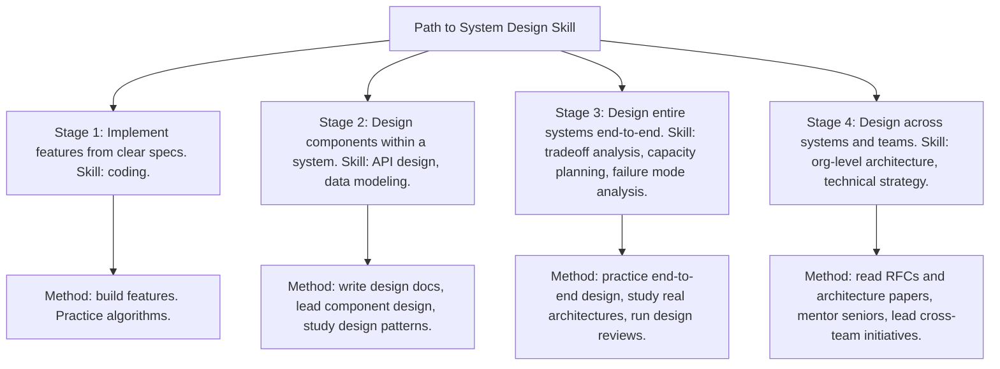
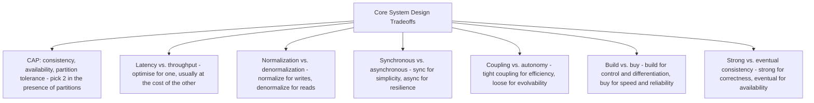
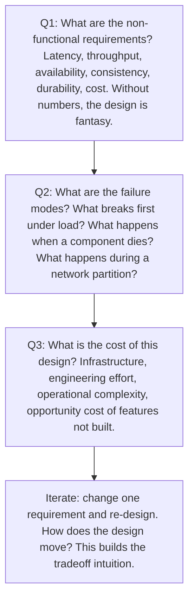

# 12.3. System Design Practice and Case Studies

## 1. Background and Why It Matters

System design is the engineering skill with the steepest experience curve. Unlike coding, where you can practice algorithms on LeetCode, system design requires building intuition about tradeoffs: consistency vs. availability, latency vs. throughput, normalisation vs. denormalisation, build vs. buy. This intuition comes only from (a) designing real systems, (b) studying how real systems were designed, and (c) practicing design under realistic constraints.

For software engineers, the path to senior and staff levels runs through system design. Junior engineers implement; senior engineers design; staff engineers design across teams. The transition from "I can implement a feature" to "I can design a system" is the most important inflection point in an engineering career, and it does not happen by accident.



---

## 2. The Core Tradeoffs

Every system design decision is a tradeoff. The skill is not in knowing the "right" answer — there usually is no right answer — but in articulating the tradeoffs clearly and choosing deliberately. The core tradeoffs:



The discipline is to name the tradeoff explicitly, enumerate the options, and choose based on the specific business requirements — not on what is fashionable or what the team did last time.

---

## 3. Practical Application: The Design Practice Repertoire

Build a repertoire of practiced designs. For each, sketch the architecture on a whiteboard in 45 minutes, then compare against published reference architectures:

```mermaid
graph TD
    Repertoire[Design Practice Repertoire]
    Repertoire --> D1[D1: URL shortener - core: ID generation, redirection, analytics]
    Repertoire --> D2[D2: Newsfeed - core: fanout on write vs. fanout on read, ranking, caching]
    Repertoire --> D3[D3: Chat system - core: connection management, message ordering, delivery guarantees]
    Repertoire --> D4[D4: Payment processor - core: idempotency, atomicity, fraud, reconciliation]
    Repertoire --> D5[D5: Rate limiter - core: token bucket vs. sliding window, distributed state]
    Repertoire --> D6[D6: Notification system - core: multi-channel delivery, preferences, deduplication]
    Repertoire --> D7[D7: Search system - core: indexing, ranking, sharding, query language]
    Repertoire --> D8[D8: Object storage - core: chunking, replication, consistency, metadata]
    Repertoire --> Method[Method: design 1 per week, compare against published architectures (Facebook, Twitter, Slack, Stripe, etc.), document tradeoffs]
```

After 8 weeks, you will have designed 8 systems and compared them against real production architectures. The compound effect is dramatic: you will see patterns repeat across systems and develop intuition for which tradeoffs matter in which contexts.

---

## 4. Concrete Exercise: The Three-Question Design Drill

For any system you design, force yourself to answer these three questions explicitly:



The discipline of explicit non-functional requirements (Q1) is the single most common gap in junior designers. "Design a URL shortener" without "1B URLs/day, 50ms p99 read latency, 99.99% availability" is not a design problem — it is a doodle.

---

## 5. Common Pitfalls and Student Misunderstandings

* **Starting with technology, not requirements.** "We will use Kafka and Cassandra" before knowing the load, latency, or consistency requirements. Technology follows requirements, not the other way around.
* **Skipping capacity estimation.** "We will scale horizontally" without knowing whether you need 3 nodes or 3,000. The design is fundamentally different at different scales.
* **Ignoring failure modes.** Designing the happy path and assuming the system will not fail. Production reality is failure modes; the happy path is the easy part.
* **Over-engineering.** Adding message queues, caching layers, and microservices for a system that handles 100 requests per day. YAGNI (see Chapter 4.2).
* **Designing in isolation.** Without a reviewer or a comparison architecture, you cannot tell whether your design is good. Always compare against published architectures or get a senior engineer to review.

---

## 6. Essential Reminders

* System design is a skill, not a talent. Practice deliberately.
* Every decision is a tradeoff. Name it explicitly.
* Non-functional requirements with numbers. Without numbers, it is fantasy.
* Always design the failure modes, not just the happy path.
* Build a repertoire of 8-12 practiced designs. Patterns will emerge.
* Compare against real production architectures. You are not the first to design most things.
