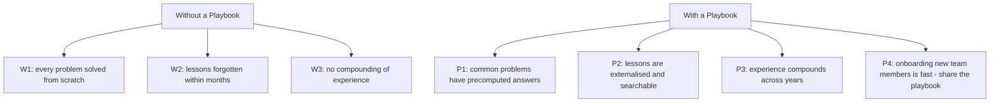
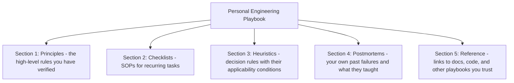
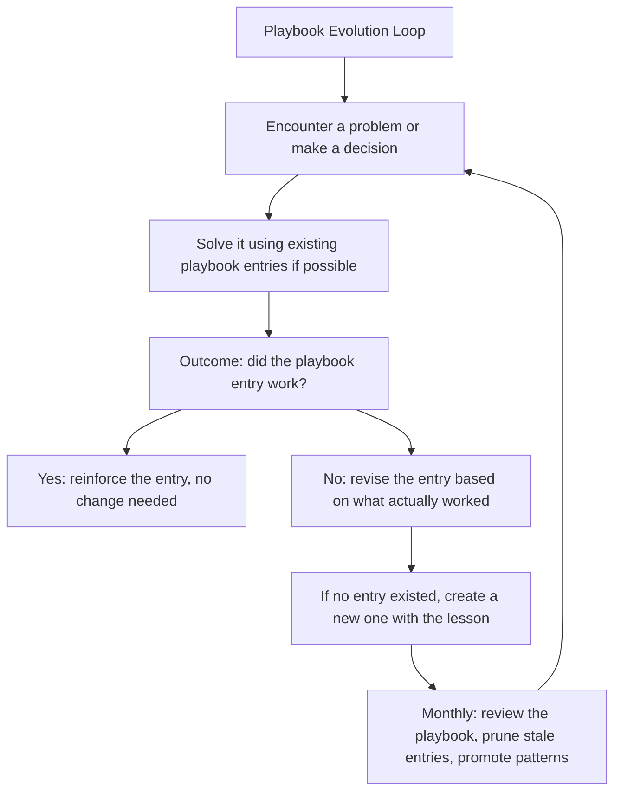
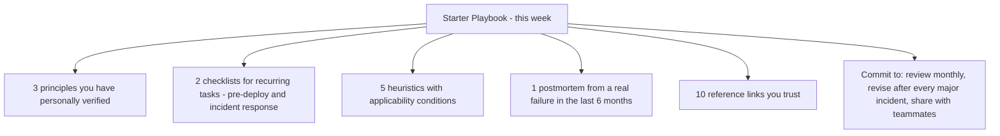

# 12.4. Building a Personal Engineering Playbook

## 1. Background and Why It Matters

A personal engineering playbook is a curated, evolving collection of the principles, checklists, heuristics, and decision rules that you have personally verified through experience. It is distinct from a notebook of things you have read, because everything in the playbook has been tested against reality and either kept (because it worked) or modified (because it did not).

For software engineers, a playbook is the artifact that converts experience into reliability. Without one, every problem is approached from scratch, and lessons learned are forgotten within months. With one, your past self does the work of solving common problems, freeing your present self to focus on what is genuinely new.

---

## 2. Playbook Structure

A personal playbook has five sections:

### 2.1. Principles
Short, declarative statements you have personally verified. Examples:
* "Optimise only after measurement."
* "Fix broken windows immediately."
* "If a function cannot be explained in 2 minutes, it is too complex."

### 2.2. Checklists
Step-by-step SOPs for recurring tasks. Examples:
* Pre-deploy checklist (tests, rollback plan, monitoring).
* Incident response checklist (assess, mitigate, communicate, root-cause).
* Code review checklist (the five layers from 12.2).

### 2.3. Heuristics
Decision rules with their applicability conditions. Examples:
* "If the working set fits in memory, in-process cache beats Redis."
* "If the API has more than 5 endpoints, generate the client from a schema."
* "If the feature has <10 monthly users, delete it."

### 2.4. Postmortems
Your own past failures, written up with what happened, what you learned, and what you changed. This section is the most valuable and the most-skipped.

### 2.5. Reference
Links to docs, code, papers, and other playbooks you trust. Saves you from re-googling the same things.

---

## 3. Practical Application: The Playbook Evolution Loop

A playbook is not a one-time artifact; it evolves through a loop:

The monthly review is essential. Without it, the playbook grows stale and stops being trusted, at which point you stop consulting it, at which point it dies.

---

## 4. Concrete Exercise: The Starter Playbook

This week, create a starter playbook with these minimum entries:

After 3 months of consistent maintenance, the playbook will have ~30-50 entries and will start to feel like an extension of your memory. After a year, it will be the most valuable engineering artifact you own.

---

## 5. Common Pitfalls and Student Misunderstandings

* **Filling the playbook with things you have read but not verified.** A playbook of unverified principles is a junk drawer of opinions. Only include what you have personally tested.
* **Letting the playbook grow without pruning.** Entries that are no longer relevant clutter the playbook and reduce trust. Prune aggressively in the monthly review.
* **Treating the playbook as private.** Sharing your playbook with teammates accelerates everyone's learning and surfaces principles you have not yet articulated.
* **Skipping the postmortem section.** This is the most painful section to write (it requires admitting failure) and the most valuable (it converts failures into permanent lessons).
* **Not revising entries when they stop working.** A principle that worked at one scale may not work at another. Update entries when reality disagrees with them.

---

## 6. Essential Reminders

* A playbook converts experience into reliability.
* Five sections: principles, checklists, heuristics, postmortems, reference.
* Only include what you have personally verified. Unverified entries are noise.
* Review monthly. Prune stale entries. Promote patterns.
* Share with teammates. Playbooks compound when shared.
* Write postmortems of your own failures. They are the most valuable section.
