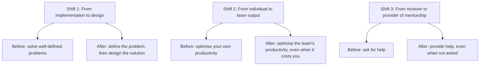
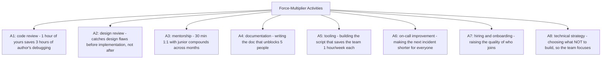
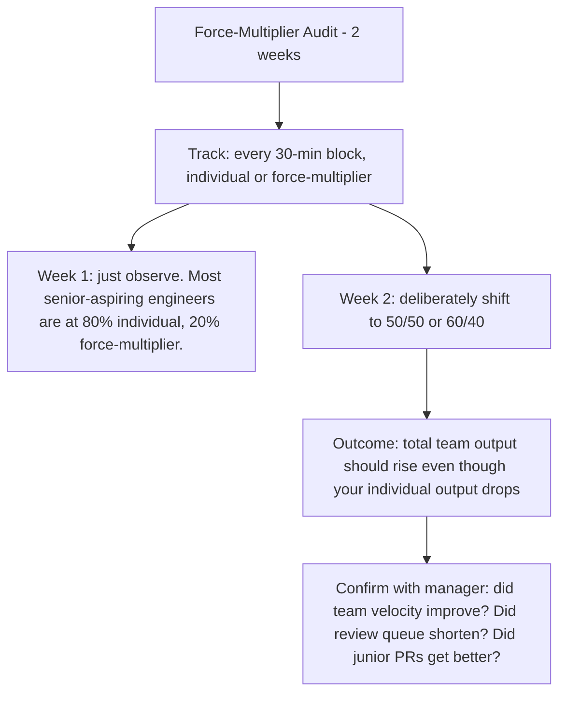

# 12.5. The Seniority Transition: From Individual Contributor to Force Multiplier

## 1. Background and Why It Matters

The transition from mid-level to senior engineer is the most important career inflection point in software engineering. At mid-level, your job is to implement features well. At senior, your job is to multiply the effectiveness of those around you. The skills that got you to mid-level (fast, accurate implementation) are necessary but no longer sufficient. The skills that get you to senior (technical leadership, ambiguity resolution, mentorship, scope expansion) are different and must be deliberately developed.

For software engineers, this transition is often undocumented and unsupported. Many engineers plateau at mid-level because they continue optimising for individual output when the role now requires team output. Understanding the transition explicitly is the first step to navigating it.

```mermaid
graph TD
    Midlevel[Mid-level Engineer]
    Midlevel --> M1[M1: implements features from clear specs]
    Midlevel --> M2[M2: own components within a system]
    Midlevel --> M3[M3: produces individual output]
    Midlevel --> M4[M4: receives mentorship]
    Senior[Senior Engineer]
    Senior --> S1[S1: designs systems, resolves ambiguity, defines what to build]
    Senior --> S2[S2: owns systems end-to-end]
    Senior --> S3[S3: multiplies team output through design, review, mentorship]
    Senior --> S4[S4: provides mentorship]
    Staff[Staff Engineer]
    Staff --> St1[St1: sets technical strategy across teams]
    Staff --> St2[St2: identifies and leads cross-team initiatives]
    Staff --> St3[St3: multiplies senior engineers' effectiveness]
```

---

## 2. The Three Skill Shifts

The seniority transition requires three skill shifts:

The hardest part of the transition is Shift 2. At mid-level, you are paid for your output. At senior, you are paid for the team's output. Spending 2 hours reviewing a junior's PR (which produces no individual output for you) is the senior activity, even though it feels unproductive to the mid-level mindset.

---

## 3. Practical Application: The Force-Multiplier Activities

Senior engineers spend significant time on activities that have zero individual output but multiply team output:

The trap: each of these activities feels less productive than writing code. None of them produces a merged PR with your name on it. But the senior engineer's job is to produce team output, not individual output. Force-multiplier activities are the job.

---

## 4. Concrete Exercise: The Force-Multiplier Audit

For two weeks, track how you spend your time, categorised as "individual output" (features you implemented, bugs you fixed) or "force multiplier" (review, mentorship, docs, tooling):

The goal is not to maximise force-multiplier time — it is to spend it on the highest-leverage force-multiplier activities, which depend on the team's current bottleneck. A team with a long review queue benefits most from review. A team with buggy production benefits most from on-call improvement. A team with high junior turnover benefits most from mentorship and onboarding. Diagnose the bottleneck, then multiply.

---

## 5. Common Pitfalls and Student Misunderstandings

* **Continuing to optimise individual output.** The mid-level mindset measures productivity in commits and PRs. The senior mindset measures it in team output. Without the shift, you plateau.
* **Treating force-multiplier activities as overhead.** "I would love to review PRs but I have my own work to do." The senior's work *is* reviewing PRs (and designing, mentoring, etc.).
* **Avoiding mentorship because it feels slow.** Mentorship compounds. A 30-minute 1:1 today can prevent a 3-hour debugging session next month. The ROI is high but delayed.
* **Doing force-multiplier activities badly.** Rubber-stamping reviews, vague mentorship, useless docs. Force-multiplier activities done badly are worse than not doing them, because they consume time without producing the multiplier.
* **Not asking for the title until you are already doing the job.** Most engineers wait to be promoted, then start doing senior work. The correct order is the reverse: do senior work, then ask for the title with evidence.

---

## 6. Essential Reminders

* Senior engineers multiply team output, not individual output.
* Three shifts: implementation→design, individual→team, receiver→provider of mentorship.
* Force-multiplier activities (review, mentorship, docs, tooling) feel unproductive but are the job.
* Diagnose the team's bottleneck, then multiply there.
* Do the senior work before asking for the title. Promotion follows behavior, not the reverse.
* "If you want to be promoted to senior, start doing senior work today." — common engineering manager advice
