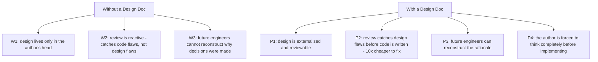
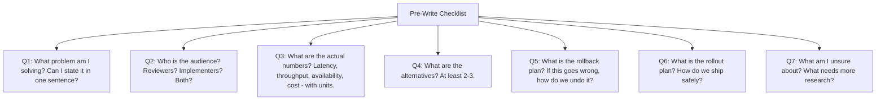
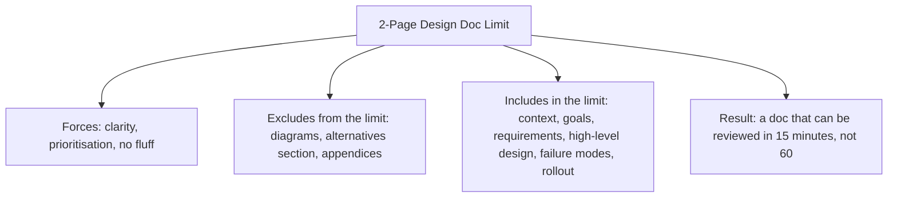

# 12.6. Writing Engineering Design Documents

## 1. Background and Why It Matters

An engineering design document (design doc, RFC, or technical specification) is the artifact that captures the design of a system before implementation begins. It serves three purposes: (1) it forces the author to think through the design completely, (2) it provides a reference for reviewers to catch design flaws before they become code flaws, and (3) it documents the *why* of the system for future engineers who will inherit it.

For software engineers, the ability to write a good design doc is the marker of seniority. Junior engineers write code; senior engineers write design docs that other engineers implement from. The skill is distinct from coding — it requires thinking at a higher abstraction level, anticipating failure modes, and writing clearly enough that a teammate can evaluate the design without having to read your mind.

---

## 2. The Standard Design Doc Structure

A good design doc has these sections, in order:

```mermaid
graph TD
    Doc[Design Doc Structure]
    Doc --> S1[S1: Context and scope - what problem, what system, what is in/out of scope]
    Doc --> S2[S2: Goals and non-goals - what success looks like, what we are explicitly not trying to do]
    Doc --> S3[S3: Actual requirements - the constraints with numbers: latency, throughput, availability, cost]
    Doc --> S4[S4: High-level design - the architecture diagram and one-paragraph explanation]
    Doc --> S5[S5: Detailed design - data model, API, algorithms, key components]
    Doc --> S6[S6: Failure modes - what breaks, what happens when it breaks, how we detect it]
    Doc --> S7[S7: Alternatives considered - what else we could have done and why we did not]
    Doc --> S8[S8: Open questions - what we still do not know and need to resolve]
    Doc --> S9[S9: Rollout plan - how we ship safely: feature flags, canaries, rollback]
```

S7 (Alternatives considered) is the most-skipped and most-valuable section. Without it, reviewers cannot tell whether the design is good or whether the author just did not consider the alternatives. With it, the design's reasoning is visible and reviewable.

---

## 3. Practical Application: The Pre-Write Checklist

Before writing a design doc, answer these questions in your head or in notes:

If you cannot answer Q1 in one sentence, you do not yet understand the problem. If you cannot answer Q3 with numbers, you do not yet understand the constraints. If you cannot answer Q4 with 2-3 alternatives, you have not done enough design work.

---

## 4. Concrete Exercise: The Two-Page Constraint

Write your next design doc with a strict 2-page limit (excluding diagrams and the alternatives section):

The 2-page limit is a forcing function for clarity. Long design docs often hide unclear thinking behind volume. Short design docs expose unclear thinking immediately, which is uncomfortable but productive.

---

## 5. Common Pitfalls and Student Misunderstandings

* **Skipping the alternatives section.** Without alternatives, reviewers cannot tell whether the design is good or whether the author just did not consider better options.
* **Vague requirements.** "The system should be fast" is not a requirement. "p99 read latency < 50ms at 10K QPS" is a requirement. Without numbers, the design is fantasy.
* **Skipping failure modes.** Designing only the happy path. Production is failure modes; the happy path is the easy part.
* **Treating the doc as a formality.** Writing the doc after the implementation is already underway. The doc should drive the implementation, not the other way around.
* **No rollout plan.** "We will deploy it" is not a rollout plan. How do we ship safely? What is the rollback? What is the canary strategy?
* **Too long.** A 20-page design doc will not be read carefully. Force clarity through brevity.

---

## 6. Essential Reminders

* A design doc externalises the design so it can be reviewed before code is written.
* Standard structure: context, goals, requirements, design, failure modes, alternatives, rollout.
* Alternatives section is the most-skipped and most-valuable.
* Requirements must have numbers. "Fast" is not a requirement.
* 2-page limit (excluding diagrams and alternatives) forces clarity.
* The doc drives the implementation, not the reverse.
