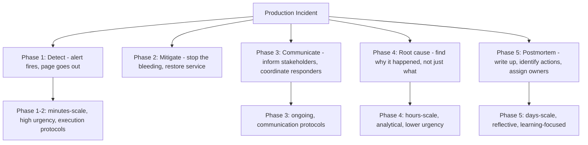
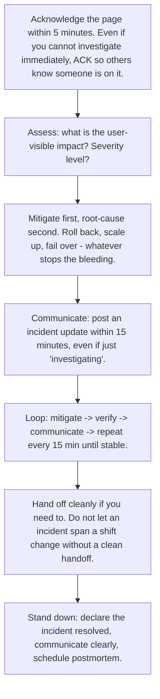
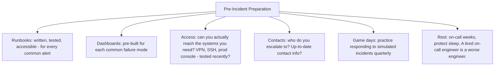

# 12.7. On-Call and Incident Response Protocols

## 1. Background and Why It Matters

On-call is the practice of being available to respond to production incidents outside normal working hours. Incident response is the discipline of detecting, mitigating, communicating, and root-causing production failures. For most engineers, on-call is a chore to be endured; for elite engineers, it is a training ground for the most valuable skills in the field: calm execution under pressure, rapid diagnosis with incomplete information, and clear communication across stakeholders.

For software engineers, the skills built through on-call are exactly the ECPR skills this entire vault is about. An engineer who has responded to 50 incidents has stress inoculation, decision-making under uncertainty, and execution protocols that cannot be learned any other way. This is why senior engineers are usually the best on-call engineers — not because they know more, but because they have built the cognitive infrastructure that handles pressure.



---

## 2. The Incident Response Protocol

When paged, run this protocol explicitly. Do not improvise.



The most common failure mode is reversing steps 2 and 3 — trying to root-cause before mitigating. This extends user-visible impact while the engineer investigates. Mitigate first, then investigate.

---

## 3. Practical Application: The Pre-Incident On-Call Preparation

Most on-call pain is preventable through preparation before the page ever fires:



Game days are the highest-leverage preparation. A team that has practiced responding to simulated incidents will respond to real incidents 3-5x faster than a team that has not. The cost is a few hours per quarter; the benefit is dramatically reduced incident duration.

---

## 4. Concrete Exercise: The Postmortem Quality Bar

Every incident deserves a postmortem. The quality bar for postmortems:

```mermaid
graph TD
    Bar[Postmortem Quality Bar]
    Bar --> B1[B1: Timeline - minute-by-minute from detection to resolution]
    Bar --> B2[B2: Impact - user-visible effects, with numbers (users affected, requests failed, revenue lost)]
    Bar --> B3[B3: Root cause - the actual mechanism, not just 'a bug in X']
    Bar --> B4[B4: Contributing factors - what made this worse? Monitoring gaps? Deploy process? On-call handoff?]
    Bar --> B5[B5: Action items - specific, owned, dated. Each prevents a class of incident, not just this one.]
    Bar --> B6[B6: Blameless - focus on systems and process, not individuals.]
    Bar --> B7[B7: Published - searchable, so future incidents can reference it]
```

B6 (blameless) is non-negotiable. Postmortems that blame individuals produce defensive engineers who hide incidents. Postmortems that blame systems produce learning engineers who expose incidents. The cultural difference compounds over years.

---

## 5. Common Pitfalls and Student Misunderstandings

* **Root-causing before mitigating.** Reverses the protocol. Extends user-visible impact. Always mitigate first.
* **Poor communication during the incident.** Stakeholders panic when they do not know what is happening. Update every 15 minutes, even if just "still investigating."
* **Postmortems that blame individuals.** "Engineer X pushed a bad commit." Wrong. The system allowed a bad commit to ship. Fix the system, not the engineer.
* **Postmortems with vague action items.** "Improve monitoring" is not an action item. "Add alert for X when Y exceeds Z" is. Each action item must be specific, owned, and dated.
* **Not running game days.** The first time the team practices incident response should not be during a real incident. Game days are the cheapest way to dramatically reduce incident duration.
* **Treating on-call as a chore.** On-call is the highest-density learning environment in engineering. Approach it as practice, not punishment.

---

## 6. Essential Reminders

* Mitigate first, root-cause second.
* Communicate every 15 minutes during an incident.
* Blameless postmortems. Fix systems, not engineers.
* Action items must be specific, owned, and dated.
* Game days quarterly. The first practice should not be during a real incident.
* On-call is the highest-density learning environment in engineering.
* "Postmortems that blame individuals produce defensive engineers who hide incidents. Postmortems that blame systems produce learning engineers who expose incidents."
