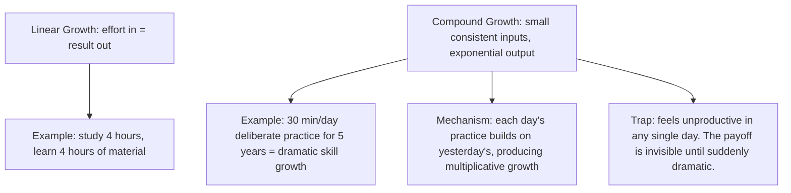
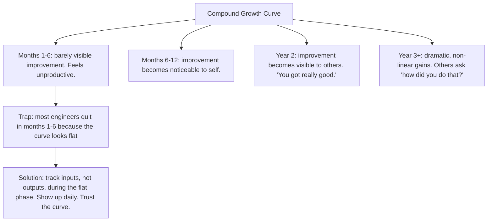
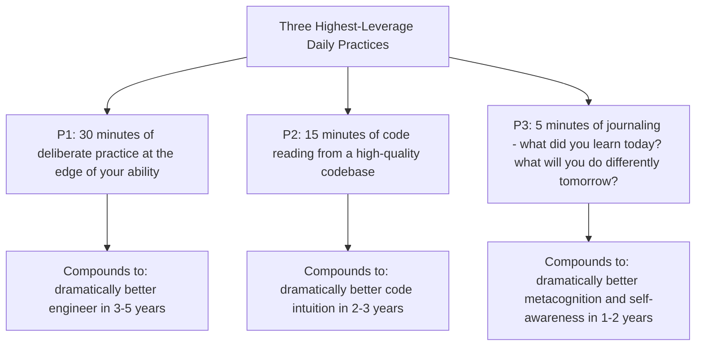
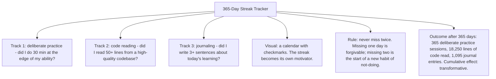

# 13.1. The Compound Effect of Small Daily Practices

## 1. Background and Origin

The compound effect is the principle that small, consistent actions, repeated daily over years, produce disproportionately large results. The mathematics is unambiguous: a 1% daily improvement compounds to 37x over a year; a 1% daily decline compounds to 0.03x. The principle is the foundation of Darren Hardy's book *The Compound Effect* and is implicit in James Clear's *Atomic Habits* (see Chapter 11.3) and in Naval Ravikant's writings on wealth creation.

For software engineers, the compound effect is the meta-principle that makes everything else in this vault work. An engineer who does 30 minutes of deliberate practice per day for 5 years (912 hours) will be dramatically more skilled than one who does 5 hours of practice once a month for 5 years (300 hours) — even though the first engineer "feels" like they are doing less. The consistency, not the intensity, is what compounds.

---

## 2. Why the Compound Effect Feels Unproductive

The compound effect has a brutal feature: the payoff is invisible in the short term. If you do 30 minutes of deliberate practice today, you will not notice any improvement tomorrow. If you do 30 minutes per day for a week, you will still not notice. The curve is flat for months, then suddenly steep.

This is why most engineers do not benefit from compound growth: they quit during the flat phase. The discipline is to track inputs (did I do my 30 minutes today?) rather than outputs (am I better yet?) during the early phase, because outputs will not move for months.

---

## 3. Practical Application: The Three Compounding Practices

If you can only sustain three daily practices, choose these:

These three practices take 50 minutes per day. They are sustainable indefinitely. They are the highest-leverage 50 minutes in your day, because they are the only 50 minutes that compound across years.

---

## 4. Concrete Exercise: The 365-Day Streak Tracker

Build a streak tracker for your three daily practices:

The "never miss twice" rule is critical. Most engineers break a streak, feel discouraged, and quit. The rule reframes: missing one day is normal; missing two is the new pattern. Recover immediately.

---

## 5. Common Pitfalls and Student Misunderstandings

* **Quitting during the flat phase.** Months 1-6 feel unproductive. Most engineers quit here. Trust the curve.
* **Tracking outputs instead of inputs.** "Am I better yet?" is the wrong question during the flat phase. "Did I show up today?" is the right question.
* **Choosing practices that are not sustainable.** 2 hours per day is not sustainable. 30 minutes per day is. Choose what you can do every day for 5 years, not what you can do for 2 weeks.
* **Letting one missed day become two.** The "never miss twice" rule is the difference between a 365-day streak and a 30-day streak.
* **Comparing yourself to others' outputs.** The compound effect is individual. Your month-12 may look like someone else's month-6. Track your own curve.

---

## 6. Essential Reminders

* Small daily inputs, exponential yearly outputs.
* The payoff is invisible for months. Most engineers quit here. Trust the curve.
* Track inputs, not outputs, during the flat phase.
* Three highest-leverage practices: deliberate practice, code reading, journaling.
* Never miss twice.
* "You do not rise to the level of your goals. You fall to the level of your systems." — James Clear
