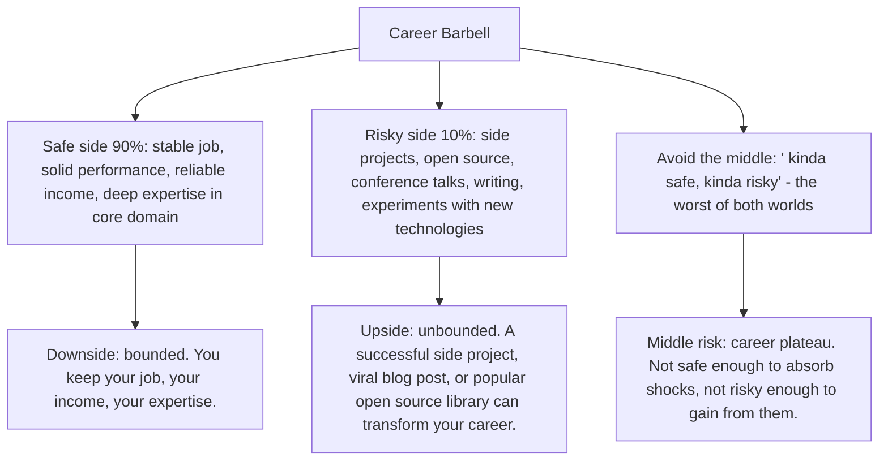
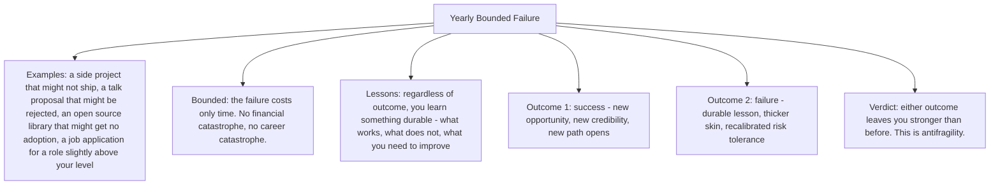

# 13.2. Anti-Fragility in Career: Designing for Stress Benefit

## 1. Background and Why It Matters

In Chapter 11.9 we covered Taleb's antifragility concept: systems that gain from stress rather than merely surviving it. This note applies the concept to engineering careers specifically. Most career advice is fragile — it optimises for smooth progression, no failures, no setbacks. Antifragile career design does the opposite: it seeks out bounded stressors that build resilience, capability, and optionality.

For software engineers, an antifragile career is one where every failure, every project that did not go as planned, every reorg or layoff, every hard problem that took 3x longer than estimated — each one leaves you stronger than before. A fragile career, by contrast, is one where any of these events would be catastrophic.

```mermaid
graph TD
    Fragile[Fragile Career]
    Fragile --> F1[F1: single employer, single domain, single technology]
    Fragile --> F2[F2: no public presence, no network outside the company]
    Fragile --> F3[F3: no savings buffer, no fallback options]
    Fragile --> F4[F4: one bad quarter or one layoff = catastrophe]
    Robust[Robust Career]
    Robust --> R1[R1: deep expertise in one area, transferable to others]
    Robust --> R2[R2: professional network across companies]
    Robust --> R3[R3: 6-12 month emergency fund]
    Robust --> R4[R4: one bad quarter is absorbed]
    Antifragile[Antifragile Career]
    Antifragile --> A1[A1: diverse skills that strengthen from market shifts]
    Antifragile --> A2[A2: public presence that grows from each contribution]
    Antifragile --> A3[A3: financial optionality - can take risks because downside is bounded]
    Antifragile --> A4[A4: failures become case studies that increase market value]
```



---

## 2. The Barbell Career Strategy

Taleb's barbell strategy — combine extreme safety with small risky bets, avoid the middle — applies directly to career design:



The barbell is the structural answer to "should I play it safe or take risks?" Both. The barbell does both — extreme safety in one part of the portfolio, small risky bets in another, nothing in the middle.

---

## 3. Practical Application: The Annual Stress Audit

Once a year, audit your career for fragility:

```mermaid
graph TD
    Audit[Annual Career Fragility Audit]
    Audit --> Q1[Q1: If I lost my job tomorrow, how long could I sustain my lifestyle? Target: 6-12 months.]
    Audit --> Q2[Q2: If my current technology became obsolete, how transferable are my skills? Target: 70%+ transferable.]
    Audit --> Q3[Q3: If I could not work for 3 months (health, family), would my career survive? Target: yes, with savings and supportive network.]
    Audit --> Q4[Q4: Do I have a public artifact (blog, GitHub, talks) that grows in value independent of my employment? Target: yes.]
    Audit --> Q5[Q5: Have I had at least one bounded failure in the last year that taught me something durable? Target: yes - failure is data, not catastrophe.]
    Audit --> Q6[Q6: Do I have optionality - multiple paths forward if my current one closes? Target: at least 2 viable alternatives.]
```

If your answers reveal fragility, the fix is not "play it safer" — it is "build optionality." Take on the 10% risky side of the barbell. Build the public artifact. Expand the network outside your current employer. Each of these increases antifragility.

---

## 4. Concrete Exercise: The Yearly Bounded Failure

Deliberately take on one project per year that has a meaningful chance of failure:



Most engineers avoid the yearly bounded failure because failure feels bad. But an engineer who has failed 5 times in 5 years (in bounded ways) is dramatically more resilient — and more employable — than one who has never failed because they never tried anything that could fail.

---

## 5. Common Pitfalls and Student Misunderstandings

* **Confusing antifragility with recklessness.** Antifragility requires *bounded* downside. Quitting your job with no savings to start a company is reckless, not antifragile. Starting a company on nights and weekends while keeping your job is antifragile.
* **Avoiding all failure.** A career with no failures is a career with no risks taken, which means no antifragility gains. Deliberately seek bounded failures.
* **Putting all career eggs in one basket.** Single employer, single technology, single domain. Maximum fragility. Build optionality.
* **Not building a public artifact.** Without a blog, GitHub, or talk portfolio, your value is invisible outside your employer. This is fragile.
* **Treating the safe side as 100%.** 100% safety means 0% optionality gain. Keep the 90/10 barbell — 90% safety, 10% risky bets.

---

## 6. Essential Reminders

* Antifragile careers gain from stress; fragile careers break.
* Barbell: 90% safety, 10% risky bets. Avoid the middle.
* Annual fragility audit: savings, transferability, public artifact, optionality.
* One bounded failure per year. Either outcome leaves you stronger.
* Build a public artifact that grows in value independent of your employer.
* "Difficulty is what wakes up the genius." — Nassim Taleb
